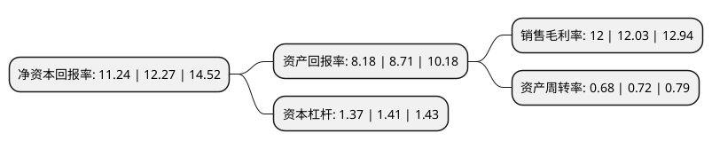

> 本页面由自动化程序生成于 2022年5月20日 01:14
> 内容可能存在错误，如有bug请提交issue至：https://github.com/Eroleice/doc-pi/issues
{.is-warning}

# 上市公司基本情况

## 基本资料

河北中瓷电子科技股份有限公司（以下简称“中瓷电子”）成立于2009年08月06日，石家庄市。于2021年01月04日在深交所中小板上市。

中瓷电子注册资本14,933.333万元，主要产品为电子陶瓷系列产品，分为四大系列:通信器件用电子陶瓷外壳，工业激光器用电子陶瓷外壳，消费电子陶瓷外壳及基板，汽车电子件，专业从事电子陶瓷系列产品研发，生产和销售。以下是详细信息：

- 公司名称: 河北中瓷电子科技股份有限公司
- 股票代码: 003031.SZ
- 所在地: 河北 - 石家庄市
- 成立日期: 2009年08月06日
- 注册资本: 14,933.333万元
- 法定代表人: 卜爱民
- 主营业务: 主要产品为电子陶瓷系列产品，分为四大系列:通信器件用电子陶瓷外壳，工业激光器用电子陶瓷外壳，消费电子陶瓷外壳及基板，汽车电子件，专业从事电子陶瓷系列产品研发，生产和销售
- 公司官网: www.sinopack.com.cn
- 公司介绍: 公司是专业从事电子陶瓷系列产品研发、生产和销售的高新技术企业，致力于成为世界一流的电子陶瓷产品供应商，为客户提供创新、高品质、有竞争力的电子陶瓷产品。经过十年来的发展，公司已成为国内领先的电子陶瓷高新技术企业，拥有河北省企业技术中心、河北省工程技术中心，作为牵头单位承担国家科技重大专项、工业强基等多项国家和省市电子陶瓷领域的重大科技攻关和产业化项目，在国内电子陶瓷行业具有重要影响力。公司定位为高端的电子陶瓷外壳产品供应商，产品质量可靠，行业知名度较高。经过多年的积累，公司已成为大批国内外电子行业领先企业的供应商，甚至是核心供应商，并与其建立了长期、稳定的合作关系。在光通信领域，全球多家著名的光电器件厂商均是公司客户；在无线通信领域，NXP、Infineon等世界知名的半导体公司为公司客户；公司业与国内著名的通信厂商华为、中兴建立了合作关系，合作范围不断扩大。

## 股东及高管情况

上市公司第一大股东为河北半导体研究所(中国电子科技集团公司第十三研究所)，持股74,187,068股，占比49.68%，为上市公司实际控制人。

截至2022年03月31日，上市公司的前十大股东中，共有1名自然人股东，6名机构股东，3个产品账户，其中5%以上大股东共有8名。上市公司前十大股东明细如下：

> 截至2022年03月31日，上市公司前十大股东信息如下：

| 股东名称 | 持股数量（股） | 持股比例 |
| --- | --- | --- |
| 河北半导体研究所(中国电子科技集团公司第十三研究所) | 74,187,068 | 49.68% |
| 中国电子科技集团公司第十三研究所 | 74,187,068 | 49.68% |
| 中国电子科技集团公司第十三研究所 | 69,200,439 | 46.34% |
| 中电科投资控股有限公司 | 13,910,047 | 9.31% |
| 中电科基金管理有限公司-中电电子信息产业投资基金(天津)合伙企业(有限合伙) | 12,294,180 | 8.23% |
| 中电科基金管理有限公司-中电电子信息产业投资基金(天津)合伙企业(有限合伙) | 12,294,180 | 8.23% |
| 石家庄泉盛盈和企业管理合伙企业(有限合伙) | 10,448,241 | 7% |
| 石家庄泉盛盈和企业管理合伙企业(有限合伙) | 10,448,241 | 7% |
| 合肥中电科国元产业投资基金合伙企业(有限合伙) | 6,147,093 | 4.12% |
| 赵建平 | 1,500,000 | 1% |

## 利润表分析

上市公司2021年总收入为10.13亿元，净利润为1.21亿元，实现盈利。

## 杜邦分析

> 数据列示周期：2021年 | 2020年 | 2019年
{.is-info}

上市公司的净资产收益率在近一年有所下降，下降幅度为-8.39%，其变化情况分解如下：
- 上市公司的销售毛利率在近一年下降了-0.25%，可能是生产效率的下降、商品原材料价格上涨或商品价格的下跌所致。
- 上市公司的资产周转率在近一年下降了-5.56%，可能是源自于更慢的销售回款或库存管理效果下降。
- 上市公司的财务杠杆比率在近一年下降了-2.84%，可能是减少负债降低财务费用。

