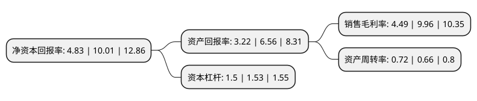

> 本页面由自动化程序生成于 2022年5月20日 01:14
> 内容可能存在错误，如有bug请提交issue至：https://github.com/Eroleice/doc-pi/issues
{.is-warning}

# 上市公司基本情况

## 基本资料

楚天龙股份有限公司（以下简称“楚天龙”）成立于2002年10月16日，东莞市。于2021年03月22日在深交所中小板上市。

楚天龙注册资本46,113.597万元，主要从事智能卡的设计，研发，生产，销售和服务，主要产品为以金融社保卡，标准银行IC卡等为代表的金融IC卡，以通信卡，交通卡等为代表的非金融IC卡，以及相关卡品的个人化等数据服务。以下是详细信息：

- 公司名称: 楚天龙股份有限公司
- 股票代码: 003040.SZ
- 所在地: 广东 - 东莞市
- 成立日期: 2002年10月16日
- 注册资本: 46,113.597万元
- 法定代表人: 苏晨
- 主营业务: 主要从事智能卡的设计，研发，生产，销售和服务，主要产品为以金融社保卡，标准银行IC卡等为代表的金融IC卡，以通信卡，交通卡等为代表的非金融IC卡，以及相关卡品的个人化等数据服务
- 公司官网: www.ctdcn.com
- 公司介绍: 公司是一家多领域高端智能卡及配套软件、智能终端设备、数字档案、应用平台系统及安全解决方案的提供商。报告期内，公司主要从事智能卡的设计、研发、生产、销售和服务，主要产品为以金融社保卡、标准银行IC卡等为代表的金融IC卡，以通信卡、交通卡等为代表的非金融IC卡，以及相关卡品的个人化等数据服务。基于在智能卡市场的规模优势、渠道资源、技术储备和行业经验，公司围绕核心业务积极实施多元化布局，充分挖掘社保、金融、通信、交通、医疗、教育等领域客户的战略需求，为客户提供智能终端、软件及服务等创新业务产品及一体化解决方案。目前，公司已经形成了以智能卡业务为核心，以智能终端、软件及服务等创新业务为延伸的业务架构。公司智能卡、智能终端和软件及服务产品均面向社保、金融、通信、交通、医疗、教育等领域客户。在金融领域，公司客户包括中国工商银行、中国农业银行、中国银行、中国建设银行、中国邮政储蓄银行等；在社保领域，公司为包括广东、河南、山东、湖北在内的30个省、自治区和直辖市的社保机构提供社保卡的制卡及(或)个人化服务；在通信领域，公司产品已覆盖中国移动、中国联通和中国电信等电信运营商。

## 股东及高管情况

上市公司第一大股东为郑州翔虹湾企业管理有限公司，持股210,000,000股，占比45.54%，为上市公司实际控制人。

截至2022年03月31日，上市公司的前十大股东中，共有1名自然人股东，7名机构股东，2个产品账户，其中5%以上大股东共有3名。上市公司前十大股东明细如下：

> 截至2022年03月31日，上市公司前十大股东信息如下：

| 股东名称 | 持股数量（股） | 持股比例 |
| --- | --- | --- |
| 郑州翔虹湾企业管理有限公司 | 210,000,000 | 45.54% |
| 康佳集团股份有限公司 | 84,000,000 | 18.22% |
| 郑州东方一马企业管理中心(有限合伙) | 30,285,850 | 6.57% |
| 河南京港股权投资基金管理有限公司-河南兴港融创创业投资发展基金(有限合伙) | 19,416,400 | 4.21% |
| 宁波梅山保税港区鼎金嘉华股权投资合伙企业(有限合伙) | 7,142,857 | 1.55% |
| 民生证券投资有限公司 | 4,693,857 | 1.02% |
| 楚天龙股份有限公司未确权股份托管专用证券账户 | 4,285,714 | 0.93% |
| 平阳龙兴投资合伙企业(有限合伙) | 2,764,500 | 0.6% |
| 平阳龙翔投资合伙企业(有限合伙) | 2,727,500 | 0.59% |
| 葛玉华 | 1,484,400 | 0.32% |

## 利润表分析

上市公司2021年总收入为13.08亿元，净利润为0.58亿元，实现盈利。

## 杜邦分析

> 数据列示周期：2021年 | 2020年 | 2019年
{.is-info}

上市公司的净资产收益率在近一年有所下降，下降幅度为-51.75%，其变化情况分解如下：
- 上市公司的销售毛利率在近一年下降了-54.92%，可能是生产效率的下降、商品原材料价格上涨或商品价格的下跌所致。
- 上市公司的资产周转率在近一年上升了9.09%，可能是源自于更快的销售回款或库存管理效果提升。
- 上市公司的财务杠杆比率在近一年下降了-1.96%，可能是减少负债降低财务费用。

