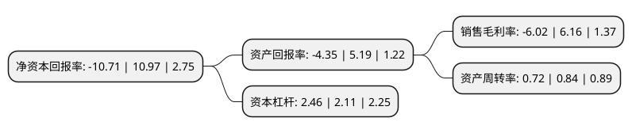

> 本页面由自动化程序生成于 2022年5月20日 01:15
> 内容可能存在错误，如有bug请提交issue至：https://github.com/Eroleice/doc-pi/issues
{.is-warning}

# 上市公司基本情况

## 基本资料

深圳市长盈精密技术股份有限公司（以下简称“长盈精密”）成立于2001年07月17日，深圳市。于2010年09月02日在深交所创业板上市。

长盈精密注册资本120,102.772万元，主营业务为设计，开发，制造精密电子零组件以下是详细信息：

- 公司名称: 深圳市长盈精密技术股份有限公司
- 股票代码: 300115.SZ
- 所在地: 广东 - 深圳市
- 成立日期: 2001年07月17日
- 注册资本: 120,102.772万元
- 法定代表人: 陈奇星
- 主营业务: 主营业务为设计，开发，制造精密电子零组件
- 公司官网: www.ewpt.com
- 公司介绍: 公司是国内领先的精密电子零组件制造商，主要从事手机机构配套件，LED精密支架，精密模具等的开发、设计、制造、销售，如手机系列连接器、屏蔽件、滑轨、转轴、金属外观件：表面贴装式LED精密支架;电子产品包装材料。公司聚集了一批行业技术精英，技术开发实力强大。公司拥有精密的模具制造、高速精密冲压、精密塑胶成型以及精密连接器自动化生产设备开发所需全系列引进生产设备和实验测试仪器。公司已通过ISO9001：2000、ISO14001：2004、ISO16949、QC080000等多项体系认证，产品全面符合欧盟RoHS环保指令，并拥有多项自主产品专利。

## 股东及高管情况

上市公司第一大股东为宁波长盈粤富投资有限公司，持股444,188,111股，占比36.98%，为上市公司实际控制人。

截至2022年03月31日，上市公司的前十大股东中，共有1名自然人股东，1名机构股东，7个产品账户，1个海外主体，其中5%以上大股东共有1名。上市公司前十大股东明细如下：

> 截至2022年03月31日，上市公司前十大股东信息如下：

| 股东名称 | 持股数量（股） | 持股比例 |
| --- | --- | --- |
| 宁波长盈粤富投资有限公司 | 444,188,111 | 36.98% |
| 深圳市长盈精密技术股份有限公司-第二期员工持股计划 | 25,647,841 | 2.14% |
| 交通银行股份有限公司-汇丰晋信低碳先锋股票型证券投资基金 | 20,125,504 | 1.68% |
| 香港中央结算有限公司(陆股通) | 18,307,622 | 1.52% |
| 杨振宇 | 13,081,488 | 1.09% |
| 交通银行-汇丰晋信动态策略混合型证券投资基金 | 10,047,436 | 0.84% |
| 深圳市长盈精密技术股份有限公司-第四期员工持股计划 | 8,740,000 | 0.73% |
| 交通银行股份有限公司-汇丰晋信核心成长混合型证券投资基金 | 8,612,619 | 0.72% |
| 全国社保基金一一三组合 | 5,999,864 | 0.5% |
| 中国银行股份有限公司-华夏中证5G通信主题交易型开放式指数证券投资基金 | 5,812,809 | 0.48% |

## 利润表分析

上市公司2021年总收入为110.46亿元，净利润为-6.66亿元，**未实现盈利**。

## 杜邦分析

> 数据列示周期：2021年 | 2020年 | 2019年
{.is-info}

上市公司的净资产收益率在近一年有所下降，下降幅度为-197.63%，其变化情况分解如下：
- 上市公司的销售毛利率在近一年下降了-197.73%，可能是生产效率的下降、商品原材料价格上涨或商品价格的下跌所致。
- 上市公司的资产周转率在近一年下降了-14.29%，可能是源自于更慢的销售回款或库存管理效果下降。
- 上市公司的财务杠杆比率在近一年上升了16.59%，可能是增加负债扩大生产规模。

