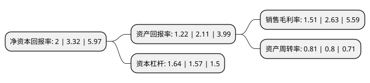

> 本页面由自动化程序生成于 2022年5月20日 01:15
> 内容可能存在错误，如有bug请提交issue至：https://github.com/Eroleice/doc-pi/issues
{.is-warning}

# 上市公司基本情况

## 基本资料

天津经纬辉开光电股份有限公司（以下简称“经纬辉开”）成立于1999年03月01日，天津市。于2010年09月17日在深交所创业板上市。

经纬辉开注册资本46,440.118万元，主营业务:液晶显示和触摸屏模组，电磁线业务，电抗器业务以下是详细信息：

- 公司名称: 天津经纬辉开光电股份有限公司
- 股票代码: 300120.SZ
- 所在地: 天津 - 天津市
- 成立日期: 1999年03月01日
- 注册资本: 46,440.118万元
- 法定代表人: 陈建波
- 主营业务: 主营业务:液晶显示和触摸屏模组，电磁线业务，电抗器业务
- 公司官网: www.jwdc.cn
- 公司介绍: 公司是一家综合实力名列同行前茅的中外合资高新技术企业，是国内产品种类多、系列全、技术水平高、规模大的铝芯电磁线企业之一，是铝芯电磁线细分领域的龙头企业。公司主要从事电磁线产品的研发、生产及销售。公司产品包括膜包线、漆包线、换位导线等系列电磁线，基本涵盖了所有电磁线产品系列；产品广泛应用于电力、机电、电气设备、家用电器、电子、通讯和交通等领域，是国家重点支持的高新技术企业，产品市场覆盖全国各省、自治区、直辖市和中国台湾地区，并远销东南亚、中东、非洲及欧美多个国家。公司自主研发的核心产品换位铝导线已成功应用于国家超/特高压输电网工程，是我国电线电缆行业“以铝节铜”技术应用和产业化的典范。公司在收购新辉开100%的股权之后，主营业务由单一高端电磁线及电力设备制造转变为高端电磁线及电力设备制造与触控显示产品制造双轮驱动的发展局面，形成多元化经营模式。

## 股东及高管情况

上市公司第一大股东为董树林，持股39,399,090股，占比8.48%，**疑似为**上市公司实际控制人。

截至2022年03月31日，上市公司的前十大股东中，共有4名自然人股东，5名机构股东，1个产品账户，其中5%以上大股东共有3名。上市公司前十大股东明细如下：

> 未能通过持股比例判定出上市公司实际控制人（持股30%以上）
> 可能存在通过间接持股、联合持股、协议控制等方式拥有实际控制权的主体，具体请参考上市公司定期公告！
{.is-warning}

> 上市公司第一大股东持股不超过10%，请检查是否存在公司控制权风险！
{.is-danger}

> 截至2022年03月31日，上市公司前十大股东信息如下：

| 股东名称 | 持股数量（股） | 持股比例 |
| --- | --- | --- |
| 董树林 | 39,399,090 | 8.48% |
| 永州市福瑞投资有限责任公司 | 27,656,098 | 5.96% |
| 西藏青崖创业投资合伙企业(有限合伙) | 26,781,707 | 5.77% |
| 张国祥 | 16,479,491 | 3.55% |
| 张秋凤 | 13,215,026 | 2.85% |
| 张家港保税区丰瑞嘉华企业管理有限公司 | 12,262,935 | 2.64% |
| 艾艳 | 7,964,800 | 1.72% |
| 湖南天易集团有限公司 | 7,855,400 | 1.69% |
| 永州恒达伟业商业投资管理有限责任公司 | 6,681,265 | 1.44% |
| 深圳市丹桂顺资产管理有限公司-丹桂顺之伍月芳号私募基金 | 4,580,000 | 0.99% |

## 杜邦分析

> 数据列示周期：2021年 | 2020年 | 2019年
{.is-info}

上市公司的净资产收益率在近一年有所下降，下降幅度为-39.76%，其变化情况分解如下：
- 上市公司的销售毛利率在近一年下降了-42.59%，可能是生产效率的下降、商品原材料价格上涨或商品价格的下跌所致。
- 上市公司的资产周转率在近一年上升了1.25%，可能是源自于更快的销售回款或库存管理效果提升。
- 上市公司的财务杠杆比率在近一年上升了4.46%，可能是增加负债扩大生产规模。

