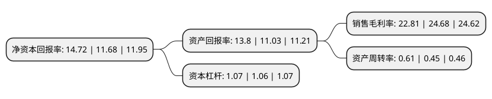

> 本页面由自动化程序生成于 2022年5月20日 01:15
> 内容可能存在错误，如有bug请提交issue至：https://github.com/Eroleice/doc-pi/issues
{.is-warning}

# 上市公司基本情况

## 基本资料

成都银河磁体股份有限公司（以下简称“银河磁体”）成立于2001年03月23日，成都市。于2010年10月13日在深交所创业板上市。

银河磁体注册资本32,314.636万元，从事粘结钕铁硼磁体元件及部件的研发，设计，生产和销售。主要产品包括光盘驱动器主轴电机磁体，硬盘驱动器主轴电机磁体，汽车微电机磁体，步进电机磁体以及各类永磁无刷直流电机转子组件等磁体零部件。以下是详细信息：

- 公司名称: 成都银河磁体股份有限公司
- 股票代码: 300127.SZ
- 所在地: 四川 - 成都市
- 成立日期: 2001年03月23日
- 注册资本: 32,314.636万元
- 法定代表人: 戴炎
- 主营业务: 从事粘结钕铁硼磁体元件及部件的研发，设计，生产和销售主要产品包括光盘驱动器主轴电机磁体，硬盘驱动器主轴电机磁体，汽车微电机磁体，步进电机磁体以及各类永磁无刷直流电机转子组件等磁体零部件
- 公司官网: www.galaxymagnets.com
- 公司介绍: 公司是一家致力于粘结钕铁硼磁体元件及部件的研发、设计、生产和销售的企业。主要产品包括：光盘驱动器主轴电机磁体、硬盘驱动器主轴电机磁体、汽车微电机磁体、步进电机磁体以及各类永磁无刷直流电机转子组件等磁体零部件。公司是全球粘结钕铁硼稀土磁体产销规模较大的厂家，在粘结钕铁硼磁体细分领域具有较强的竞争力。公司粘结钕铁硼磁体的应用市场包括：汽车电机、硬盘驱动器主轴电机、光盘驱动器主轴电机、步进电机以及各类永磁无刷直流电机转子组件等零部件，产品广泛应用于汽车、信息技术、消费类电子、节能家电、办公自动化和工厂自动化设备等多种领域。

## 股东及高管情况

上市公司第一大股东为成都市银河工业(集团)有限公司，持股99,504,445股，占比30.79%，为上市公司实际控制人。

截至2022年03月31日，上市公司的前十大股东中，共有7名自然人股东，1名机构股东，1个产品账户，1个海外主体，其中5%以上大股东共有2名。上市公司前十大股东明细如下：

> 截至2022年03月31日，上市公司前十大股东信息如下：

| 股东名称 | 持股数量（股） | 持股比例 |
| --- | --- | --- |
| 成都市银河工业(集团)有限公司 | 99,504,445 | 30.79% |
| 戴炎 | 98,615,862 | 30.52% |
| 张燕 | 12,057,318 | 3.73% |
| 吴志坚 | 10,522,318 | 3.26% |
| 何金洲 | 1,911,464 | 0.59% |
| 陈昌芬 | 980,552 | 0.3% |
| 米玉峰 | 910,000 | 0.28% |
| 香港中央结算有限公司(陆股通) | 824,439 | 0.26% |
| 王春飞 | 690,000 | 0.21% |
| 中国建设银行股份有限公司-嘉实中证稀土产业交易型开放式指数证券投资基金 | 555,200 | 0.17% |

## 利润表分析

上市公司2021年总收入为8.61亿元，净利润为1.96亿元，实现盈利。

## 杜邦分析

> 数据列示周期：2021年 | 2020年 | 2019年
{.is-info}

上市公司的净资产收益率在近一年有所上升，上升幅度为26.03%，其变化情况分解如下：
- 上市公司的销售毛利率在近一年下降了-7.58%，可能是生产效率的下降、商品原材料价格上涨或商品价格的下跌所致。
- 上市公司的资产周转率在近一年上升了35.56%，可能是源自于更快的销售回款或库存管理效果提升。
- 上市公司的财务杠杆比率在近一年上升了0.94%，可能是增加负债扩大生产规模。

