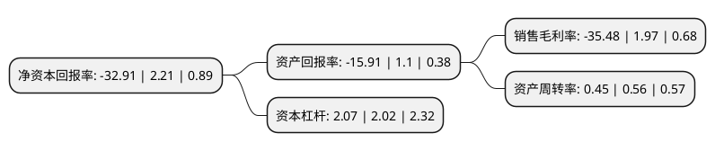

> 本页面由自动化程序生成于 2022年5月20日 01:15
> 内容可能存在错误，如有bug请提交issue至：https://github.com/Eroleice/doc-pi/issues
{.is-warning}

# 上市公司基本情况

## 基本资料

苏州锦富技术股份有限公司（以下简称“锦富技术”）成立于2004年03月29日，苏州市。于2010年10月13日在深交所创业板上市。

锦富技术注册资本109,411.541万元，主营业务为各类光电显示薄膜器件，以及隔热减震类制品和精密模切设备等产品的生产与销售。主导产品为光电显示薄膜器件，按其产品特性归类，可分为光学膜片，胶粘类制品，绝缘类制品。以下是详细信息：

- 公司名称: 苏州锦富技术股份有限公司
- 股票代码: 300128.SZ
- 所在地: 江苏 - 苏州市
- 成立日期: 2004年03月29日
- 注册资本: 109,411.541万元
- 法定代表人: 顾清
- 主营业务: 主营业务为各类光电显示薄膜器件，以及隔热减震类制品和精密模切设备等产品的生产与销售主导产品为光电显示薄膜器件，按其产品特性归类，可分为光学膜片，胶粘类制品，绝缘类制品
- 公司官网: www.jin-fu.cn
- 公司介绍: 公司是中国领先的光电显示薄膜器件生产和整体解决方案提供厂商，内资控股同类企业中市场规模最大的企业，市场份额在国内光电显示薄膜器件市场中位列前茅。公司致力于为客户提供优质的定制产品，同时会同下游厂商共同进行新产品的研发、设计及材料选择，从而提供全方位的综合服务解决方案。公司拥有多年在光电显示领域内积累的行业洞见、创新能力和业务网络，与日东电工、杜邦帝人等主要上游原材料供应商建立了稳定的合作关系，是杜邦帝人在国内重要的战略合作伙伴。公司已获得“苏州工业园区高新技术企业”、“苏州市高新技术企业”、“国家高新技术企业”证书。

## 股东及高管情况

上市公司第一大股东为泰兴市智成产业投资基金(有限合伙)，持股209,963,460股，占比19.19%，**疑似为**上市公司实际控制人。

截至2022年03月31日，上市公司的前十大股东中，共有7名自然人股东，1名机构股东，2个产品账户，其中5%以上大股东共有2名。上市公司前十大股东明细如下：

> 未能通过持股比例判定出上市公司实际控制人（持股30%以上）
> 可能存在通过间接持股、联合持股、协议控制等方式拥有实际控制权的主体，具体请参考上市公司定期公告！
{.is-warning}

> 截至2022年03月31日，上市公司前十大股东信息如下：

| 股东名称 | 持股数量（股） | 持股比例 |
| --- | --- | --- |
| 泰兴市智成产业投资基金(有限合伙) | 209,963,460 | 19.19% |
| 泰兴市赛尔新能源科技有限公司 | 92,133,024 | 8.42% |
| 孙海珍 | 21,818,607 | 1.99% |
| 王建军 | 17,325,951 | 1.58% |
| 上海睿度资产管理有限公司-睿度资产聚缘1号私募证券投资基金 | 12,621,839 | 1.15% |
| 余悦辉 | 12,000,080 | 1.1% |
| 许晶晶 | 7,200,000 | 0.66% |
| 王慧萍 | 6,835,847 | 0.62% |
| 朱丹鸣 | 6,113,299 | 0.56% |
| 蒋萍 | 5,780,125 | 0.53% |

## 利润表分析

上市公司2021年总收入为9.72亿元，净利润为-3.45亿元，**未实现盈利**。

## 杜邦分析

> 数据列示周期：2021年 | 2020年 | 2019年
{.is-info}

上市公司的净资产收益率在近一年有所下降，下降幅度为-1589.14%，其变化情况分解如下：
- 上市公司的销售毛利率在近一年下降了-1901.02%，可能是生产效率的下降、商品原材料价格上涨或商品价格的下跌所致。
- 上市公司的资产周转率在近一年下降了-19.64%，可能是源自于更慢的销售回款或库存管理效果下降。
- 上市公司的财务杠杆比率在近一年上升了2.48%，可能是增加负债扩大生产规模。

