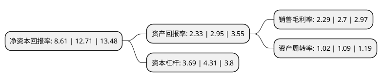

> 本页面由自动化程序生成于 2022年5月20日 01:15
> 内容可能存在错误，如有bug请提交issue至：https://github.com/Eroleice/doc-pi/issues
{.is-warning}

# 上市公司基本情况

## 基本资料

欣旺达电子股份有限公司（以下简称“欣旺达”）成立于1997年12月09日，深圳市。于2011年04月21日在深交所创业板上市。

欣旺达注册资本171,895.728万元，主要产品:锂离子电池模组。主要业务:锂离子电池模组研发制造业务以下是详细信息：

- 公司名称: 欣旺达电子股份有限公司
- 股票代码: 300207.SZ
- 所在地: 广东 - 深圳市
- 成立日期: 1997年12月09日
- 注册资本: 171,895.728万元
- 法定代表人: 王威
- 主营业务: 主要产品:锂离子电池模组锂离子电池模组研发制造业务
- 公司官网: www.sunwoda.com
- 公司介绍: 公司是国内锂能源领域设计能力最强、配套能力最完善、产品系列最多的锂离子电池模组制造商之一。历经二十余年，公司发展成为全球锂离子电池领域的领军企业，形成了动力电池及动力总成、储能系统与能源互联网、3c消费类电池、智能硬件、自动化与智能制造、第三方检测六大产业群，致力于提供绿色、快速、高效的新能源一体化解决方案服务。公司主要从事锂离子电池模组研发制造业务，主要产品为锂离子电池模组，属于新能源领域。锂离子电池产业作为新能源领域的重要组成部分，广泛应用于手机、笔记本电脑、电动汽车动力总成、可穿戴设备、储能、能源互联网、动力工具、电动自行车等领域。公司产品还涵盖锂离子电芯、电源管理系统、精密结构件、智能制造类(含自动化设备)等多个领域。公司在锂离子电池模组领域，通过自主研发，拥有多项自主原始创新和集成创新的核心技术。通过多年努力，公司先后获评“世界能源500强”、“中国电子信息企业百强”、“中国电池百强企业”、“中国民营制造业500强”等荣誉。

## 股东及高管情况

上市公司第一大股东为王明旺，持股361,779,557股，占比21.05%，**疑似为**上市公司实际控制人。

截至2022年03月31日，上市公司的前十大股东中，共有4名自然人股东，5个产品账户，1个海外主体，其中5%以上大股东共有3名。上市公司前十大股东明细如下：

> 未能通过持股比例判定出上市公司实际控制人（持股30%以上）
> 可能存在通过间接持股、联合持股、协议控制等方式拥有实际控制权的主体，具体请参考上市公司定期公告！
{.is-warning}

> 截至2022年03月31日，上市公司前十大股东信息如下：

| 股东名称 | 持股数量（股） | 持股比例 |
| --- | --- | --- |
| 王明旺 | 361,779,557 | 21.05% |
| 王威 | 132,446,600 | 7.71% |
| 香港中央结算有限公司(陆股通) | 92,885,897 | 5.4% |
| 王宇 | 20,002,610 | 1.16% |
| 中国建设银行股份有限公司-前海开源公用事业行业股票型证券投资基金 | 16,422,689 | 0.96% |
| 中国工商银行股份有限公司-前海开源新经济灵活配置混合型证券投资基金 | 16,121,200 | 0.94% |
| 广发基金管理有限公司-社保基金四二零组合 | 15,539,199 | 0.9% |
| 全国社保基金一零二组合 | 15,484,728 | 0.9% |
| 上海浦东发展银行股份有限公司-景顺长城新能源产业股票型证券投资基金 | 13,341,421 | 0.78% |
| 蔡帝娥 | 12,029,060 | 0.7% |

## 利润表分析

上市公司2021年总收入为373.58亿元，净利润为8.54亿元，实现盈利。

## 杜邦分析

> 数据列示周期：2021年 | 2020年 | 2019年
{.is-info}

上市公司的净资产收益率在近一年有所下降，下降幅度为-32.26%，其变化情况分解如下：
- 上市公司的销售毛利率在近一年下降了-15.19%，可能是生产效率的下降、商品原材料价格上涨或商品价格的下跌所致。
- 上市公司的资产周转率在近一年下降了-6.42%，可能是源自于更慢的销售回款或库存管理效果下降。
- 上市公司的财务杠杆比率在近一年下降了-14.39%，可能是减少负债降低财务费用。

