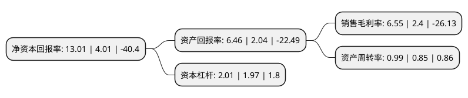

> 本页面由自动化程序生成于 2022年5月20日 01:15
> 内容可能存在错误，如有bug请提交issue至：https://github.com/Eroleice/doc-pi/issues
{.is-warning}

# 上市公司基本情况

## 基本资料

鸿利智汇集团股份有限公司（以下简称“鸿利智汇”）成立于2004年05月31日，广州市。于2011年05月18日在深交所创业板上市。

鸿利智汇注册资本70,794.351万元，主要产品:LED车灯智能模组，商用车LED智能灯具，乘用车智能灯具等。主要业务:LED封装业务，LED汽车照明业务，互联网车主服务，以下是详细信息：

- 公司名称: 鸿利智汇集团股份有限公司
- 股票代码: 300219.SZ
- 所在地: 广东 - 广州市
- 成立日期: 2004年05月31日
- 注册资本: 70,794.351万元
- 法定代表人: 李俊东
- 主营业务: 主要产品:LED车灯智能模组，商用车LED智能灯具，乘用车智能灯具等LED封装业务，LED汽车照明业务，互联网车主服务，
- 公司官网: www.honglitronic.com
- 公司介绍: 公司是国家火炬计划重点高新技术企业，作为国内领先的白光LED封装企业，主要从事LED器件及其应用产品的研发、生产与销售，产品广泛应用于通用照明、背光源、汽车信号/照明、特殊照明、专用照明、显示屏等众多领域。公司凭借在行业的品牌影响力和核心竞争力，产品已覆盖全国大部分省市，并销往欧洲、美洲、东南亚、南非等各个国家和地区。同时，公司一直高度重视技术研发和创新工作，拥有广东省省级企业技术中心，是国家半导体照明工程研发及产业联盟常务理事单位，中国半导体照明技术标准工作组成员单位。公司产品满足当前国际环保RoHS、REACH、PFOS/PFOA等法令法规要求，相关产品通过IEC62471光生物安全测试要求。公司始终不懈坚持于节能科技的研发及普及，力求以不懈的努力，带动节能环保的蝴蝶效应，为全球绿色环保事业做出卓越贡献。

## 股东及高管情况

上市公司第一大股东为四川金舵投资有限责任公司，持股212,954,666股，占比30.08%，为上市公司实际控制人。

截至2022年03月31日，上市公司的前十大股东中，共有4名自然人股东，3名机构股东，2个产品账户，1个海外主体，其中5%以上大股东共有2名。上市公司前十大股东明细如下：

> 截至2022年03月31日，上市公司前十大股东信息如下：

| 股东名称 | 持股数量（股） | 持股比例 |
| --- | --- | --- |
| 四川金舵投资有限责任公司 | 212,954,666 | 30.08% |
| 李国平 | 90,312,630 | 12.76% |
| 马成章 | 18,450,728 | 2.61% |
| 香港中央结算有限公司(陆股通) | 11,275,055 | 1.59% |
| 中国工商银行股份有限公司-兴全绿色投资混合型证券投资基金(LOF) | 11,078,734 | 1.56% |
| 中国农业银行股份有限公司-大成创业板两年定期开放混合型证券投资基金 | 8,849,355 | 1.25% |
| 华夏人寿保险股份有限公司-自有资金 | 5,425,600 | 0.77% |
| 财通证券股份有限公司 | 5,007,000 | 0.71% |
| 刘青 | 4,898,902 | 0.69% |
| 唐兴元 | 4,860,745 | 0.69% |

## 利润表分析

上市公司2021年总收入为40.75亿元，净利润为2.66亿元，实现盈利。

## 杜邦分析

> 数据列示周期：2021年 | 2020年 | 2019年
{.is-info}

上市公司的净资产收益率在近一年有所上升，上升幅度为224.44%，其变化情况分解如下：
- 上市公司的销售毛利率在近一年上升了172.92%，可能是生产效率的提升、商品原材料价格下跌或商品价格的上涨所致。
- 上市公司的资产周转率在近一年上升了16.47%，可能是源自于更快的销售回款或库存管理效果提升。
- 上市公司的财务杠杆比率在近一年上升了2.03%，可能是增加负债扩大生产规模。

