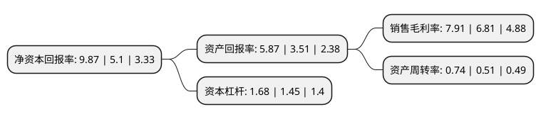

> 本页面由自动化程序生成于 2022年5月20日 01:15
> 内容可能存在错误，如有bug请提交issue至：https://github.com/Eroleice/doc-pi/issues
{.is-warning}

# 上市公司基本情况

## 基本资料

烟台正海磁性材料股份有限公司（以下简称“正海磁材”）成立于2000年04月06日，烟台市。于2011年05月31日在深交所创业板上市。

正海磁材注册资本82,021.656万元，主营业务:高性能钕铁硼永磁材料，新能源汽车电机驱动系统以下是详细信息：

- 公司名称: 烟台正海磁性材料股份有限公司
- 股票代码: 300224.SZ
- 所在地: 山东 - 烟台市
- 成立日期: 2000年04月06日
- 注册资本: 82,021.656万元
- 法定代表人: 王庆凯
- 主营业务: 主营业务:高性能钕铁硼永磁材料，新能源汽车电机驱动系统
- 公司官网: www.zhmag.com
- 公司介绍: 公司是国内新能源和节能环保领域高性能钕铁硼永磁材料的主要供应商，国内高性能钕铁硼永磁材料的龙头企业。公司秉承“高性能钕铁硼永磁材料+新能源汽车电机驱动系统”的双主营业务的发展模式。公司控股子公司上海大郡是国内专业从事新能源汽车驱动电机及其控制系统的研发、生产和销售的高新技术企业。公司是国家发改委、科技部、财政部、海关总署以及国家税务总局的联合认定的国家级企业技术中心。

## 股东及高管情况

上市公司第一大股东为正海集团有限公司，持股358,080,148股，占比43.66%，为上市公司实际控制人。

截至2022年03月31日，上市公司的前十大股东中，共有1名自然人股东，3名机构股东，5个产品账户，1个海外主体，其中5%以上大股东共有1名。上市公司前十大股东明细如下：

> 截至2022年03月31日，上市公司前十大股东信息如下：

| 股东名称 | 持股数量（股） | 持股比例 |
| --- | --- | --- |
| 正海集团有限公司 | 358,080,148 | 43.66% |
| 烟台正海磁性材料股份有限公司-第一期员工持股计划 | 16,000,079 | 1.95% |
| 山东省国有资产投资控股有限公司 | 15,160,642 | 1.85% |
| 郑坚 | 14,481,593 | 1.77% |
| 烟台正海电子网板股份有限公司 | 12,957,300 | 1.58% |
| 中国工商银行股份有限公司-嘉实智能汽车股票型证券投资基金 | 10,077,727 | 1.23% |
| 中国银行股份有限公司-嘉实新能源新材料股票型证券投资基金 | 8,739,800 | 1.07% |
| 中国农业银行股份有限公司-嘉实环保低碳股票型证券投资基金 | 8,036,905 | 0.98% |
| 中国建设银行股份有限公司-前海开源沪港深创新成长灵活配置混合型证券投资基金 | 5,721,394 | 0.7% |
| 香港中央结算有限公司(陆股通) | 4,807,130 | 0.59% |

## 利润表分析

上市公司2021年总收入为33.69亿元，净利润为2.66亿元，实现盈利。

## 杜邦分析

> 数据列示周期：2021年 | 2020年 | 2019年
{.is-info}

上市公司的净资产收益率在近一年有所上升，上升幅度为93.53%，其变化情况分解如下：
- 上市公司的销售毛利率在近一年上升了16.15%，可能是生产效率的提升、商品原材料价格下跌或商品价格的上涨所致。
- 上市公司的资产周转率在近一年上升了45.1%，可能是源自于更快的销售回款或库存管理效果提升。
- 上市公司的财务杠杆比率在近一年上升了15.86%，可能是增加负债扩大生产规模。

