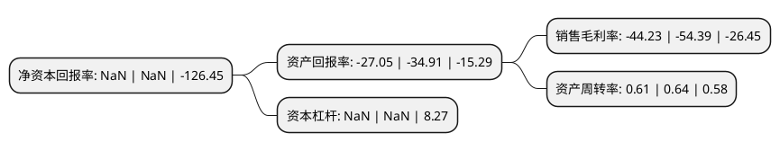

> 本页面由自动化程序生成于 2022年5月20日 01:16
> 内容可能存在错误，如有bug请提交issue至：https://github.com/Eroleice/doc-pi/issues
{.is-warning}

# 上市公司基本情况

## 基本资料

江西星星科技股份有限公司（以下简称“*ST星星”）成立于2003年09月25日，萍乡市。于2011年08月19日在深交所创业板上市。

*ST星星注册资本95,793.64万元，主要产品:手机，平板电脑等产品的视窗防护屏。主要业务:各种视窗防护屏，触控显示模组及精密结构件的研发和制造以下是详细信息：

- 公司名称: 江西星星科技股份有限公司
- 股票代码: 300256.SZ
- 所在地: 江西 - 萍乡市
- 成立日期: 2003年09月25日
- 注册资本: 95,793.64万元
- 法定代表人: 兰子建
- 主营业务: 主要产品:手机，平板电脑等产品的视窗防护屏各种视窗防护屏，触控显示模组及精密结构件的研发和制造
- 公司官网: www.first-panel.com
- 公司介绍: 公司是行业骨干高新技术企业之一，主营各种视窗防护屏、触控显示模组及精密结构件的研发和制造。公司产品主要应用于手机、平板电脑、可穿戴产品、VR(虚拟现实)设备等消费电子产品，同时也广泛应用于车载电子、工控、医疗器械等其他领域。公司致力于成为“智能终端部件一站式解决方案提供商”，未来在智能终端产品上，公司将打造功能模块及结构模块等两大产品板块。公司是消费电子产品制造行业内具有自主创新和研发能力的企业，在技术上一直走在行业前列，在原主营业务视窗防护屏领域，首创使用在玻璃片材上贴防爆膜的技术，降低了玻璃破碎伤人的风险，提高了安全系数。几年来公司承担的多个科研项目被列入国家及省级科技计划项目；多项产品通过浙江省科技主管部门成果鉴定，产品质量达到国际先进水平；多项成果获得浙江省科技进步奖、台州市科技进步奖。

## 股东及高管情况

上市公司第一大股东为萍乡范钛客网络科技有限公司，持股144,056,026股，占比15.04%，**疑似为**上市公司实际控制人。

截至2022年03月31日，上市公司的前十大股东中，共有5名自然人股东，5名机构股东，其中5%以上大股东共有1名。上市公司前十大股东明细如下：

> 未能通过持股比例判定出上市公司实际控制人（持股30%以上）
> 可能存在通过间接持股、联合持股、协议控制等方式拥有实际控制权的主体，具体请参考上市公司定期公告！
{.is-warning}

> 截至2022年03月31日，上市公司前十大股东信息如下：

| 股东名称 | 持股数量（股） | 持股比例 |
| --- | --- | --- |
| 萍乡范钛客网络科技有限公司 | 144,056,026 | 15.04% |
| 萍乡中州信安商业管理中心(有限合伙) | 26,663,137 | 2.78% |
| 深圳市德懋投资发展有限公司 | 24,718,728 | 2.58% |
| 星星集团有限公司 | 13,890,026 | 1.45% |
| 叶仙玉 | 12,197,017 | 1.27% |
| 朱攀 | 6,705,269 | 0.7% |
| 肖亿辉 | 6,644,950 | 0.69% |
| 李廷生 | 6,068,300 | 0.63% |
| 中国国际金融香港资产管理有限公司-客户资金2 | 5,516,950 | 0.58% |
| 王琦 | 4,465,950 | 0.47% |

## 利润表分析

上市公司2021年总收入为32.18亿元，净利润为-14.24亿元，**未实现盈利**。

## 杜邦分析

> 数据列示周期：2021年 | 2020年 | 2019年
{.is-info}

上市公司的净资产收益率在近一年有所下降，下降幅度为NaN%，其变化情况分解如下：
- 上市公司的销售毛利率在近一年下降了-18.68%，可能是生产效率的下降、商品原材料价格上涨或商品价格的下跌所致。
- 上市公司的资产周转率在近一年下降了-4.69%，可能是源自于更慢的销售回款或库存管理效果下降。
- 上市公司的财务杠杆比率在近一年下降了NaN%，可能是减少负债降低财务费用。

