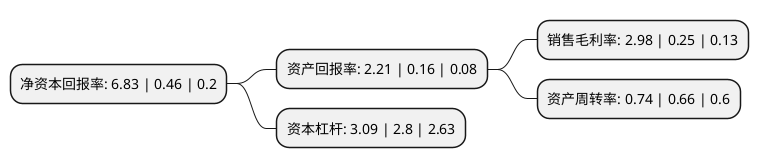

> 本页面由自动化程序生成于 2022年5月20日 01:16
> 内容可能存在错误，如有bug请提交issue至：https://github.com/Eroleice/doc-pi/issues
{.is-warning}

# 上市公司基本情况

## 基本资料

无锡和晶科技股份有限公司（以下简称“和晶科技”）成立于1998年08月14日，无锡市。于2011年12月29日在深交所创业板上市。

和晶科技注册资本44,894.2万元，公司主要从事大型白色家电智能控制器的研发，生产和销售。主要包括以下四大类产品:制冷类家电智能控制器(用于冰箱，酒柜等);洗涤类家电智能控制器(用于滚筒，波轮洗衣机);热控制类家电智能控制器(用于燃气或电烤箱，壁挂锅炉，热水器等);小家电智能控制器(用于豆浆机，电磁炉等)。其中，冰箱智能控制器是公司目前最主要的产品，并已在市场中占有较高的份额，洗衣机，燃气热水器，壁挂锅炉等家电智能控制器是公司未来业绩主要增长点。以下是详细信息：

- 公司名称: 无锡和晶科技股份有限公司
- 股票代码: 300279.SZ
- 所在地: 江苏 - 无锡市
- 成立日期: 1998年08月14日
- 注册资本: 44,894.2万元
- 法定代表人: 冯红涛
- 主营业务: 公司主要从事大型白色家电智能控制器的研发，生产和销售主要包括以下四大类产品:制冷类家电智能控制器(用于冰箱，酒柜等);洗涤类家电智能控制器(用于滚筒，波轮洗衣机);热控制类家电智能控制器(用于燃气或电烤箱，壁挂锅炉，热水器等);小家电智能控制器(用于豆浆机，电磁炉等)其中，冰箱智能控制器是公司目前最主要的产品，并已在市场中占有较高的份额，洗衣机，燃气热水器，壁挂锅炉等家电智能控制器是公司未来业绩主要增长点
- 公司官网: www.hodgen-china.com
- 公司介绍: 公司是一家业务聚焦智慧在生活领域，以感知为目的，以社会属性为核心，推动人、物、信息的互联及深度融合，提供家庭服务为中心的综合性互联网企业。公司自上市以来，通过自身发展和利用资本平台进行外延式扩张，一家从原来单一的白色家电智能控制器制造商转型成为业务聚焦在智慧生活领域的综合性互联网企业。围绕“智慧生活”公司通过四大业务板块(和晶智造、和晶智联、和晶互动数据、和晶互联网教育)的联动发展，构建“硬件+平台+内容+应用”的智慧生活平台。

## 股东及高管情况

上市公司第一大股东为荆州慧和股权投资合伙企业(有限合伙)，持股83,370,000股，占比18.57%，**疑似为**上市公司实际控制人。

截至2022年03月31日，上市公司的前十大股东中，共有6名自然人股东，3名机构股东，1个产品账户，其中5%以上大股东共有2名。上市公司前十大股东明细如下：

> 未能通过持股比例判定出上市公司实际控制人（持股30%以上）
> 可能存在通过间接持股、联合持股、协议控制等方式拥有实际控制权的主体，具体请参考上市公司定期公告！
{.is-warning}

> 截至2022年03月31日，上市公司前十大股东信息如下：

| 股东名称 | 持股数量（股） | 持股比例 |
| --- | --- | --- |
| 荆州慧和股权投资合伙企业(有限合伙) | 83,370,000 | 18.57% |
| 陈柏林 | 44,856,287 | 9.99% |
| 林孝国 | 9,631,500 | 2.15% |
| 国联证券-张晨光-国联定新41号单一资产管理计划 | 8,130,000 | 1.81% |
| 顾群 | 5,603,271 | 1.25% |
| 纪红光 | 3,872,500 | 0.86% |
| 徐宏斌 | 2,800,000 | 0.62% |
| 北京禹源资产管理有限公司 | 2,063,000 | 0.46% |
| 荣天集团有限公司 | 1,762,000 | 0.39% |
| 龚小溪 | 1,650,000 | 0.37% |

## 利润表分析

上市公司2021年总收入为20.6亿元，净利润为0.61亿元，实现盈利。

## 杜邦分析

> 数据列示周期：2021年 | 2020年 | 2019年
{.is-info}

上市公司的净资产收益率在近一年有所上升，上升幅度为1384.78%，其变化情况分解如下：
- 上市公司的销售毛利率在近一年上升了1092%，可能是生产效率的提升、商品原材料价格下跌或商品价格的上涨所致。
- 上市公司的资产周转率在近一年上升了12.12%，可能是源自于更快的销售回款或库存管理效果提升。
- 上市公司的财务杠杆比率在近一年上升了10.36%，可能是增加负债扩大生产规模。

