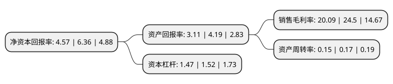

> 本页面由自动化程序生成于 2022年5月20日 01:17
> 内容可能存在错误，如有bug请提交issue至：https://github.com/Eroleice/doc-pi/issues
{.is-warning}

# 上市公司基本情况

## 基本资料

北京赛微电子股份有限公司（以下简称“赛微电子”）成立于2008年05月15日，北京市。于2015年05月14日在深交所创业板上市。

赛微电子注册资本73,328.907万元，主要产品:MEMS芯片的工艺开发及晶圆制造，军/民用导航系统及器件，航空电子系统等。以下是详细信息：

- 公司名称: 北京赛微电子股份有限公司
- 股票代码: 300456.SZ
- 所在地: 北京 - 北京市
- 成立日期: 2008年05月15日
- 注册资本: 73,328.907万元
- 法定代表人: 杨云春
- 主营业务: 主要产品:MEMS芯片的工艺开发及晶圆制造，军/民用导航系统及器件，航空电子系统等
- 公司官网: www.smeiic.com
- 公司介绍: 北京赛微电子股份有限公司以半导体业务为核心，面向物联网与人工智能时代，一方面重点发展MEMS工艺开发与晶圆制造业务，一方面积极布局GaN材料与器件业务，致力于成为一家立足本土、国际化发展的知名半导体科技企业集团。公司目前的主要产品及业务包括MEMS芯片的工艺开发及晶圆制造、GaN外延材料生长与器件设计，下游应用领域包括通信、生物医疗、工业汽车、消费电子等。公司业务遍及全球，服务客户包括全球DNA/RNA测序仪巨头、光刻机巨头、网络通信和应用巨头以及工业和消费细分行业的领先企业等。

## 股东及高管情况

上市公司第一大股东为杨云春，持股196,676,719股，占比26.82%，**疑似为**上市公司实际控制人。

截至2022年03月31日，上市公司的前十大股东中，共有4名自然人股东，5个产品账户，1个海外主体，其中5%以上大股东共有3名。上市公司前十大股东明细如下：

> 未能通过持股比例判定出上市公司实际控制人（持股30%以上）
> 可能存在通过间接持股、联合持股、协议控制等方式拥有实际控制权的主体，具体请参考上市公司定期公告！
{.is-warning}

> 截至2022年03月31日，上市公司前十大股东信息如下：

| 股东名称 | 持股数量（股） | 持股比例 |
| --- | --- | --- |
| 杨云春 | 196,676,719 | 26.82% |
| 国家集成电路产业投资基金股份有限公司 | 88,362,101 | 12.05% |
| 中泰证券资管-证券行业支持民企发展中泰资管2号FOF集合资管计划-证券行业支持民企发展系列之中泰资管18号单一资产管理+ | 37,000,000 | 5.05% |
| 中金期货有限公司-中金期货-融汇1号资产管理计划 | 7,748,934 | 1.06% |
| 中国建设银行股份有限公司-华夏国证半导体芯片交易型开放式指数证券投资基金 | 6,511,200 | 0.89% |
| 杭州乐信投资管理有限公司-乐信长阳私募证券投资基金 | 4,985,953 | 0.68% |
| 刘琼 | 4,805,372 | 0.66% |
| 香港中央结算有限公司(陆股通) | 3,782,091 | 0.52% |
| 李纪华 | 3,141,623 | 0.43% |
| 廖仲钦 | 3,099,573 | 0.42% |

## 利润表分析

上市公司2021年总收入为9.28亿元，净利润为1.86亿元，实现盈利。

## 杜邦分析

> 数据列示周期：2021年 | 2020年 | 2019年
{.is-info}

上市公司的净资产收益率在近一年有所下降，下降幅度为-28.14%，其变化情况分解如下：
- 上市公司的销售毛利率在近一年下降了-18%，可能是生产效率的下降、商品原材料价格上涨或商品价格的下跌所致。
- 上市公司的资产周转率在近一年下降了-11.76%，可能是源自于更慢的销售回款或库存管理效果下降。
- 上市公司的财务杠杆比率在近一年下降了-3.29%，可能是减少负债降低财务费用。

