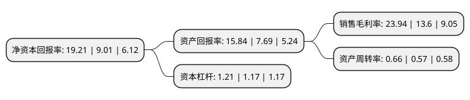

> 本页面由自动化程序生成于 2022年5月20日 01:17
> 内容可能存在错误，如有bug请提交issue至：https://github.com/Eroleice/doc-pi/issues
{.is-warning}

# 上市公司基本情况

## 基本资料

珠海全志科技股份有限公司（以下简称“全志科技”）成立于2007年09月19日，珠海市。于2015年05月15日在深交所创业板上市。

全志科技注册资本33,100.076万元，主要产品:智能应用处理器SoC，高性能模拟器件和无线互联芯片。主营业务:系智能应用处理器SoC，高性能模拟器件和无线互联芯片的研发与设计。以下是详细信息：

- 公司名称: 珠海全志科技股份有限公司
- 股票代码: 300458.SZ
- 所在地: 广东 - 珠海市
- 成立日期: 2007年09月19日
- 注册资本: 33,100.076万元
- 法定代表人: 张建辉
- 主营业务: 主要产品:智能应用处理器SoC，高性能模拟器件和无线互联芯片主营业务:系智能应用处理器SoC，高性能模拟器件和无线互联芯片的研发与设计
- 公司官网: www.allwinnertech.com
- 公司介绍: 公司是领先的智能应用处理器SoC、高性能模拟器件和无线互联芯片设计厂商。公司目前的主营业务为系智能应用处理器SoC、高性能模拟器件和无线互联芯片的研发与设计。主要产品为智能应用处理器SoC、高性能模拟器件和无线互联芯片，产品广泛适用于智能硬件、平板电脑、智能家电、车联网、机器人、虚拟现实、网络机顶盒以及电源模拟器件、无线通信模组、智能物联网等多个产品领域。公司以客户为中心，凝聚卓越团队和坚持核心技术长期投入，在超高清视频编解码、高性能CPU/GPU/AI多核整合、先进工艺的高集成度、超低功耗、全栈集成平台等方面提供具有市场突出竞争力的系统解决方案和贴心服务。公司重视优秀人才的培养和研发团队的建设工作。通过加强对优秀人才的引进和培育工作，利用信息化手段细化、量化管理流程，提高管理水平，加强了公司内部的团队实力。

## 股东及高管情况

上市公司第一大股东为张建辉，持股28,997,573股，占比8.76%，**疑似为**上市公司实际控制人。

截至2022年03月31日，上市公司的前十大股东中，共有7名自然人股东，1个产品账户，2个海外主体，其中5%以上大股东共有4名。上市公司前十大股东明细如下：

> 未能通过持股比例判定出上市公司实际控制人（持股30%以上）
> 可能存在通过间接持股、联合持股、协议控制等方式拥有实际控制权的主体，具体请参考上市公司定期公告！
{.is-warning}

> 上市公司第一大股东持股不超过10%，请检查是否存在公司控制权风险！
{.is-danger}

> 截至2022年03月31日，上市公司前十大股东信息如下：

| 股东名称 | 持股数量（股） | 持股比例 |
| --- | --- | --- |
| 张建辉 | 28,997,573 | 8.76% |
| 丁然 | 26,134,147 | 7.9% |
| 侯丽荣 | 25,442,563 | 7.69% |
| 龚晖 | 21,222,721 | 6.41% |
| 蔡建宇 | 13,281,037 | 4.01% |
| 唐立华 | 7,499,928 | 2.27% |
| PAN YA LING | 6,406,600 | 1.94% |
| 李龙生 | 5,039,406 | 1.52% |
| 中国建设银行股份有限公司-华夏国证半导体芯片交易型开放式指数证券投资基金 | 3,478,546 | 1.05% |
| 香港中央结算有限公司(陆股通) | 3,262,410 | 0.99% |

## 利润表分析

上市公司2021年总收入为20.65亿元，净利润为4.94亿元，实现盈利。

## 杜邦分析

> 数据列示周期：2021年 | 2020年 | 2019年
{.is-info}

上市公司的净资产收益率在近一年有所上升，上升幅度为113.21%，其变化情况分解如下：
- 上市公司的销售毛利率在近一年上升了76.03%，可能是生产效率的提升、商品原材料价格下跌或商品价格的上涨所致。
- 上市公司的资产周转率在近一年上升了15.79%，可能是源自于更快的销售回款或库存管理效果提升。
- 上市公司的财务杠杆比率在近一年上升了3.42%，可能是增加负债扩大生产规模。

