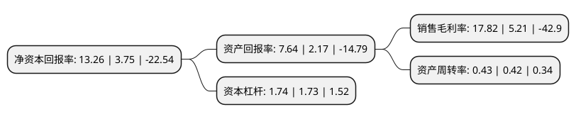

> 本页面由自动化程序生成于 2022年5月20日 01:17
> 内容可能存在错误，如有bug请提交issue至：https://github.com/Eroleice/doc-pi/issues
{.is-warning}

# 上市公司基本情况

## 基本资料

广东惠伦晶体科技股份有限公司（以下简称“惠伦晶体”）成立于2002年06月25日，东莞市。于2015年05月15日在深交所创业板上市。

惠伦晶体注册资本27,900.425万元，主要产品:压电石英晶体元器件，包括表面贴装式(SMD)石英晶体谐振器和双列直插式(DIP)石英晶体谐振器。主要业务:研发，生产和销售新型表面贴装石英晶体谐振器，振荡器，热敏电阻。以下是详细信息：

- 公司名称: 广东惠伦晶体科技股份有限公司
- 股票代码: 300460.SZ
- 所在地: 广东 - 东莞市
- 成立日期: 2002年06月25日
- 注册资本: 27,900.425万元
- 法定代表人: 赵积清
- 主营业务: 主要产品:压电石英晶体元器件，包括表面贴装式(SMD)石英晶体谐振器和双列直插式(DIP)石英晶体谐振器研发，生产和销售新型表面贴装石英晶体谐振器，振荡器，热敏电阻
- 公司官网: www.dgylec.com
- 公司介绍: 公司是一家专业研发、生产和销售新型表面贴装石英晶体谐振器、振荡器、热敏电阻的国家级高新技术企业，产品广泛应用于国民经济的各个领域，是电脑及电脑网络周边产品、无线通讯、手提电话、车载电话、GPS卫星定位、数码视听设备、遥控装置等电子产业不可或缺的基础元器件。经过十多年的发展，公司已成为国内表面贴装式压电石英晶体元器件行业龙头企业之一。公司较早在国内实现SMD2520、SMD2016、SMD1612等片式小微型谐振器的批量生产，建立了行业内唯一一家国家级实验室“压电石英晶体元器件研究开发中心”，并多次承担国家、省、市科技项目，其中，“超小型高精度无线通讯用‘频率控制与选择’表面贴装元器件(SMD3225，26MHZ)”被列为国家重点新产品；“精密石英晶体温补振荡器(TCXO)关键技术研究与产业化”入选广东省－中科院合作项目。公司本着“质量第一、信誉第一、客户至上、热情服务”的原则，积极进取，广泛与国内外同行交流，共同发展，共创未来。

## 股东及高管情况

上市公司第一大股东为新疆惠伦股权投资合伙企业(有限合伙)，持股57,650,980股，占比20.66%，**疑似为**上市公司实际控制人。

截至2022年03月31日，上市公司的前十大股东中，共有5名自然人股东，4名机构股东，1个产品账户，其中5%以上大股东共有2名。上市公司前十大股东明细如下：

> 未能通过持股比例判定出上市公司实际控制人（持股30%以上）
> 可能存在通过间接持股、联合持股、协议控制等方式拥有实际控制权的主体，具体请参考上市公司定期公告！
{.is-warning}

> 截至2022年03月31日，上市公司前十大股东信息如下：

| 股东名称 | 持股数量（股） | 持股比例 |
| --- | --- | --- |
| 新疆惠伦股权投资合伙企业(有限合伙) | 57,650,980 | 20.66% |
| 安徽志道投资有限公司 | 14,000,000 | 5.02% |
| 世锦国际有限公司 | 9,079,723 | 3.25% |
| 香港通盈投资有限公司 | 5,531,238 | 1.98% |
| 林纳新 | 3,635,600 | 1.3% |
| 夏敏勇 | 2,186,000 | 0.78% |
| 丑建忠 | 2,155,860 | 0.77% |
| 东莞金控股权投资基金管理有限公司-东莞市上市莞企二号发展投资合伙企业(有限合伙) | 1,300,000 | 0.47% |
| 赵桂丹 | 1,091,700 | 0.39% |
| 胡登玉 | 1,080,300 | 0.39% |

## 利润表分析

上市公司2021年总收入为6.55亿元，净利润为1.16亿元，实现盈利。

## 杜邦分析

> 数据列示周期：2021年 | 2020年 | 2019年
{.is-info}

上市公司的净资产收益率在近一年有所上升，上升幅度为253.6%，其变化情况分解如下：
- 上市公司的销售毛利率在近一年上升了242.03%，可能是生产效率的提升、商品原材料价格下跌或商品价格的上涨所致。
- 上市公司的资产周转率在近一年上升了2.38%，可能是源自于更快的销售回款或库存管理效果提升。
- 上市公司的财务杠杆比率在近一年上升了0.58%，可能是增加负债扩大生产规模。

