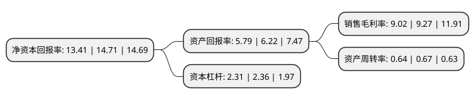

> 本页面由自动化程序生成于 2022年5月20日 01:18
> 内容可能存在错误，如有bug请提交issue至：https://github.com/Eroleice/doc-pi/issues
{.is-warning}

# 上市公司基本情况

## 基本资料

胜宏科技(惠州)股份有限公司（以下简称“胜宏科技”）成立于2006年07月28日，惠州市。于2015年06月11日在深交所创业板上市。

胜宏科技注册资本86,365.702万元，主要产品:双面板，多层板(含HDI)等。主要业务:新型电子器件(高精密度线路板)的研究开发，生产和销售。以下是详细信息：

- 公司名称: 胜宏科技(惠州)股份有限公司
- 股票代码: 300476.SZ
- 所在地: 广东 - 惠州市
- 成立日期: 2006年07月28日
- 注册资本: 86,365.702万元
- 法定代表人: 陈涛
- 主营业务: 主要产品:双面板，多层板(含HDI)等新型电子器件(高精密度线路板)的研究开发，生产和销售
- 公司官网: www.shpcb.com
- 公司介绍: 公司拥有一流的PCB生产设备及专业团队，专业从事高密度印制线路板的研发、生产和销售，主要产品为双面板、多层板(含HDI)等，产品广泛用于LED显示器、SERVER(服务器)、通讯、医疗器械、新能源汽车、电脑周边等领域。公司是中国印制电路行业协会(CPCA)的常务理事单位，是行业标准的制定单位之一，位居中国印制电路行业企业排行榜前列。公司先后通过UL安全认证、ISO/9001、ISO/14001、OHSAS18001、TS16949、CQC、QC080000、中国ROHS、知识产权管理体系、信息安全管理体系、能源管理体系认证；获得了“国家火炬计划重点高新技术企业”、“国家知识产权优势企业”、“广东省创新型企业”和“广东省知识产权优势企业”等荣誉。

## 股东及高管情况

上市公司第一大股东为深圳市胜华欣业投资有限公司，持股160,566,476股，占比18.59%，**疑似为**上市公司实际控制人。

截至2022年04月27日，上市公司的前十大股东中，共有3名机构股东，7个产品账户，其中5%以上大股东共有2名。上市公司前十大股东明细如下：

> 未能通过持股比例判定出上市公司实际控制人（持股30%以上）
> 可能存在通过间接持股、联合持股、协议控制等方式拥有实际控制权的主体，具体请参考上市公司定期公告！
{.is-warning}

> 截至2022年04月27日，上市公司前十大股东信息如下：

| 股东名称 | 持股数量（股） | 持股比例 |
| --- | --- | --- |
| 深圳市胜华欣业投资有限公司 | 160,566,476 | 18.59% |
| 胜宏科技集团(香港)有限公司 | 131,432,001 | 15.22% |
| 惠州市博达兴实业有限公司 | 28,311,973 | 3.28% |
| 中国工商银行股份有限公司-兴全绿色投资混合型证券投资基金(LOF) | 24,989,524 | 2.89% |
| 兴业银行股份有限公司-兴全趋势投资混合型证券投资基金 | 19,717,895 | 2.28% |
| 基本养老保险基金一二零五组合 | 17,791,400 | 2.06% |
| 华泰瑞联基金管理有限公司-南京华泰瑞联并购基金二号(有限合伙) | 15,556,453 | 1.8% |
| 交通银行股份有限公司-易方达科讯混合型证券投资基金 | 14,381,438 | 1.67% |
| 中国光大银行股份有限公司-兴全商业模式优选混合型证券投资基金(LOF) | 12,889,060 | 1.49% |
| 全国社保基金四一八组合 | 11,248,435 | 1.3% |

## 利润表分析

上市公司2021年总收入为74.32亿元，净利润为6.7亿元，实现盈利。

## 杜邦分析

> 数据列示周期：2021年 | 2020年 | 2019年
{.is-info}

上市公司的净资产收益率在近一年有所下降，下降幅度为-8.84%，其变化情况分解如下：
- 上市公司的销售毛利率在近一年下降了-2.7%，可能是生产效率的下降、商品原材料价格上涨或商品价格的下跌所致。
- 上市公司的资产周转率在近一年下降了-4.48%，可能是源自于更慢的销售回款或库存管理效果下降。
- 上市公司的财务杠杆比率在近一年下降了-2.12%，可能是减少负债降低财务费用。

