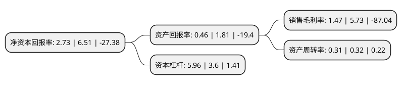

> 本页面由自动化程序生成于 2022年5月20日 01:18
> 内容可能存在错误，如有bug请提交issue至：https://github.com/Eroleice/doc-pi/issues
{.is-warning}

# 上市公司基本情况

## 基本资料

光智科技股份有限公司（以下简称“光智科技”）成立于2006年07月19日，哈尔滨市。于2015年07月01日在深交所创业板上市。

光智科技注册资本13,612.5万元，主营业务:高性能铝合金材料及机加工产品的研发，生产和销售;按照业务类别的不同，公司的主营业务可分为制造类业务和贸易类业务，同时有少量的受托加工业务。公司产品主要包括制造类产品和贸易类产品。以下是详细信息：

- 公司名称: 光智科技股份有限公司
- 股票代码: 300489.SZ
- 所在地: 黑龙江 - 哈尔滨市
- 成立日期: 2006年07月19日
- 注册资本: 13,612.5万元
- 法定代表人: 朱世彬
- 主营业务: 主营业务:高性能铝合金材料及机加工产品的研发，生产和销售;按照业务类别的不同，公司的主营业务可分为制造类业务和贸易类业务，同时有少量的受托加工业务公司产品主要包括制造类产品和贸易类产品
- 公司官网: www.zfgf.cc
- 公司介绍: 作为国家级高新技术企业，光智科技立足于红外光学与激光器件、高性能铝合金材料行业的发展，紧抓国家大力发展高端精密电子设备、促进国家装备升级和产业升级的契机，聚焦于高端红外光学及激光器件、高性能铝合金材料等产品的研发、设计、生产、销售及服务，满足广大客户的需求。公司在红外光学及激光器件领域拥有大规模、批量化的生产制造能力，产品主要为锗产品、硒化锌产品、硫化锌产品、硫系玻璃产品、其他红外产品以及红外镜头等等，主要用于红外热成像领域，涉及安保、消防、车载、无人机、建筑、电力、医疗检疫等行业。公司在高性能铝合金领域具有高端装备技术优势和生产经验，为中核集团合格供应商，产品可广泛应用于核电、航空航天、兵器舰船、电子信息及轨道交通等领域。

## 股东及高管情况

上市公司第一大股东为佛山粤邦投资管理有限公司，持股37,200,000股，占比27.33%，**疑似为**上市公司实际控制人。

截至2022年03月31日，上市公司的前十大股东中，共有6名自然人股东，4名机构股东，其中5%以上大股东共有2名。上市公司前十大股东明细如下：

> 未能通过持股比例判定出上市公司实际控制人（持股30%以上）
> 可能存在通过间接持股、联合持股、协议控制等方式拥有实际控制权的主体，具体请参考上市公司定期公告！
{.is-warning}

> 截至2022年03月31日，上市公司前十大股东信息如下：

| 股东名称 | 持股数量（股） | 持股比例 |
| --- | --- | --- |
| 佛山粤邦投资管理有限公司 | 37,200,000 | 27.33% |
| 深圳市前海富银城投投资有限公司 | 19,057,500 | 14% |
| 邵晟 | 5,011,896 | 3.68% |
| 东莞鸿粤驿虎汽车销售服务有限公司 | 1,834,400 | 1.35% |
| 中国国际金融股份有限公司 | 1,260,500 | 0.93% |
| 龚涛 | 930,000 | 0.68% |
| 陈彦明 | 676,300 | 0.5% |
| 徐春珍 | 565,000 | 0.42% |
| 张大薇 | 530,000 | 0.39% |
| 方士雄 | 499,300 | 0.37% |

## 利润表分析

上市公司2021年总收入为7.24亿元，净利润为0.1亿元，实现盈利。

## 杜邦分析

> 数据列示周期：2021年 | 2020年 | 2019年
{.is-info}

上市公司的净资产收益率在近一年有所下降，下降幅度为-58.06%，其变化情况分解如下：
- 上市公司的销售毛利率在近一年下降了-74.35%，可能是生产效率的下降、商品原材料价格上涨或商品价格的下跌所致。
- 上市公司的资产周转率在近一年下降了-3.12%，可能是源自于更慢的销售回款或库存管理效果下降。
- 上市公司的财务杠杆比率在近一年上升了65.56%，可能是增加负债扩大生产规模。

