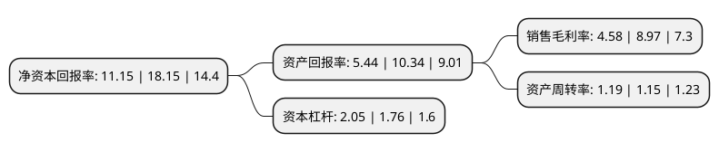

> 本页面由自动化程序生成于 2022年5月20日 01:18
> 内容可能存在错误，如有bug请提交issue至：https://github.com/Eroleice/doc-pi/issues
{.is-warning}

# 上市公司基本情况

## 基本资料

深圳市朗科智能电气股份有限公司（以下简称“朗科智能”）成立于2001年11月20日，深圳市。于2016年09月08日在深交所创业板上市。

朗科智能注册资本26,817.489万元，主要产品电子智能控制器产品的研发，生产和销售公司是从事电子智能控制器产品的研发，生产和销售的高新技术企业，产品主要应用于家用电器，电动工具，锂电池保护，LED和HID照明电源等领域。以下是详细信息：

- 公司名称: 深圳市朗科智能电气股份有限公司
- 股票代码: 300543.SZ
- 所在地: 广东 - 深圳市
- 成立日期: 2001年11月20日
- 注册资本: 26,817.489万元
- 法定代表人: 陈静
- 主营业务: 主要产品电子智能控制器产品的研发，生产和销售公司是从事电子智能控制器产品的研发，生产和销售的高新技术企业，产品主要应用于家用电器，电动工具，锂电池保护，LED和HID照明电源等领域
- 公司官网: www.longood.com
- 公司介绍: 公司属国家级高新技术企业，区级民营百强企业，主要从事基于应用电子技术的智能控制、智能电源及新能源等产品研发、生产、销售及服务；产品广泛应用于智能家电、电动工具、锂电池管理、LED照明、HID照明、电机系统及新能源等领域。公司的电子智能控制器产品主要包括两大类：电器智能控制器、智能电源及控制器，与九阳、TTI、苏泊尔、爱仕达、大宇国际、德豪润达、Lasko、SNOWA、EURO-PRO、FUTEK、VRLA、SUNNY等国内外大型企业建立了长期紧密的战略合作关系。自主研发的产品已获得多项国内外专利。公司内部管理规范，结合先进的ERP系统，严格按照国际标准进行管理和控制，拥有较完善的企业管理、质量保证体系，生产的产品符合CQC、UL、CUL、EMC、LVD等标准认证，并已通过了ISO9001管理体系认证。公司拥有雄厚的技术积累和较强的研发实力，可保证在较短时间内开发出符合客户要求的各类电子智能控制器产品，满足其对终端产品的功能化要求，并在柔性生产的机制下组织规模化、高效的生产安排，及时交货，快速响应市场需求。

## 股东及高管情况

上市公司第一大股东为陈静，持股59,868,900股，占比22.32%，**疑似为**上市公司实际控制人。

截至2022年03月31日，上市公司的前十大股东中，共有9名自然人股东，1个产品账户，其中5%以上大股东共有1名。上市公司前十大股东明细如下：

> 未能通过持股比例判定出上市公司实际控制人（持股30%以上）
> 可能存在通过间接持股、联合持股、协议控制等方式拥有实际控制权的主体，具体请参考上市公司定期公告！
{.is-warning}

> 截至2022年03月31日，上市公司前十大股东信息如下：

| 股东名称 | 持股数量（股） | 持股比例 |
| --- | --- | --- |
| 陈静 | 59,868,900 | 22.32% |
| 郑勇 | 12,806,950 | 4.78% |
| 刘沛然 | 11,973,780 | 4.46% |
| 刘晓昕 | 9,635,600 | 3.59% |
| 潘声旺 | 8,489,948 | 3.17% |
| 刘孝朋 | 6,640,293 | 2.48% |
| 深圳市朗科智能电气股份有限公司-第一期员工持股计划 | 3,209,094 | 1.2% |
| 肖凌 | 3,054,021 | 1.14% |
| 何淦 | 2,977,611 | 1.11% |
| 舒金明 | 1,730,000 | 0.65% |

## 利润表分析

上市公司2021年总收入为23.3亿元，净利润为1.06亿元，实现盈利。

## 杜邦分析

> 数据列示周期：2021年 | 2020年 | 2019年
{.is-info}

上市公司的净资产收益率在近一年有所下降，下降幅度为-38.57%，其变化情况分解如下：
- 上市公司的销售毛利率在近一年下降了-48.94%，可能是生产效率的下降、商品原材料价格上涨或商品价格的下跌所致。
- 上市公司的资产周转率在近一年上升了3.48%，可能是源自于更快的销售回款或库存管理效果提升。
- 上市公司的财务杠杆比率在近一年上升了16.48%，可能是增加负债扩大生产规模。

