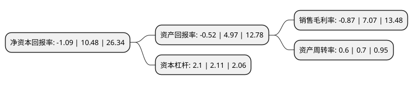

> 本页面由自动化程序生成于 2022年5月20日 01:19
> 内容可能存在错误，如有bug请提交issue至：https://github.com/Eroleice/doc-pi/issues
{.is-warning}

# 上市公司基本情况

## 基本资料

深圳市飞荣达科技股份有限公司（以下简称“飞荣达”）成立于1993年11月10日，深圳市。于2017年01月26日在深交所创业板上市。

飞荣达注册资本50,794.195万元，主要产品:电磁屏蔽材料及器件，导热材料及器件及其他电子器件等三大类。主要业务:电磁屏蔽材料及器件，导热材料及器件的研发，设计，生产与销售。以下是详细信息：

- 公司名称: 深圳市飞荣达科技股份有限公司
- 股票代码: 300602.SZ
- 所在地: 广东 - 深圳市
- 成立日期: 1993年11月10日
- 注册资本: 50,794.195万元
- 法定代表人: 马飞
- 主营业务: 主要产品:电磁屏蔽材料及器件，导热材料及器件及其他电子器件等三大类电磁屏蔽材料及器件，导热材料及器件的研发，设计，生产与销售
- 公司官网: www.frd.cn
- 公司介绍: 公司是国家高新技术企业，主要产品为电磁屏蔽材料及器件、导热材料及器件和其他电子器件，是中国领先的、创新型专业电磁屏蔽及导热解决方案服务商，主要产品包括电磁屏蔽材料及器件、导热材料及器件及其他电子器件等三大类。公司经过多年的市场服务中，凭借不断提升的研发实力，积累了较为丰富的行业经验，公司产品主要应用在通讯设备、计算机、手机终端、汽车电子、医疗器械、家用电器工等多个领域，公司与上述领域中的下游客户形成长期稳定的合作关系，参与到客户产品的研发和设计阶段，能及时了解客户的需求。公司注重研发与创新，经过多年研发生产积累，掌握了丰富的电磁屏蔽及导热技术，如碳纤维金属化技术、导电硅胶的配方及多色多孔共挤技术、复合导电塑料在电子产品上的应用技术等核心工艺技术。公司现已通过ISO9001国际质量管理体系、ISO14001国际环境管理体系、QC080000有害物质过程管理体系、OHSAS18001职业健康安全管理体系、TATF16949汽车行业质量管理体系等的认证，品牌得到越来越多客户认可。

## 股东及高管情况

上市公司第一大股东为马飞，持股238,548,313股，占比46.96%，为上市公司实际控制人。

截至2022年03月31日，上市公司的前十大股东中，共有6名自然人股东，2名机构股东，1个产品账户，1个海外主体，其中5%以上大股东共有2名。上市公司前十大股东明细如下：

> 截至2022年03月31日，上市公司前十大股东信息如下：

| 股东名称 | 持股数量（股） | 持股比例 |
| --- | --- | --- |
| 马飞 | 238,548,313 | 46.96% |
| 黄峥 | 47,894,729 | 9.43% |
| 马军 | 14,520,431 | 2.86% |
| 常州飞驰创业投资合伙企业(有限合伙) | 14,122,488 | 2.78% |
| 杨燕灵 | 11,273,345 | 2.22% |
| 孙慧明 | 10,026,843 | 1.97% |
| 深圳市远致瑞信股权投资管理有限公司-深圳市远致瑞信混改股权投资基金合伙企业(有限合伙) | 8,647,771 | 1.7% |
| 深圳安鹏资本创新有限公司 | 3,735,218 | 0.74% |
| 香港中央结算有限公司(陆股通) | 3,678,286 | 0.72% |
| 张晓冰 | 3,031,323 | 0.6% |

## 利润表分析

上市公司2021年总收入为30.58亿元，净利润为-0.27亿元，**未实现盈利**。

## 杜邦分析

> 数据列示周期：2021年 | 2020年 | 2019年
{.is-info}

上市公司的净资产收益率在近一年有所下降，下降幅度为-110.4%，其变化情况分解如下：
- 上市公司的销售毛利率在近一年下降了-112.31%，可能是生产效率的下降、商品原材料价格上涨或商品价格的下跌所致。
- 上市公司的资产周转率在近一年下降了-14.29%，可能是源自于更慢的销售回款或库存管理效果下降。
- 上市公司的财务杠杆比率在近一年下降了-0.47%，可能是减少负债降低财务费用。

