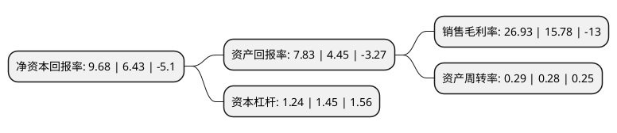

> 本页面由自动化程序生成于 2022年5月20日 01:19
> 内容可能存在错误，如有bug请提交issue至：https://github.com/Eroleice/doc-pi/issues
{.is-warning}

# 上市公司基本情况

## 基本资料

广东新劲刚科技股份有限公司（以下简称“新劲刚”）成立于1998年12月09日，佛山市。于2017年03月24日在深交所创业板上市。

新劲刚注册资本13,956.289万元，主营业务为高性能金属基复合材料及制品的研究，开发，生产和销售。主要产品包括射频微波类产品，金属基超硬材料制品及配套产品等以下是详细信息：

- 公司名称: 广东新劲刚科技股份有限公司
- 股票代码: 300629.SZ
- 所在地: 广东 - 佛山市
- 成立日期: 1998年12月09日
- 注册资本: 13,956.289万元
- 法定代表人: 王刚
- 主营业务: 主营业务为高性能金属基复合材料及制品的研究，开发，生产和销售主要产品包括射频微波类产品，金属基超硬材料制品及配套产品等
- 公司官网: www.king-strong.com
- 公司介绍: 公司是一家专业从事高性能金属基复合材料及制品的研究、开发、生产和销售的国家火炬计划重点高新技术企业，秉持“技术领先、持续创新”的发展战略，以市场需求为导向，潜心于为下游客户提供高效节能的加工工具和具有个性化性能的关键部件，致力于成为国内领先的高性能金属基复合材料及制品供应商。公司全资子公司康泰威公司是目前国内为数不多的拥有军工资质及军品供应能力的民营企业之一。公司目前的主要产品为金属基超硬材料制品及配套产品。此外，公司还根据武器装备承制单位的需求，研发、生产和供应金属基耐磨复合材料及制品、金属基轻质高强复合材料制品、电磁波吸收材料、防腐导静电材料、热障涂层等其他产品。公司以其品牌优势、技术优势、市场优势，确立了在行业中的重要地位，通过了ISO9001国际质量管理体系认证。“劲刚”品牌被认定为中国驰名商标、广东省著名商标和广东省优秀自主品牌。

## 股东及高管情况

上市公司第一大股东为王刚，持股27,970,854股，占比20%，**疑似为**上市公司实际控制人。

截至2022年03月31日，上市公司的前十大股东中，共有8名自然人股东，2个产品账户，其中5%以上大股东共有1名。上市公司前十大股东明细如下：

> 未能通过持股比例判定出上市公司实际控制人（持股30%以上）
> 可能存在通过间接持股、联合持股、协议控制等方式拥有实际控制权的主体，具体请参考上市公司定期公告！
{.is-warning}

> 截至2022年03月31日，上市公司前十大股东信息如下：

| 股东名称 | 持股数量（股） | 持股比例 |
| --- | --- | --- |
| 王刚 | 27,970,854 | 20% |
| 雷炳秀 | 5,618,159 | 4.02% |
| 文俊 | 5,350,863 | 3.83% |
| 吴小伟 | 5,238,896 | 3.75% |
| 彭波 | 4,196,500 | 3% |
| 朱允来 | 2,262,330 | 1.62% |
| 王婧 | 2,080,079 | 1.49% |
| 胡四章 | 1,774,286 | 1.27% |
| 佛山正合资产管理有限公司-正合智远2号私募证券投资基金 | 1,615,600 | 1.15% |
| 中国银行股份有限公司-华夏行业景气混合型证券投资基金 | 1,180,438 | 0.84% |

## 利润表分析

上市公司2021年总收入为3.6亿元，净利润为0.97亿元，实现盈利。

## 杜邦分析

> 数据列示周期：2021年 | 2020年 | 2019年
{.is-info}

上市公司的净资产收益率在近一年有所上升，上升幅度为50.54%，其变化情况分解如下：
- 上市公司的销售毛利率在近一年上升了70.66%，可能是生产效率的提升、商品原材料价格下跌或商品价格的上涨所致。
- 上市公司的资产周转率在近一年上升了3.57%，可能是源自于更快的销售回款或库存管理效果提升。
- 上市公司的财务杠杆比率在近一年下降了-14.48%，可能是减少负债降低财务费用。

