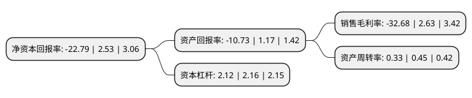

> 本页面由自动化程序生成于 2022年5月20日 01:19
> 内容可能存在错误，如有bug请提交issue至：https://github.com/Eroleice/doc-pi/issues
{.is-warning}

# 上市公司基本情况

## 基本资料

深圳市超频三科技股份有限公司（以下简称“超频三”）成立于2005年04月27日，深圳市。于2017年05月03日在深交所创业板上市。

超频三注册资本43,061.876万元，主营业务为电子产品新型散热器件的研发，生产和销售。主要产品包括LED照明散热组件及PC散热配件，其中LED照明散热组件是公司未来业务增长的重点产品。以下是详细信息：

- 公司名称: 深圳市超频三科技股份有限公司
- 股票代码: 300647.SZ
- 所在地: 广东 - 深圳市
- 成立日期: 2005年04月27日
- 注册资本: 43,061.876万元
- 法定代表人: 杜建军
- 主营业务: 主营业务为电子产品新型散热器件的研发，生产和销售主要产品包括LED照明散热组件及PC散热配件，其中LED照明散热组件是公司未来业务增长的重点产品
- 公司官网: www.cps-groups.cn
- 公司介绍: 公司是一家集LED灯具套件和PC散热件研发、生产、销售于一体的国家级高新技术企业，致力为全球客户提供最佳照明及系统散热解决方案。公司主营业务为电子产品新型散热器件的研发、生产和销售。公司目前主要产品包括LED照明散热组件及PC散热配件。其“扣片式散热器及其制造方法”荣获国家知识产权局颁发的“中国专利优秀奖”广东省人民政府颁发的“广东专利奖”深圳市人民政府颁发的“深圳市专利奖”。“CPU散热器先进制造及应用”荣获广东省人民政府颁发的“广东省科学技术奖励三等奖”深圳市人民政府颁发的“深圳市科技进步奖一等奖”。

## 股东及高管情况

上市公司第一大股东为刘郁，持股70,697,682股，占比16.42%，**疑似为**上市公司实际控制人。

截至2022年03月31日，上市公司的前十大股东中，共有7名自然人股东，3名机构股东，其中5%以上大股东共有2名。上市公司前十大股东明细如下：

> 未能通过持股比例判定出上市公司实际控制人（持股30%以上）
> 可能存在通过间接持股、联合持股、协议控制等方式拥有实际控制权的主体，具体请参考上市公司定期公告！
{.is-warning}

> 截至2022年03月31日，上市公司前十大股东信息如下：

| 股东名称 | 持股数量（股） | 持股比例 |
| --- | --- | --- |
| 刘郁 | 70,697,682 | 16.42% |
| 张魁 | 35,378,988 | 8.22% |
| 益阳高新产业投资有限公司 | 12,930,348 | 3% |
| 张正华 | 11,481,750 | 2.67% |
| 云南吉信泰富企业管理中心(有限合伙) | 9,842,500 | 2.29% |
| 黄海燕 | 9,527,914 | 2.21% |
| 云南智业恒企业管理中心(有限合伙) | 9,036,382 | 2.1% |
| 黄晓娴 | 8,835,836 | 2.05% |
| 李光耀 | 6,006,150 | 1.39% |
| 罗纾沂 | 4,862,200 | 1.13% |

## 利润表分析

上市公司2021年总收入为5.79亿元，净利润为-1.9亿元，**未实现盈利**。

## 杜邦分析

> 数据列示周期：2021年 | 2020年 | 2019年
{.is-info}

上市公司的净资产收益率在近一年有所下降，下降幅度为-1000.79%，其变化情况分解如下：
- 上市公司的销售毛利率在近一年下降了-1342.59%，可能是生产效率的下降、商品原材料价格上涨或商品价格的下跌所致。
- 上市公司的资产周转率在近一年下降了-26.67%，可能是源自于更慢的销售回款或库存管理效果下降。
- 上市公司的财务杠杆比率在近一年下降了-1.85%，可能是减少负债降低财务费用。

