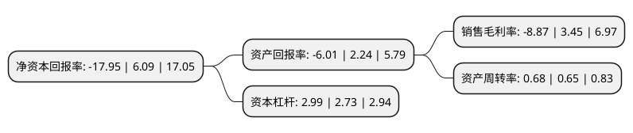

> 本页面由自动化程序生成于 2022年5月20日 01:19
> 内容可能存在错误，如有bug请提交issue至：https://github.com/Eroleice/doc-pi/issues
{.is-warning}

# 上市公司基本情况

## 基本资料

厦门弘信电子科技集团股份有限公司（以下简称“弘信电子”）成立于2003年09月08日，厦门市。于2017年05月23日在深交所创业板上市。

弘信电子注册资本44,505.308万元，主要产品:印制电路板(PCB)，PCB可分为刚性印制电路板，挠性印制电路板(FPC)和刚挠结合印制电路板。主营业务:FPC研发，设计，制造和销售。以下是详细信息：

- 公司名称: 厦门弘信电子科技集团股份有限公司
- 股票代码: 300657.SZ
- 所在地: 福建 - 厦门市
- 成立日期: 2003年09月08日
- 注册资本: 44,505.308万元
- 法定代表人: 李强
- 主营业务: 主要产品:印制电路板(PCB)，PCB可分为刚性印制电路板，挠性印制电路板(FPC)和刚挠结合印制电路板主营业务:FPC研发，设计，制造和销售
- 公司官网: www.hon-flex.com
- 公司介绍: 公司是专业从事FPC研发、设计、制造和销售的高新技术企业，经营范围包括新型仪表元器件、材料(挠性印制电路板)和其它电子产品的设计、生产和进出口、批发(不涉及国营贸易管理商品，涉及配额、许可证管理商品的，按国家有关规定办理申请)。公司自成立以来专注FPC产业，是FPC业界最具成长性的企业之一，已成为国内技术领先、实力雄厚、产量产值居前、综合实力位居一流水平的知名FPC制造企业。公司质量控制体系完备，已通过ISO9001质量管理体系、IATF16949汽车质量管理体系、QC080000(RoHS)有害物质管理体系、ISO14001环境管理体系、OHSAS18000职业健康安全管理体系等认证。

## 股东及高管情况

上市公司第一大股东为弘信创业工场投资集团股份有限公司，持股113,489,914股，占比25.5%，**疑似为**上市公司实际控制人。

截至2022年03月31日，上市公司的前十大股东中，共有6名自然人股东，1名机构股东，3个产品账户，其中5%以上大股东共有1名。上市公司前十大股东明细如下：

> 未能通过持股比例判定出上市公司实际控制人（持股30%以上）
> 可能存在通过间接持股、联合持股、协议控制等方式拥有实际控制权的主体，具体请参考上市公司定期公告！
{.is-warning}

> 截至2022年03月31日，上市公司前十大股东信息如下：

| 股东名称 | 持股数量（股） | 持股比例 |
| --- | --- | --- |
| 弘信创业工场投资集团股份有限公司 | 113,489,914 | 25.5% |
| 张洪 | 12,719,791 | 2.86% |
| 广发银行股份有限公司-国泰聚信价值优势灵活配置混合型证券投资基金 | 11,000,000 | 2.47% |
| 施玮 | 9,950,000 | 2.24% |
| 新余善思投资管理中心(有限合伙)-善思慧成玖号私募证券投资基金 | 9,799,448 | 2.2% |
| 李毅峰 | 9,039,658 | 2.03% |
| 李奎 | 8,724,297 | 1.96% |
| 邱葵 | 6,218,825 | 1.4% |
| 吴放 | 6,130,100 | 1.38% |
| 中国工商银行股份有限公司-诺安先锋混合型证券投资基金 | 5,055,416 | 1.14% |

## 利润表分析

上市公司2021年总收入为31.95亿元，净利润为-2.84亿元，**未实现盈利**。

## 杜邦分析

> 数据列示周期：2021年 | 2020年 | 2019年
{.is-info}

上市公司的净资产收益率在近一年有所下降，下降幅度为-394.75%，其变化情况分解如下：
- 上市公司的销售毛利率在近一年下降了-357.1%，可能是生产效率的下降、商品原材料价格上涨或商品价格的下跌所致。
- 上市公司的资产周转率在近一年上升了4.62%，可能是源自于更快的销售回款或库存管理效果提升。
- 上市公司的财务杠杆比率在近一年上升了9.52%，可能是增加负债扩大生产规模。

