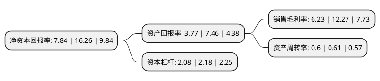

> 本页面由自动化程序生成于 2022年5月20日 01:19
> 内容可能存在错误，如有bug请提交issue至：https://github.com/Eroleice/doc-pi/issues
{.is-warning}

# 上市公司基本情况

## 基本资料

宁波江丰电子材料股份有限公司（以下简称“江丰电子”）成立于2005年04月14日，宁波市。于2017年06月15日在深交所创业板上市。

江丰电子注册资本23,140.451万元，主要产品:各种高纯溅射靶材，包括铝靶，钛靶，钽靶，钨钛靶等;主营业务:高纯溅射靶材的研发，生产和销售。以下是详细信息：

- 公司名称: 宁波江丰电子材料股份有限公司
- 股票代码: 300666.SZ
- 所在地: 浙江 - 宁波市
- 成立日期: 2005年04月14日
- 注册资本: 23,140.451万元
- 法定代表人: 姚力军
- 主营业务: 主要产品:各种高纯溅射靶材，包括铝靶，钛靶，钽靶，钨钛靶等;主营业务:高纯溅射靶材的研发，生产和销售
- 公司官网: www.kfmic.com
- 公司介绍: 公司自成立以来一直从事高纯溅射靶材的研发、生产和销售业务，主要产品为各种高纯溅射靶材，包括铝靶、钛靶、钽靶、钨钛靶等，这些产品主要应用于半导体(主要为超大规模集成电路领域)、平板显示、太阳能等领域。超高纯金属及溅射靶材是生产超大规模集成电路的关键材料之一，公司的超高纯金属溅射靶材产品已应用于世界著名半导体厂商的最先端制造工艺，在16纳米技术节点实现批量供货，同时还满足了国内厂商28纳米技术节点的量产需求。

## 股东及高管情况

上市公司第一大股东为姚力军，持股56,059,842股，占比24.2%，**疑似为**上市公司实际控制人。

截至2022年03月31日，上市公司的前十大股东中，共有3名自然人股东，5名机构股东，2个产品账户，其中5%以上大股东共有1名。上市公司前十大股东明细如下：

> 未能通过持股比例判定出上市公司实际控制人（持股30%以上）
> 可能存在通过间接持股、联合持股、协议控制等方式拥有实际控制权的主体，具体请参考上市公司定期公告！
{.is-warning}

> 截至2022年03月31日，上市公司前十大股东信息如下：

| 股东名称 | 持股数量（股） | 持股比例 |
| --- | --- | --- |
| 姚力军 | 56,059,842 | 24.2% |
| 宁波拜耳克管理咨询有限公司 | 11,487,303 | 4.96% |
| 上海智鼎博能投资合伙企业(有限合伙) | 8,340,641 | 3.6% |
| 宁波江阁实业投资合伙企业(有限合伙) | 5,508,099 | 2.38% |
| 宁波宏德实业投资合伙企业(有限合伙) | 5,508,076 | 2.38% |
| 谢立新 | 3,513,372 | 1.52% |
| 张辉阳 | 3,077,054 | 1.33% |
| 上海智兴博辉投资合伙企业(有限合伙) | 3,023,093 | 1.3% |
| 大家人寿保险股份有限公司-万能产品 | 2,980,026 | 1.29% |
| 大家人寿保险股份有限公司-传统产品 | 2,025,249 | 0.87% |

## 利润表分析

上市公司2021年总收入为15.93亿元，净利润为0.99亿元，实现盈利。

## 杜邦分析

> 数据列示周期：2021年 | 2020年 | 2019年
{.is-info}

上市公司的净资产收益率在近一年有所下降，下降幅度为-51.78%，其变化情况分解如下：
- 上市公司的销售毛利率在近一年下降了-49.23%，可能是生产效率的下降、商品原材料价格上涨或商品价格的下跌所致。
- 上市公司的资产周转率在近一年下降了-1.64%，可能是源自于更慢的销售回款或库存管理效果下降。
- 上市公司的财务杠杆比率在近一年下降了-4.59%，可能是减少负债降低财务费用。

