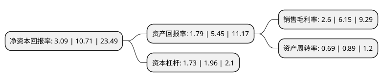

> 本页面由自动化程序生成于 2022年5月20日 01:19
> 内容可能存在错误，如有bug请提交issue至：https://github.com/Eroleice/doc-pi/issues
{.is-warning}

# 上市公司基本情况

## 基本资料

深圳市智动力精密技术股份有限公司（以下简称“智动力”）成立于2004年07月26日，深圳市。于2017年08月04日在深交所创业板上市。

智动力注册资本26,562.424万元，主要产品:防护保洁类，粘贴固定类，缓冲类，屏蔽类，散热类等内部功能性器件，以及防护引导类，标识类等外部功能性器件。主营业务:为智能手机，平板电脑，智能穿戴，智能家居等中高端消费电子产品及新能源汽车提供精密器件平台型一体化解决方案。以下是详细信息：

- 公司名称: 深圳市智动力精密技术股份有限公司
- 股票代码: 300686.SZ
- 所在地: 广东 - 深圳市
- 成立日期: 2004年07月26日
- 注册资本: 26,562.424万元
- 法定代表人: 刘炜
- 主营业务: 主要产品:防护保洁类，粘贴固定类，缓冲类，屏蔽类，散热类等内部功能性器件，以及防护引导类，标识类等外部功能性器件主营业务:为智能手机，平板电脑，智能穿戴，智能家居等中高端消费电子产品及新能源汽车提供精密器件平台型一体化解决方案
- 公司官网: www.szcdl.com
- 公司介绍: 公司致力于为智能手机、平板电脑、智能穿戴、智能家居等中高端消费电子产品及新能源汽车提供精密器件平台型一体化解决方案。公司产品系列包括：防护保洁类、粘贴固定类、缓冲类、屏蔽类、散热类等内部功能性器件，以及防护引导类、标识类等外部功能性器件。内部功能性器件主要是玻璃盖板背面保护膜、摄像头内部保护膜、摄像头泡棉、镜片泡棉、听筒及喇叭防尘网、线路绝缘片、电池散热膜、处理器散热膜等产品；外部功能性器件主要是镜片保护膜、摄像头保护膜、电池盖保护膜、屏幕防爆膜、电池标签、功能铭牌、防伪标签等产品。公司具备较强的生产能力，能够快速组织各种种类、规模、尺寸的消费电子功能性器件的生产；公司响应速度快，能为客户提供从前期方案设计到批量生产的一站式服务；公司建立了完整的质量控制体系，先后通过了ISO9001:2008、ISO/TS16949:2009质量管理体系认证、ISO14001:2004环境管理体系认证，以及OHSAS18001:2007职业健康安全管理体系要求认证。

## 股东及高管情况

上市公司第一大股东为吴加维，持股47,879,986股，占比18.03%，**疑似为**上市公司实际控制人。

截至2022年03月31日，上市公司的前十大股东中，共有3名自然人股东，4名机构股东，3个产品账户，其中5%以上大股东共有2名。上市公司前十大股东明细如下：

> 未能通过持股比例判定出上市公司实际控制人（持股30%以上）
> 可能存在通过间接持股、联合持股、协议控制等方式拥有实际控制权的主体，具体请参考上市公司定期公告！
{.is-warning}

> 截至2022年03月31日，上市公司前十大股东信息如下：

| 股东名称 | 持股数量（股） | 持股比例 |
| --- | --- | --- |
| 吴加维 | 47,879,986 | 18.03% |
| 陈奕纯 | 41,006,355 | 15.44% |
| 广东恒阔投资管理有限公司 | 13,234,196 | 4.98% |
| 深圳市远致富海投资管理有限公司-深圳远致富海并购股权投资基金合伙企业(有限合伙) | 11,370,096 | 4.28% |
| 深圳市远致瑞信股权投资管理有限公司-深圳市远致瑞信混改股权投资基金合伙企业(有限合伙) | 10,430,520 | 3.93% |
| 铜陵大江投资控股有限公司 | 5,685,048 | 2.14% |
| 中国华融资产管理股份有限公司 | 5,685,048 | 2.14% |
| 周桂克 | 3,608,697 | 1.36% |
| 云南智轩明企业管理有限公司 | 2,947,625 | 1.11% |
| 深圳市远致瑞信股权投资管理有限公司-深圳市东方远致平稳发展私募股权投资基金合伙企业(有限合伙) | 2,842,524 | 1.07% |

## 利润表分析

上市公司2021年总收入为21.66亿元，净利润为0.56亿元，实现盈利。

## 杜邦分析

> 数据列示周期：2021年 | 2020年 | 2019年
{.is-info}

上市公司的净资产收益率在近一年有所下降，下降幅度为-71.15%，其变化情况分解如下：
- 上市公司的销售毛利率在近一年下降了-57.72%，可能是生产效率的下降、商品原材料价格上涨或商品价格的下跌所致。
- 上市公司的资产周转率在近一年下降了-22.47%，可能是源自于更慢的销售回款或库存管理效果下降。
- 上市公司的财务杠杆比率在近一年下降了-11.73%，可能是减少负债降低财务费用。

