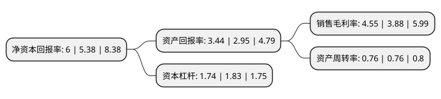

> 本页面由自动化程序生成于 2022年5月20日 01:19
> 内容可能存在错误，如有bug请提交issue至：https://github.com/Eroleice/doc-pi/issues
{.is-warning}

# 上市公司基本情况

## 基本资料

中山联合光电科技股份有限公司（以下简称“联合光电”）成立于2005年08月18日，中山市。于2017年08月11日在深交所创业板上市。

联合光电注册资本26,606.375万元，主要产品:高端光学镜头。主营业务:高端光学镜头产品及解决方案。以下是详细信息：

- 公司名称: 中山联合光电科技股份有限公司
- 股票代码: 300691.SZ
- 所在地: 广东 - 中山市
- 成立日期: 2005年08月18日
- 注册资本: 26,606.375万元
- 法定代表人: 龚俊强
- 主营业务: 主要产品:高端光学镜头主营业务:高端光学镜头产品及解决方案
- 公司官网: www.union-optech.com
- 公司介绍: 公司是一家专注于光学、光电产品研发和生产的公司，经过持续多年的科技创新和研发投入，形成了集光学镜头设计开发、精密制造、销售与技术服务为一体的独立、完整业务体系。产品广泛应用于安防视频监控摄像机、手机、车载成像系统、视讯会议、数码相机/摄像机、智能家居、运动DV、航拍无人机、虚拟现实VR、激光投影产品等。公司能够快速的为客户提供个性化的光学产品设计(ODM)及综合解决方案，产品应用于手机摄像模组，数位相机，摄像机，车载摄像系统，安全监控等领域。

## 股东及高管情况

上市公司第一大股东为龚俊强，持股63,397,349股，占比23.83%，**疑似为**上市公司实际控制人。

截至2022年03月31日，上市公司的前十大股东中，共有6名自然人股东，3名机构股东，1个产品账户，其中5%以上大股东共有4名。上市公司前十大股东明细如下：

> 未能通过持股比例判定出上市公司实际控制人（持股30%以上）
> 可能存在通过间接持股、联合持股、协议控制等方式拥有实际控制权的主体，具体请参考上市公司定期公告！
{.is-warning}

> 截至2022年03月31日，上市公司前十大股东信息如下：

| 股东名称 | 持股数量（股） | 持股比例 |
| --- | --- | --- |
| 龚俊强 | 63,397,349 | 23.83% |
| 光博投资有限公司 | 20,158,592 | 7.58% |
| 邱盛平 | 16,544,256 | 6.22% |
| 正安县中联光企业管理合伙企业(有限合伙) | 15,315,456 | 5.76% |
| 肖明志 | 11,788,800 | 4.43% |
| 君联和盛(上海)股权投资基金合伙企业(有限合伙) | 7,510,312 | 2.82% |
| 蔡宾 | 4,876,588 | 1.83% |
| 谢晋国 | 4,858,278 | 1.83% |
| 张新龙 | 3,420,734 | 1.29% |
| 俊佳科技有限公司 | 2,302,916 | 0.87% |

## 利润表分析

上市公司2021年总收入为16.35亿元，净利润为0.74亿元，实现盈利。

## 杜邦分析

> 数据列示周期：2021年 | 2020年 | 2019年
{.is-info}

上市公司的净资产收益率在近一年有所上升，上升幅度为11.52%，其变化情况分解如下：
- 上市公司的销售毛利率在近一年上升了17.27%，可能是生产效率的提升、商品原材料价格下跌或商品价格的上涨所致。
- 上市公司的资产周转率在近一年下降了0%，可能是源自于更慢的销售回款或库存管理效果下降。
- 上市公司的财务杠杆比率在近一年下降了-4.92%，可能是减少负债降低财务费用。

