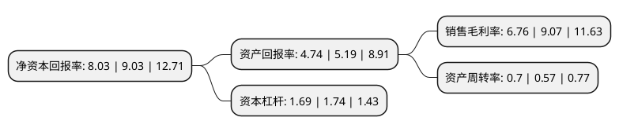

> 本页面由自动化程序生成于 2022年5月20日 01:19
> 内容可能存在错误，如有bug请提交issue至：https://github.com/Eroleice/doc-pi/issues
{.is-warning}

# 上市公司基本情况

## 基本资料

江苏精研科技股份有限公司（以下简称“精研科技”）成立于2004年11月29日，常州市。于2017年10月19日在深交所创业板上市。

精研科技注册资本15,519.322万元，主要产品:连接器接口，卡托，摄像头支架，摄像头装饰圈，手机结构件，汽车零部件等。主营业务:为智能手机，可穿戴设备，笔记本及平板计算机等消费电子领域和汽车领域大批量提供高复杂度，高精度，高强度，外观精美的定制化MIM核心零部件产品。以下是详细信息：

- 公司名称: 江苏精研科技股份有限公司
- 股票代码: 300709.SZ
- 所在地: 江苏 - 常州市
- 成立日期: 2004年11月29日
- 注册资本: 15,519.322万元
- 法定代表人: 王明喜
- 主营业务: 主要产品:连接器接口，卡托，摄像头支架，摄像头装饰圈，手机结构件，汽车零部件等主营业务:为智能手机，可穿戴设备，笔记本及平板计算机等消费电子领域和汽车领域大批量提供高复杂度，高精度，高强度，外观精美的定制化MIM核心零部件产品
- 公司官网: www.jsgian.com
- 公司介绍: 公司主要为智能手机、可穿戴设备、笔记本及平板电脑等消费电子领域和汽车领域大批量提供高复杂度、高精度、高强度、外观精美的定制化MIM核心零部件产品，产品涵盖了诸如手机卡托、摄像头装饰圈、按键、穿戴设备表壳、表扣、笔记本散热风扇、汽车零部件等多个细分门类。公司一直将技术创新作为业务发展的持续动力，现已被认定为“高新技术企业”、“国家火炬计划高新技术企业”、“常州市粉末注射成型工程技术研究中心”及“常州市企业技术中心”，并担任“江苏省钛合金粉末注射成型技术工程中心”的承建单位。

## 股东及高管情况

上市公司第一大股东为王明喜，持股30,134,333股，占比19.42%，**疑似为**上市公司实际控制人。

截至2022年03月31日，上市公司的前十大股东中，共有4名自然人股东，1名机构股东，4个产品账户，1个海外主体，其中5%以上大股东共有1名。上市公司前十大股东明细如下：

> 未能通过持股比例判定出上市公司实际控制人（持股30%以上）
> 可能存在通过间接持股、联合持股、协议控制等方式拥有实际控制权的主体，具体请参考上市公司定期公告！
{.is-warning}

> 截至2022年03月31日，上市公司前十大股东信息如下：

| 股东名称 | 持股数量（股） | 持股比例 |
| --- | --- | --- |
| 王明喜 | 30,134,333 | 19.42% |
| 黄逸超 | 7,592,270 | 4.89% |
| 常州创研投资咨询有限公司 | 7,411,620 | 4.78% |
| 邬均文 | 3,659,635 | 2.36% |
| 中国建设银行股份有限公司-景顺长城环保优势股票型证券投资基金 | 2,844,380 | 1.83% |
| 珠海阿巴马资产管理有限公司-阿巴马元享红利5号私募证券投资基金 | 2,799,600 | 1.8% |
| 上海一村投资管理有限公司-一村基石6号私募证券投资基金 | 2,496,000 | 1.61% |
| 中国银行股份有限公司-景顺长城优选混合型证券投资基金 | 2,341,837 | 1.51% |
| UBS AG | 2,241,381 | 1.44% |
| 钱叶军 | 2,061,666 | 1.33% |

## 利润表分析

上市公司2021年总收入为24.04亿元，净利润为1.62亿元，实现盈利。

## 杜邦分析

> 数据列示周期：2021年 | 2020年 | 2019年
{.is-info}

上市公司的净资产收益率在近一年有所下降，下降幅度为-11.07%，其变化情况分解如下：
- 上市公司的销售毛利率在近一年下降了-25.47%，可能是生产效率的下降、商品原材料价格上涨或商品价格的下跌所致。
- 上市公司的资产周转率在近一年上升了22.81%，可能是源自于更快的销售回款或库存管理效果提升。
- 上市公司的财务杠杆比率在近一年下降了-2.87%，可能是减少负债降低财务费用。

