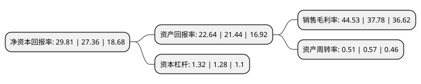

> 本页面由自动化程序生成于 2022年5月20日 01:20
> 内容可能存在错误，如有bug请提交issue至：https://github.com/Eroleice/doc-pi/issues
{.is-warning}

# 上市公司基本情况

## 基本资料

株洲宏达电子股份有限公司（以下简称“宏达电子”）成立于1993年11月18日，株洲市。于2017年11月21日在深交所创业板上市。

宏达电子注册资本41,183.985万元，主要产品:陶瓷电容器，功率电感，薄膜电容器，电阻，单片电容，微波组件，环形器与隔离器，电源模块，电源管理芯片，板卡等。主营业务:钽电容器等军用电子元器件的研发，生产，销售及相关服务。以下是详细信息：

- 公司名称: 株洲宏达电子股份有限公司
- 股票代码: 300726.SZ
- 所在地: 湖南 - 株洲市
- 成立日期: 1993年11月18日
- 注册资本: 41,183.985万元
- 法定代表人: 钟若农
- 主营业务: 主要产品:陶瓷电容器，功率电感，薄膜电容器，电阻，单片电容，微波组件，环形器与隔离器，电源模块，电源管理芯片，板卡等主营业务:钽电容器等军用电子元器件的研发，生产，销售及相关服务
- 公司官网: www.hongdacap.com.cn
- 公司介绍: 公司是总装备部军用电子元器件配套定点研制生产军用钽电解电容器的专业厂家，属工信部国防科工局管理。公司拥有30多年的生产钽电解电容器的经验和历史，有五条成熟的、先进的钽电解电容器生产线及两个较大规模的生产基地，拥有从美国、日本、韩国以及欧盟引进的先进生产线设备。公司的钽电解电容器生产工艺先进、技术力量雄厚，设备精良，拥有国内一流的新品研发能力，拥有完善的质量检测体系和完整的钽电解电容器环境试验、例行试验手段。公司以质量为生命，追求高标准、零缺陷，在长期的研制生产过程中，同国内外先进企业和高等院校有着广泛的合作。公司是以电容器为主导产品，集研发、生产、销售、服务为一体的高技术企业，以钽电解电容器品种全、质量好、信誉高和服务优而享誉国内外市场。公司通过了质量管理体系认证，不断加强技术创新和质量管理工作，持续改进和提升质量水平。随着公司产品不断进入军工配套领域，公司非固体电解质钽电容器生产线、片式固体电解质钽电容器生产线、固体电解质钽电容器生产线贯彻国军标，产品列入了相关军用电子元器件合格产品目录(QPL)。

## 股东及高管情况

上市公司第一大股东为曾琛，持股140,800,000股，占比34.19%，为上市公司实际控制人。

截至2022年03月31日，上市公司的前十大股东中，共有3名自然人股东，2名机构股东，4个产品账户，1个海外主体，其中5%以上大股东共有3名。上市公司前十大股东明细如下：

> 截至2022年03月31日，上市公司前十大股东信息如下：

| 股东名称 | 持股数量（股） | 持股比例 |
| --- | --- | --- |
| 曾琛 | 140,800,000 | 34.19% |
| 钟若农 | 122,401,896 | 29.72% |
| 曾继疆 | 20,798,104 | 5.05% |
| 香港中央结算有限公司(陆股通) | 6,539,931 | 1.59% |
| 天津宏湘资产管理合伙企业(有限合伙) | 3,836,800 | 0.93% |
| 兴业银行股份有限公司-博时汇兴回报一年持有期灵活配置混合型证券投资基金 | 3,508,909 | 0.85% |
| 国家军民融合产业投资基金有限责任公司 | 3,404,555 | 0.83% |
| 株洲宏明股权投资管理合伙企业(有限合伙) | 2,373,999 | 0.58% |
| 上海浦东发展银行股份有限公司-华夏创新未来18个月封闭运作混合型证券投资基金 | 2,266,027 | 0.55% |
| 中国建设银行股份有限公司-国泰中证军工交易型开放式指数证券投资基金 | 1,959,633 | 0.48% |

## 利润表分析

上市公司2021年总收入为20亿元，净利润为8.9亿元，实现盈利。

## 杜邦分析

> 数据列示周期：2021年 | 2020年 | 2019年
{.is-info}

上市公司的净资产收益率在近一年有所上升，上升幅度为8.95%，其变化情况分解如下：
- 上市公司的销售毛利率在近一年上升了17.87%，可能是生产效率的提升、商品原材料价格下跌或商品价格的上涨所致。
- 上市公司的资产周转率在近一年下降了-10.53%，可能是源自于更慢的销售回款或库存管理效果下降。
- 上市公司的财务杠杆比率在近一年上升了3.13%，可能是增加负债扩大生产规模。

