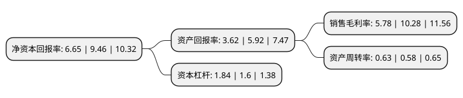

> 本页面由自动化程序生成于 2022年5月20日 01:20
> 内容可能存在错误，如有bug请提交issue至：https://github.com/Eroleice/doc-pi/issues
{.is-warning}

# 上市公司基本情况

## 基本资料

深圳明阳电路科技股份有限公司（以下简称“明阳电路”）成立于2001年07月31日，深圳市。于2018年02月01日在深交所创业板上市。

明阳电路注册资本29,475.813万元，主营业务为印制电路板(PCB)研发，生产和销售，拥有PCB全制程的生产能力，产品以小批量PCB为主。以下是详细信息：

- 公司名称: 深圳明阳电路科技股份有限公司
- 股票代码: 300739.SZ
- 所在地: 广东 - 深圳市
- 成立日期: 2001年07月31日
- 注册资本: 29,475.813万元
- 法定代表人: 张佩珂
- 主营业务: 主营业务为印制电路板(PCB)研发，生产和销售，拥有PCB全制程的生产能力，产品以小批量PCB为主
- 公司官网: www.sunshinepcb.com
- 公司介绍: 公司致力于印制线路板的研发与制作，逐步形成了“小批量、多品种、高技术”的市场路线，在小批量、高多层线路板领域处于国内领先地位。公司产品类型多样，覆盖单层版、多层板、高层板、HDI板、刚挠结合版、背板、厚铜板、立体板、特殊材料版(金属基板、高频材料板、PI材料)等，广泛应用在工业控制、机床、医疗设备、交通设备(汽车、轨道交通)、4G通信等行业，能满足客户的各种定制化需求。公司坚持“多品种、小批量、高技术”的企业定位，秉承“以最小的资源消耗，为电子科技的持续发展提供高技术和高可靠性的线路板和服务”的理念。

## 股东及高管情况

上市公司第一大股东为广西润之玺企业管理有限公司，持股163,871,263股，占比55.6%，为上市公司实际控制人。

截至2022年03月31日，上市公司的前十大股东中，共有5名自然人股东，5名机构股东，其中5%以上大股东共有1名。上市公司前十大股东明细如下：

> 截至2022年03月31日，上市公司前十大股东信息如下：

| 股东名称 | 持股数量（股） | 持股比例 |
| --- | --- | --- |
| 广西润之玺企业管理有限公司 | 163,871,263 | 55.6% |
| 云南盛健企业管理中心(有限合伙) | 12,498,411 | 4.24% |
| 寻乌县圣高盈企业管理有限公司 | 11,919,850 | 4.04% |
| 孙文兵 | 5,690,000 | 1.93% |
| 北流市利运得企业管理有限公司 | 3,307,720 | 1.12% |
| 云南健玺企业管理中心(有限合伙) | 1,804,857 | 0.61% |
| 蒋力珍 | 701,600 | 0.24% |
| 冯梅 | 685,600 | 0.23% |
| 陈达超 | 622,205 | 0.21% |
| 刘政达 | 548,000 | 0.19% |

## 利润表分析

上市公司2021年总收入为18.54亿元，净利润为1.07亿元，实现盈利。

## 杜邦分析

> 数据列示周期：2021年 | 2020年 | 2019年
{.is-info}

上市公司的净资产收益率在近一年有所下降，下降幅度为-29.7%，其变化情况分解如下：
- 上市公司的销售毛利率在近一年下降了-43.77%，可能是生产效率的下降、商品原材料价格上涨或商品价格的下跌所致。
- 上市公司的资产周转率在近一年上升了8.62%，可能是源自于更快的销售回款或库存管理效果提升。
- 上市公司的财务杠杆比率在近一年上升了15%，可能是增加负债扩大生产规模。

