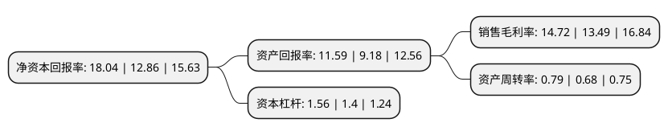

> 本页面由自动化程序生成于 2022年5月20日 01:20
> 内容可能存在错误，如有bug请提交issue至：https://github.com/Eroleice/doc-pi/issues
{.is-warning}

# 上市公司基本情况

## 基本资料

武汉锐科光纤激光技术股份有限公司（以下简称“锐科激光”）成立于2007年04月06日，武汉市。于2018年06月25日在深交所创业板上市。

锐科激光注册资本43,602.35万元，主要产品:10W至200W的脉冲光纤激光器;10W至12，000W的连续光纤激光器;75W至450W准连续光纤激光器;80W至3，000W直接半导体激光器。主营业务:为激光制造装备集成商提供各类光纤激光器产品和应用解决方案，并为客户提供技术研发服务和定制化产品。以下是详细信息：

- 公司名称: 武汉锐科光纤激光技术股份有限公司
- 股票代码: 300747.SZ
- 所在地: 湖北 - 武汉市
- 成立日期: 2007年04月06日
- 注册资本: 43,602.35万元
- 法定代表人: 伍晓峰
- 主营业务: 主要产品:10W至200W的脉冲光纤激光器;10W至12，000W的连续光纤激光器;75W至450W准连续光纤激光器;80W至3，000W直接半导体激光器主营业务:为激光制造装备集成商提供各类光纤激光器产品和应用解决方案，并为客户提供技术研发服务和定制化产品
- 公司官网: www.raycuslaser.com
- 公司介绍: 公司是一家专业从事光纤激光器及其关键器件与材料的研发、生产和销售的国家火炬计划重点高新技术企业，拥有高功率光纤激光器国家重点领域创新团队和光纤激光器技术国家地方联合工程研究中心，是全球有影响力的具有从材料、器件到整机垂直集成能力的光纤激光器研发、生产和服务供应商。公司主营业务包括为激光制造装备集成商提供各类光纤激光器产品和应用解决方案，并为客户提供技术研发服务和定制化产品。经过多年的自主研发和创新，公司开发出一系列拥有自主知识产权的专利技术，目前拥有专利108项，其中境内发明专利24项，境内实用新型专利68项，境内外观设计专利15项，境外专利1项，软件著作权7项。

## 股东及高管情况

上市公司第一大股东为中国航天三江集团有限公司，持股146,873,548股，占比33.68%，为上市公司实际控制人。

截至2022年03月31日，上市公司的前十大股东中，共有5名自然人股东，2名机构股东，2个产品账户，1个海外主体，其中5%以上大股东共有2名。上市公司前十大股东明细如下：

> 截至2022年03月31日，上市公司前十大股东信息如下：

| 股东名称 | 持股数量（股） | 持股比例 |
| --- | --- | --- |
| 中国航天三江集团有限公司 | 146,873,548 | 33.68% |
| 闫大鹏 | 39,222,526 | 9% |
| 香港中央结算有限公司(陆股通) | 20,592,361 | 4.72% |
| 江苏新恒通投资集团有限公司 | 15,354,311 | 3.52% |
| 卢昆忠 | 14,643,589 | 3.36% |
| 李成 | 12,232,420 | 2.81% |
| 王克寒 | 9,855,658 | 2.26% |
| 兴业银行股份有限公司-工银瑞信文体产业股票型证券投资基金 | 9,000,019 | 2.06% |
| 招商银行股份有限公司-工银瑞信圆兴混合型证券投资基金 | 6,300,014 | 1.44% |
| 闫长鹍 | 5,726,154 | 1.31% |

## 利润表分析

上市公司2021年总收入为34.09亿元，净利润为5.02亿元，实现盈利。

## 杜邦分析

> 数据列示周期：2021年 | 2020年 | 2019年
{.is-info}

上市公司的净资产收益率在近一年有所上升，上升幅度为40.28%，其变化情况分解如下：
- 上市公司的销售毛利率在近一年上升了9.12%，可能是生产效率的提升、商品原材料价格下跌或商品价格的上涨所致。
- 上市公司的资产周转率在近一年上升了16.18%，可能是源自于更快的销售回款或库存管理效果提升。
- 上市公司的财务杠杆比率在近一年上升了11.43%，可能是增加负债扩大生产规模。

