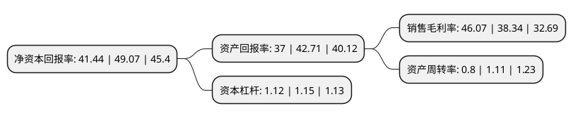

> 本页面由自动化程序生成于 2022年5月20日 01:20
> 内容可能存在错误，如有bug请提交issue至：https://github.com/Eroleice/doc-pi/issues
{.is-warning}

# 上市公司基本情况

## 基本资料

江苏卓胜微电子股份有限公司（以下简称“卓胜微”）成立于2012年08月10日，无锡市。于2019年06月18日在深交所创业板上市。

卓胜微注册资本33,359.084万元，射频前端芯片的研究，开发与销售，主要向市场提供射频开关，射频低噪声放大器等射频前端芯片产品，并提供IP授权，应用于智能手机等移动智能终端。以下是详细信息：

- 公司名称: 江苏卓胜微电子股份有限公司
- 股票代码: 300782.SZ
- 所在地: 江苏 - 无锡市
- 成立日期: 2012年08月10日
- 注册资本: 33,359.084万元
- 法定代表人: 许志翰
- 主营业务: 射频前端芯片的研究，开发与销售，主要向市场提供射频开关，射频低噪声放大器等射频前端芯片产品，并提供IP授权，应用于智能手机等移动智能终端
- 公司官网: www.maxscend.com
- 公司介绍: 公司由硅谷留学人员创办于张江高科技园区，在知名风险投资红杉资本和盈富泰克的支持下，已迅速成长为一家在射频器件及无线连接专业方向上具有顶尖的技术实力和不凡市场竞争力的芯片设计公司。公司专注于移动互联领域，致力于开发无线通信的射频，射频与数字soc芯片产品，并为客户提供基于公司芯片的完整软硬件解决方案。经过8年多的研发积累，公司已拥有丰富的产品线，在行业内树立了领先的地位，销售方面亦已快速扩张，目前的产品已经得到诸如三星、华为、联想、展讯等***客户的采用。目前，公司已成为国内领先的射频器件及无线连接领域的专家，曾经推出或现有的产品线，如cmmb项目产品mxd0265、硅调谐器产品mxd1516、gps低噪放大器芯片mxdln16g及lte switch芯片mxd8650等。

## 股东及高管情况

上市公司第一大股东为无锡汇智联合投资企业(有限合伙)，持股42,680,594股，占比12.79%，**疑似为**上市公司实际控制人。

截至2022年03月31日，上市公司的前十大股东中，共有3名自然人股东，3名机构股东，1个产品账户，3个海外主体，其中5%以上大股东共有5名。上市公司前十大股东明细如下：

> 未能通过持股比例判定出上市公司实际控制人（持股30%以上）
> 可能存在通过间接持股、联合持股、协议控制等方式拥有实际控制权的主体，具体请参考上市公司定期公告！
{.is-warning}

> 截至2022年03月31日，上市公司前十大股东信息如下：

| 股东名称 | 持股数量（股） | 持股比例 |
| --- | --- | --- |
| 无锡汇智联合投资企业(有限合伙) | 42,680,594 | 12.79% |
| FENG CHENHUI(冯晨晖) | 26,244,635 | 7.87% |
| TANG ZHUANG(唐壮) | 25,574,551 | 7.67% |
| 许志翰 | 22,733,156 | 6.81% |
| 姚立生 | 19,948,714 | 5.98% |
| 天津浔渡创业投资合伙企业(有限合伙) | 15,125,927 | 4.53% |
| 南通金信灏嘉投资中心(有限合伙) | 14,860,894 | 4.45% |
| 香港中央结算有限公司(陆股通) | 14,068,884 | 4.22% |
| 中国工商银行股份有限公司-诺安成长混合型证券投资基金 | 9,500,404 | 2.85% |
| 陈皞玥 | 3,821,349 | 1.15% |

## 利润表分析

上市公司2021年总收入为46.33亿元，净利润为21.34亿元，实现盈利。

## 杜邦分析

> 数据列示周期：2021年 | 2020年 | 2019年
{.is-info}

上市公司的净资产收益率在近一年有所下降，下降幅度为-15.55%，其变化情况分解如下：
- 上市公司的销售毛利率在近一年上升了20.16%，可能是生产效率的提升、商品原材料价格下跌或商品价格的上涨所致。
- 上市公司的资产周转率在近一年下降了-27.93%，可能是源自于更慢的销售回款或库存管理效果下降。
- 上市公司的财务杠杆比率在近一年下降了-2.61%，可能是减少负债降低财务费用。

