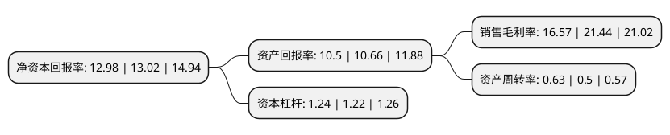

> 本页面由自动化程序生成于 2022年5月20日 01:20
> 内容可能存在错误，如有bug请提交issue至：https://github.com/Eroleice/doc-pi/issues
{.is-warning}

# 上市公司基本情况

## 基本资料

深圳市铂科新材料股份有限公司（以下简称“铂科新材”）成立于2009年09月17日，深圳市。于2019年12月30日在深交所创业板上市。

铂科新材注册资本10,368万元，主营业务:合金软磁粉，合金软磁粉芯及相关电感元件产品的研发，生产和销售，为下游用户电力电子设备或系统实现高效稳定，节能环保运行提供高性能软磁材料，模块化电感以及整体解决方案，主要产品包括合金软磁粉(制造合金软磁粉芯的核心材料)，合金软磁粉芯(电感元件的核心部件)，电感元件等。以下是详细信息：

- 公司名称: 深圳市铂科新材料股份有限公司
- 股票代码: 300811.SZ
- 所在地: 广东 - 深圳市
- 成立日期: 2009年09月17日
- 注册资本: 10,368万元
- 法定代表人: 杜江华
- 主营业务: 主营业务:合金软磁粉，合金软磁粉芯及相关电感元件产品的研发，生产和销售，为下游用户电力电子设备或系统实现高效稳定，节能环保运行提供高性能软磁材料，模块化电感以及整体解决方案，主要产品包括合金软磁粉(制造合金软磁粉芯的核心材料)，合金软磁粉芯(电感元件的核心部件)，电感元件等
- 公司官网: www.pocomagnetic.com
- 公司介绍: 本公司是由铂科有限于2015年9月6日依法整体变更设立的股份有限公司。公司是经认定的国家级高新技术企业，自设立以来一直从事合金软磁粉、合金软磁粉芯及相关电感元件产品的研发、生产和销售，为下游用户电力电子设备或系统实现高效稳定、节能环保运行提供高性能软磁材料、模块化电感以及整体解决方案，主要产品包括合金软磁粉(制造合金软磁粉芯的核心材料)、合金软磁粉芯(电感元件的核心部件)、电感元件等。公司于2004年在中国开始粉体的研发试验，并在2007年成功开发出铁硅气雾化粉末。公司完全掌握了铁硅、铁硅铝从粉体研发制造，粉体绝缘到粉体成型的整个金属磁粉芯的完整供应体系、核心技术及所有知识产权。提供从粉芯的生产、销售、解决方案的设计、特种电感器件的供应。

## 股东及高管情况

上市公司第一大股东为深圳市摩码新材料投资有限公司，持股28,899,873股，占比27.87%，**疑似为**上市公司实际控制人。

截至2022年03月31日，上市公司的前十大股东中，共有5名自然人股东，4名机构股东，1个产品账户，其中5%以上大股东共有4名。上市公司前十大股东明细如下：

> 未能通过持股比例判定出上市公司实际控制人（持股30%以上）
> 可能存在通过间接持股、联合持股、协议控制等方式拥有实际控制权的主体，具体请参考上市公司定期公告！
{.is-warning}

> 截至2022年03月31日，上市公司前十大股东信息如下：

| 股东名称 | 持股数量（股） | 持股比例 |
| --- | --- | --- |
| 深圳市摩码新材料投资有限公司 | 28,899,873 | 27.87% |
| 郭雄志 | 13,924,494 | 13.43% |
| 罗志敏 | 7,487,692 | 7.22% |
| 阮佳林 | 7,487,692 | 7.22% |
| 广发乾和投资有限公司 | 3,148,287 | 3.04% |
| 杜江华 | 2,627,242 | 2.53% |
| 陈崇贤 | 2,388,745 | 2.3% |
| 深圳市铂科天成投资管理企业(有限合伙) | 1,986,588 | 1.92% |
| 中国太平洋人寿保险股份有限公司-传统-普通保险产品 | 1,552,640 | 1.5% |
| 中国太平洋人寿保险股份有限公司-分红-个人分红 | 1,040,060 | 1% |

## 利润表分析

上市公司2021年总收入为7.25亿元，净利润为1.2亿元，实现盈利。

## 杜邦分析

> 数据列示周期：2021年 | 2020年 | 2019年
{.is-info}

上市公司的净资产收益率在近一年有所下降，下降幅度为-0.31%，其变化情况分解如下：
- 上市公司的销售毛利率在近一年下降了-22.71%，可能是生产效率的下降、商品原材料价格上涨或商品价格的下跌所致。
- 上市公司的资产周转率在近一年上升了26%，可能是源自于更快的销售回款或库存管理效果提升。
- 上市公司的财务杠杆比率在近一年上升了1.64%，可能是增加负债扩大生产规模。

