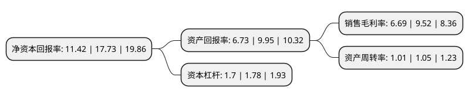

> 本页面由自动化程序生成于 2022年5月20日 01:20
> 内容可能存在错误，如有bug请提交issue至：https://github.com/Eroleice/doc-pi/issues
{.is-warning}

# 上市公司基本情况

## 基本资料

深圳中富电路股份有限公司（以下简称“中富电路”）成立于2004年03月12日，深圳市。于2021年08月12日在深交所创业板上市。

中富电路注册资本17,579.6万元，专业从事印制电路板研发，生产和销售，主要为电子信息制造业各细分领域主流客户提供定制化的PCB产品以下是详细信息：

- 公司名称: 深圳中富电路股份有限公司
- 股票代码: 300814.SZ
- 所在地: 广东 - 深圳市
- 成立日期: 2004年03月12日
- 注册资本: 17,579.6万元
- 法定代表人: 王昌民
- 主营业务: 专业从事印制电路板研发，生产和销售，主要为电子信息制造业各细分领域主流客户提供定制化的PCB产品
- 公司官网: www.jovepcb.com
- 公司介绍: 公司是一家专业从事印制电路板(Printed Circuit Board，简称PCB)研发、生产和销售的高新技术企业。印制电路板的主要功能是使各种电子元件形成预定电路的连接，起到信号传输、电源供给等重要作用。公司生产的PCB产品包括单面板、双面板和多层板等。公司主要为电子信息制造业各细分领域主流客户提供定制化的PCB产品，主要应用于通信、工业控制、消费电子、汽车电子及医疗电子等领域。公司凭借技术逐步积累和与客户的长期合作，在细分产品领域拥有了较为稳定的客户资源，与华为、Vertiv、NCAB、Asteelflash、LACROIX、LENZE、三星、中兴通讯、施耐德、理邦医疗等国内外知名企业保持了良好的合作关系，其中华为、Vertiv、NCAB、Asteelflash、LENZE等主要客户与公司形成了长期深入的合作伙伴关系。目前，公司产品已出口到欧洲、亚洲、美洲等国家和地区。根据中国电子信息产业联合会同中国电子电路行业协会(CPCA)联合发布的《第十九届(2019)中国电子电路行业排行榜》，公司在2019年中国PCB行业排名第46位。

## 股东及高管情况

上市公司第一大股东为中富电子有限公司，持股54,500,000股，占比31%，为上市公司实际控制人。

截至2022年03月31日，上市公司的前十大股东中，共有2名自然人股东，8名机构股东，其中5%以上大股东共有4名。上市公司前十大股东明细如下：

> 截至2022年03月31日，上市公司前十大股东信息如下：

| 股东名称 | 持股数量（股） | 持股比例 |
| --- | --- | --- |
| 中富电子有限公司 | 54,500,000 | 31% |
| 深圳市睿山科技有限公司 | 29,539,200 | 16.8% |
| 香港慧金投资有限公司 | 21,967,000 | 12.5% |
| 深圳市泓锋投资有限公司 | 18,493,800 | 10.52% |
| 深圳市聚中盛实业投资合伙企业(有限合伙) | 3,270,000 | 1.86% |
| 深圳市聚中利实业投资合伙企业(有限合伙) | 2,700,000 | 1.54% |
| 深圳市聚中成实业投资合伙企业(有限合伙) | 866,000 | 0.49% |
| 深圳市中富兴业电子有限公司 | 500,000 | 0.28% |
| 吴畅 | 493,500 | 0.28% |
| 陈建奇 | 356,900 | 0.2% |

## 利润表分析

上市公司2021年总收入为14.4亿元，净利润为0.96亿元，实现盈利。

## 杜邦分析

> 数据列示周期：2021年 | 2020年 | 2019年
{.is-info}

上市公司的净资产收益率在近一年有所下降，下降幅度为-35.59%，其变化情况分解如下：
- 上市公司的销售毛利率在近一年下降了-29.73%，可能是生产效率的下降、商品原材料价格上涨或商品价格的下跌所致。
- 上市公司的资产周转率在近一年下降了-3.81%，可能是源自于更慢的销售回款或库存管理效果下降。
- 上市公司的财务杠杆比率在近一年下降了-4.49%，可能是减少负债降低财务费用。

