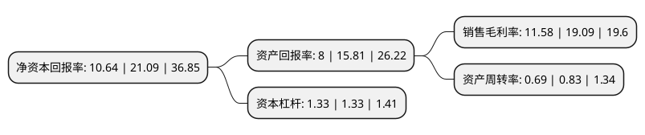

> 本页面由自动化程序生成于 2022年5月20日 01:20
> 内容可能存在错误，如有bug请提交issue至：https://github.com/Eroleice/doc-pi/issues
{.is-warning}

# 上市公司基本情况

## 基本资料

深圳贝仕达克技术股份有限公司（以下简称“贝仕达克”）成立于2010年05月14日，深圳市。于2020年03月13日在深交所创业板上市。

贝仕达克注册资本16,000.5万元，主营业务为智能控制器及智能产品的研发，生产和销售。主要产品包括智能照明，智能安防等。以下是详细信息：

- 公司名称: 深圳贝仕达克技术股份有限公司
- 股票代码: 300822.SZ
- 所在地: 广东 - 深圳市
- 成立日期: 2010年05月14日
- 注册资本: 16,000.5万元
- 法定代表人: 肖萍
- 主营业务: 主营业务为智能控制器及智能产品的研发，生产和销售主要产品包括智能照明，智能安防等
- 公司官网: www.szbtk.com
- 公司介绍: 公司是一家具备较强的研发实力，系国家高新技术企业，主营业务为智能控制器及智能产品的研发、生产和销售，智能控制器主要应用于电动工具领域，并向智能家居、汽车电机等领域拓展，主要客户包括TTI、捷和电机等国际知名企业；智能产品系智能控制器的下游延伸，主要包括智能照明、智能安防等产品，主要客户包括亚马逊、TTI等。取得了73项实用新型专利、2项外观设计专利和38项软件著作权，掌握了智能控制器及智能产品的核心技术，能高效实现客户对产品外观、结构、功能等设计理念，每年推出数十款新产品。公司擅长根据不同产品特性自行研制自动化生产和检测设备，不断提升生产自动化及智能化水平，生产效率不断提高，有利于保证产品品质及增强客户粘性。公司拥有优质、稳定的客户群，与TTI、亚马逊、捷和电机等知名客户建立了良好的合作关系；公司获得了沃尔玛、Costco、QVC、BJs等国际知名企业的认证，智能产品由客户通过上述渠道及客户自有渠道销售。

## 股东及高管情况

上市公司第一大股东为深圳市泰萍鼎盛投资有限公司，持股49,680,000股，占比31.05%，为上市公司实际控制人。

截至2022年03月31日，上市公司的前十大股东中，共有6名自然人股东，4名机构股东，其中5%以上大股东共有2名。上市公司前十大股东明细如下：

> 截至2022年03月31日，上市公司前十大股东信息如下：

| 股东名称 | 持股数量（股） | 持股比例 |
| --- | --- | --- |
| 深圳市泰萍鼎盛投资有限公司 | 49,680,000 | 31.05% |
| 深圳市奕龙达克投资有限公司 | 47,088,000 | 29.43% |
| 李清文 | 5,616,000 | 3.51% |
| 肖萍 | 5,616,000 | 3.51% |
| 李海俭 | 5,572,450 | 3.48% |
| 深圳市创新财富二号投资合伙企业(有限合伙) | 3,000,000 | 1.87% |
| 深圳市创新财富一号投资合伙企业(有限合伙) | 3,000,000 | 1.87% |
| 周伯文 | 400,000 | 0.25% |
| 王金奎 | 399,850 | 0.25% |
| 王稳栋 | 283,500 | 0.18% |

## 利润表分析

上市公司2021年总收入为10.8亿元，净利润为1.25亿元，实现盈利。

## 杜邦分析

> 数据列示周期：2021年 | 2020年 | 2019年
{.is-info}

上市公司的净资产收益率在近一年有所下降，下降幅度为-49.55%，其变化情况分解如下：
- 上市公司的销售毛利率在近一年下降了-39.34%，可能是生产效率的下降、商品原材料价格上涨或商品价格的下跌所致。
- 上市公司的资产周转率在近一年下降了-16.87%，可能是源自于更慢的销售回款或库存管理效果下降。
- 上市公司的财务杠杆比率在近一年下降了0%，可能是减少负债降低财务费用。

