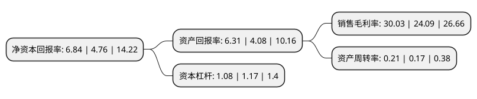

> 本页面由自动化程序生成于 2022年5月20日 01:20
> 内容可能存在错误，如有bug请提交issue至：https://github.com/Eroleice/doc-pi/issues
{.is-warning}

# 上市公司基本情况

## 基本资料

西安派瑞功率半导体变流技术股份有限公司（以下简称“派瑞股份”）成立于2010年12月10日，西安市。于2020年05月07日在深交所创业板上市。

派瑞股份注册资本32,000万元，主营业务为电力半导体器件和装置的研发，生产，实验调试和销售服务。产品可分为高压直流阀用晶闸管，普通元器件及电力电子装置三大类。以下是详细信息：

- 公司名称: 西安派瑞功率半导体变流技术股份有限公司
- 股票代码: 300831.SZ
- 所在地: 陕西 - 西安市
- 成立日期: 2010年12月10日
- 注册资本: 32,000万元
- 法定代表人: 陆剑秋
- 主营业务: 主营业务为电力半导体器件和装置的研发，生产，实验调试和销售服务产品可分为高压直流阀用晶闸管，普通元器件及电力电子装置三大类
- 公司官网: www.chinaxaperi.com
- 公司介绍: 公司是一家国家高新技术企业,主要从事电力半导体器件和装置的研发、生产、实验调试和销售服务，公司产品可分为高压直流阀用晶闸管、普通元器件及电力电子装置三大类。高压直流阀用晶闸管包括直流输电用大功率电控晶闸管和光控晶闸管，主要应用于超高压、特高压直流输电工程，服务于国家能源输送及调配、绿色能源并网输电等重点能源建设领域，是并网和远距离输送不可替代的器件,公司是西电所控股子公司。西电所是我国电力半导体器件的发源地，我国第一只整流管、晶闸管、快速晶闸管、双向晶闸管、逆导晶闸管、可关断晶闸管(GTO)、光控晶闸管等电力半导体器件均由西电所研发。西电所是中国电器工业协会电力电子协会、中国电工技术学会电力电子学会、全国电力电子学标准化技术委员会秘书处所在地，是国家电力电子产品质量监督检验中心挂靠单位,目前，公司生产的高压直流阀用晶闸管在国内超高压和特高压直流输电工程中拥有较高的市场份额，经过多年的技术创新和生产技术积累，公司在电力半导体器件领域，特别是直流输电产业链中，掌握了多项核心技术与核心生产工艺.

## 股东及高管情况

上市公司第一大股东为西安电力电子技术研究所，持股126,574,080股，占比39.55%，为上市公司实际控制人。

截至2022年04月12日，上市公司的前十大股东中，共有1名自然人股东，6名机构股东，2个产品账户，1名其他股东，其中5%以上大股东共有3名。上市公司前十大股东明细如下：

> 截至2022年04月12日，上市公司前十大股东信息如下：

| 股东名称 | 持股数量（股） | 持股比例 |
| --- | --- | --- |
| 西安电力电子技术研究所 | 126,574,080 | 39.55% |
| 国开装备制造产业投资基金有限责任公司 | 16,847,857 | 5.265% |
| 国开装备制造产业投资基金有限责任公司 | 16,847,857 | 5.26% |
| 北京开信派瑞资本管理中心(有限合伙) | 14,039,186 | 4.39% |
| 陕西科技控股集团有限责任公司 | 8,941,680 | 2.79% |
| 西安金河投资管理有限公司 | 5,073,600 | 1.59% |
| 杭州百竹实业有限公司 | 3,354,500 | 1.05% |
| 北京砻淬资本管理中心(有限合伙) | 1,356,996 | 0.42% |
| 王正鸣 | 954,054 | 0.3% |
| 陕西金河科技创业投资有限责任公司 | 727,900 | 0.23% |

## 利润表分析

上市公司2021年总收入为1.78亿元，净利润为0.53亿元，实现盈利。

## 杜邦分析

> 数据列示周期：2021年 | 2020年 | 2019年
{.is-info}

上市公司的净资产收益率在近一年有所上升，上升幅度为43.7%，其变化情况分解如下：
- 上市公司的销售毛利率在近一年上升了24.66%，可能是生产效率的提升、商品原材料价格下跌或商品价格的上涨所致。
- 上市公司的资产周转率在近一年上升了23.53%，可能是源自于更快的销售回款或库存管理效果提升。
- 上市公司的财务杠杆比率在近一年下降了-7.69%，可能是减少负债降低财务费用。

