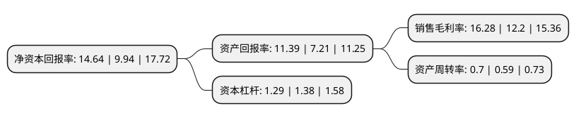

> 本页面由自动化程序生成于 2022年5月20日 01:20
> 内容可能存在错误，如有bug请提交issue至：https://github.com/Eroleice/doc-pi/issues
{.is-warning}

# 上市公司基本情况

## 基本资料

安徽龙磁科技股份有限公司（以下简称“龙磁科技”）成立于1998年01月19日，合肥市。于2020年05月25日在深交所创业板上市。

龙磁科技注册资本7,067万元，高性能永磁铁氧体材料系列产品的研发，生产和销售。以下是详细信息：

- 公司名称: 安徽龙磁科技股份有限公司
- 股票代码: 300835.SZ
- 所在地: 安徽 - 合肥市
- 成立日期: 1998年01月19日
- 注册资本: 7,067万元
- 法定代表人: 熊永宏
- 主营业务: 高性能永磁铁氧体材料系列产品的研发，生产和销售
- 公司官网: www.sinomagtech.com
- 公司介绍: 公司主要从事永磁铁氧体新型功能材料的研发、生产和销售，是国内高性能永磁铁氧体湿压磁瓦主要生产企业之一。永磁铁氧体具有较高的磁性能，环境耐受性好，是一种应用广泛的电子功能材料。公司注重技术创新，多次承担国家及省市级科技创新攻关项目，已取得百余项国家发明及实用新型专利。公司通过不断的技术进步和持续的产品结构调整，实现产品向高端升级，开发出具有较强市场竞争力的高性能产品，为汽车及变频家电等行业提供配套和服务。公司致力于服务国内外高端客户，一直以来高度重视市场开发和品牌建设，经过多年努力，龙磁品牌获得市场认同，主要客户较为稳定且多为行业内领先企业，如全球汽车零部件配套供应商百强企业法国VALEO(法雷奥)、日本MITSUBA(三叶)、德国BROSE(博泽)、BOSCH(博世)和全球知名家电企业格力电器、韩国LG、三星等。

## 股东及高管情况

上市公司第一大股东为熊永宏，持股34,289,000股，占比28.54%，**疑似为**上市公司实际控制人。

截至2022年05月05日，上市公司的前十大股东中，共有10名自然人股东，其中5%以上大股东共有2名。上市公司前十大股东明细如下：

> 未能通过持股比例判定出上市公司实际控制人（持股30%以上）
> 可能存在通过间接持股、联合持股、协议控制等方式拥有实际控制权的主体，具体请参考上市公司定期公告！
{.is-warning}

> 截至2022年05月05日，上市公司前十大股东信息如下：

| 股东名称 | 持股数量（股） | 持股比例 |
| --- | --- | --- |
| 熊永宏 | 34,289,000 | 28.54% |
| 熊咏鸽 | 12,807,800 | 10.66% |
| 晏云生 | 3,417,000 | 2.84% |
| 徐从容 | 3,385,550 | 2.82% |
| 张勇 | 2,261,000 | 1.88% |
| 张中木 | 2,059,000 | 1.71% |
| 程晓茜 | 1,768,000 | 1.47% |
| 章信忠 | 1,189,440 | 0.99% |
| 强建明 | 905,250 | 0.75% |
| 张剑兴 | 828,410 | 0.69% |

## 利润表分析

上市公司2021年总收入为8.04亿元，净利润为1.31亿元，实现盈利。

## 杜邦分析

> 数据列示周期：2021年 | 2020年 | 2019年
{.is-info}

上市公司的净资产收益率在近一年有所上升，上升幅度为47.28%，其变化情况分解如下：
- 上市公司的销售毛利率在近一年上升了33.44%，可能是生产效率的提升、商品原材料价格下跌或商品价格的上涨所致。
- 上市公司的资产周转率在近一年上升了18.64%，可能是源自于更快的销售回款或库存管理效果提升。
- 上市公司的财务杠杆比率在近一年下降了-6.52%，可能是减少负债降低财务费用。

