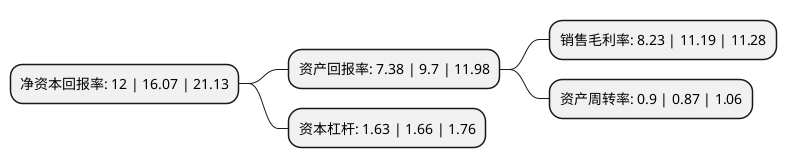

> 本页面由自动化程序生成于 2022年5月20日 01:20
> 内容可能存在错误，如有bug请提交issue至：https://github.com/Eroleice/doc-pi/issues
{.is-warning}

# 上市公司基本情况

## 基本资料

胜蓝科技股份有限公司（以下简称“胜蓝股份”）成立于2007年12月14日，东莞市。于2020年07月02日在深交所创业板上市。

胜蓝股份注册资本14,890万元，电子连接器及精密零组件的研发，生产及销售，主要产品已广泛应用于消费类电子，新能源汽车等领域。以下是详细信息：

- 公司名称: 胜蓝科技股份有限公司
- 股票代码: 300843.SZ
- 所在地: 广东 - 东莞市
- 成立日期: 2007年12月14日
- 注册资本: 14,890万元
- 法定代表人: 黄福林
- 主营业务: 电子连接器及精密零组件的研发，生产及销售，主要产品已广泛应用于消费类电子，新能源汽车等领域
- 公司官网: www.jctc.com.cn
- 公司介绍: 公司系一家专注于电子连接器及精密零组件的研发、生产及销售的高新技术企业，主要产品已广泛应用于消费类电子、新能源汽车等领域。自成立以来，公司扎根于自身精湛的模具开发能力以及快速的客户需求响应能力，通过了IATF16949、ISO9001、ISO14001、QC080000等体系认证和产品安规认证，公司拥有优质、稳定的客户资源，已与富士康、立讯精密、小米、TCL、日本电产、日立集团、比亚迪、长城汽车等国内外知名客户建立稳定合作关系。通过多年的生产经营积累，“JCTC TERMINAL&CONNECTORS”注册商标被认定为国家驰名商标，同时也获得广东省守合同重信用企业、广东省高新技术产品、东莞市专利优势企业等荣誉。

## 股东及高管情况

上市公司第一大股东为胜蓝投资控股有限公司，持股90,200,000股，占比60.58%，为上市公司实际控制人。

截至2022年03月31日，上市公司的前十大股东中，共有2名自然人股东，2名机构股东，6个产品账户，其中5%以上大股东共有2名。上市公司前十大股东明细如下：

> 截至2022年03月31日，上市公司前十大股东信息如下：

| 股东名称 | 持股数量（股） | 持股比例 |
| --- | --- | --- |
| 胜蓝投资控股有限公司 | 90,200,000 | 60.58% |
| 大田胜之蓝商贸合伙企业(有限合伙) | 7,982,500 | 5.36% |
| 伍建华 | 6,000,000 | 4.03% |
| 广发证券股份有限公司-中庚小盘价值股票型证券投资基金 | 3,144,051 | 2.11% |
| 黄雪林 | 3,000,000 | 2.01% |
| 华泰证券股份有限公司-中庚价值领航混合型证券投资基金 | 2,041,683 | 1.37% |
| 东方证券股份有限公司-中庚价值先锋股票型证券投资基金 | 1,343,900 | 0.9% |
| 深圳昭图投资管理有限公司-昭图5期证券投资基金 | 1,003,600 | 0.67% |
| 中国银行股份有限公司-鹏华高质量增长混合型证券投资基金 | 959,000 | 0.64% |
| 平安银行股份有限公司-中庚价值灵动灵活配置混合型证券投资基金 | 747,900 | 0.5% |

## 利润表分析

上市公司2021年总收入为13.02亿元，净利润为1.07亿元，实现盈利。

## 杜邦分析

> 数据列示周期：2021年 | 2020年 | 2019年
{.is-info}

上市公司的净资产收益率在近一年有所下降，下降幅度为-25.33%，其变化情况分解如下：
- 上市公司的销售毛利率在近一年下降了-26.45%，可能是生产效率的下降、商品原材料价格上涨或商品价格的下跌所致。
- 上市公司的资产周转率在近一年上升了3.45%，可能是源自于更快的销售回款或库存管理效果提升。
- 上市公司的财务杠杆比率在近一年下降了-1.81%，可能是减少负债降低财务费用。

