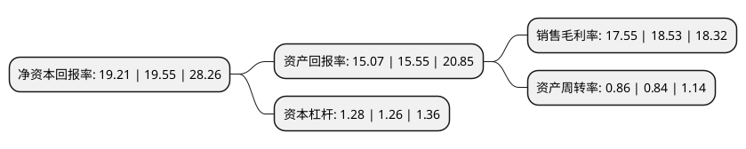

> 本页面由自动化程序生成于 2022年5月20日 01:21
> 内容可能存在错误，如有bug请提交issue至：https://github.com/Eroleice/doc-pi/issues
{.is-warning}

# 上市公司基本情况

## 基本资料

四会富仕电子科技股份有限公司（以下简称“四会富仕”）成立于2009年08月28日，肇庆市。于2020年07月13日在深交所创业板上市。

四会富仕注册资本10,193.076万元，公司主营业务是印制电路板的研发，生产和销售，公司印制电路板产品类型丰富，除单/双面板，多层板以外，产品类型覆盖HDI板，厚铜板，金属基板，刚挠结合板，高频高速板等。以下是详细信息：

- 公司名称: 四会富仕电子科技股份有限公司
- 股票代码: 300852.SZ
- 所在地: 广东 - 肇庆市
- 成立日期: 2009年08月28日
- 注册资本: 10,193.076万元
- 法定代表人: 刘天明
- 主营业务: 公司主营业务是印制电路板的研发，生产和销售，公司印制电路板产品类型丰富，除单/双面板，多层板以外，产品类型覆盖HDI板，厚铜板，金属基板，刚挠结合板，高频高速板等
- 公司官网: www.fujipcb.cn
- 公司介绍: 公司系由四会富士电子科技有限公司整体变更设立的股份有限公司，公司主营业务是印制电路板的研发、生产和销售，公司印制电路板产品类型丰富,除单/双面板,多层板以外,产品类型覆盖HDI板,厚铜板,金属基板,刚挠结合板,高频高速板等.公司专注于印制电路板小批量板的制造，以“小批量、高品质、高可靠、短交期、快速响应”为市场定位，产品广泛应用于工业控制、汽车电子、交通、通信设备、医疗器械等领域。公司是国家高新技术企业，先后获得了肇庆市企业技术中心、肇庆市工程技术研究中心、广东省高可靠性电路板设计与制造工程技术研究中心、广东省企业技术中心等认定，在高可靠性印制电路板研发与生产领域积累了丰富经验。

## 股东及高管情况

上市公司第一大股东为四会市明诚贸易有限公司，持股40,247,280股，占比39.48%，为上市公司实际控制人。

截至2022年03月31日，上市公司的前十大股东中，共有3名自然人股东，4名机构股东，3个产品账户，其中5%以上大股东共有3名。上市公司前十大股东明细如下：

> 截至2022年03月31日，上市公司前十大股东信息如下：

| 股东名称 | 持股数量（股） | 持股比例 |
| --- | --- | --- |
| 四会市明诚贸易有限公司 | 40,247,280 | 39.48% |
| 四会天诚同创投资合伙企业(有限合伙) | 10,890,000 | 10.68% |
| 四会市一鸣投资有限公司 | 9,898,200 | 9.71% |
| 刘天明 | 2,649,937 | 2.6% |
| 温一峰 | 2,649,924 | 2.6% |
| 深圳市中瑞汇川投资发展中心(有限合伙) | 1,546,272 | 1.52% |
| 东方证券股份有限公司-中庚价值先锋股票型证券投资基金 | 905,500 | 0.89% |
| 深圳市高新投人才股权投资基金管理有限公司-深圳市人才创新创业二号股权投资基金合伙企业(有限合伙) | 593,647 | 0.58% |
| 刘国珍 | 476,760 | 0.47% |
| 华泰证券股份有限公司-中庚价值领航混合型证券投资基金 | 361,300 | 0.35% |

## 利润表分析

上市公司2021年总收入为10.49亿元，净利润为1.84亿元，实现盈利。

## 杜邦分析

> 数据列示周期：2021年 | 2020年 | 2019年
{.is-info}

上市公司的净资产收益率在近一年有所下降，下降幅度为-1.74%，其变化情况分解如下：
- 上市公司的销售毛利率在近一年下降了-5.29%，可能是生产效率的下降、商品原材料价格上涨或商品价格的下跌所致。
- 上市公司的资产周转率在近一年上升了2.38%，可能是源自于更快的销售回款或库存管理效果提升。
- 上市公司的财务杠杆比率在近一年上升了1.59%，可能是增加负债扩大生产规模。

