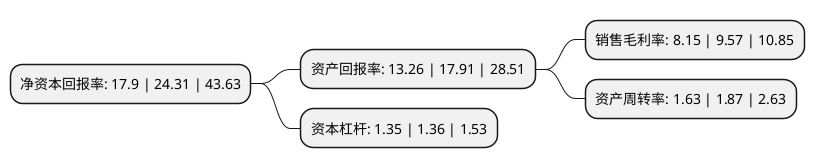

> 本页面由自动化程序生成于 2022年5月20日 01:21
> 内容可能存在错误，如有bug请提交issue至：https://github.com/Eroleice/doc-pi/issues
{.is-warning}

# 上市公司基本情况

## 基本资料

安克创新科技股份有限公司（以下简称“安克创新”）成立于2011年12月06日，长沙市。于2020年08月24日在深交所创业板上市。

安克创新注册资本40,642.721万元，公司主要从事自有品牌的移动设备周边产品，智能硬件产品等消费电子产品的自主研发，设计和销售，是全球消费电子行业知名品牌商，产品主要包括充电类，无线音频类，智能创新类三大系列。以下是详细信息：

- 公司名称: 安克创新科技股份有限公司
- 股票代码: 300866.SZ
- 所在地: 湖南 - 长沙市
- 成立日期: 2011年12月06日
- 注册资本: 40,642.721万元
- 法定代表人: 阳萌
- 主营业务: 公司主要从事自有品牌的移动设备周边产品，智能硬件产品等消费电子产品的自主研发，设计和销售，是全球消费电子行业知名品牌商，产品主要包括充电类，无线音频类，智能创新类三大系列
- 公司官网: www.anker-in.com
- 公司介绍: 公司专业从事智能移动周边产品、智能生活周边产品及计算机周边产品的研发和销售，公司“Anker”等品牌的消费电子产品销往全球，在亚马逊等境外大型电子商务平台上占据领先的行业市场份额，拥有很高的知名度和美誉度。此外，公司亦大力拓展线下销售渠道，在北美、欧洲、日本和中东等发达国家和地区市场通过沃尔玛、百思买、塔吉特、日本Canon Marketing等知名渠道的销售快速增长。报告期内，公司主营业务收入97%以上的收入来源于境外销售，公司境外销售主要来自北美、欧洲、日本、中东等经济发达、消费力强、运作规范的市场和地区。公司在全球最大传播集团WPP与Google联合发布的“BrandZ中国出海品牌50强”2017年、2018年榜单中分别位列第8和第7名，并在2017年被评选为“成长最快消费电子品牌”；于2018年荣获知名媒体平台Morketing所颁发的“灵眸奖(Morketing Award)”之“十大全球化领军企业”第三名；并在2017年被美国权威电商研究机构Internet Retailer提名入围年度全球电商奖。

## 股东及高管情况

上市公司第一大股东为阳萌，持股178,974,000股，占比44.04%，为上市公司实际控制人。

截至2022年03月31日，上市公司的前十大股东中，共有6名自然人股东，3名机构股东，1个海外主体，其中5%以上大股东共有2名。上市公司前十大股东明细如下：

> 截至2022年03月31日，上市公司前十大股东信息如下：

| 股东名称 | 持股数量（股） | 持股比例 |
| --- | --- | --- |
| 阳萌 | 178,974,000 | 44.04% |
| 赵东平 | 48,700,000 | 11.98% |
| 吴文龙 | 20,321,300 | 5% |
| 和谐成长二期(义乌)投资中心(有限合伙) | 15,340,984 | 3.77% |
| 贺丽 | 15,027,000 | 3.7% |
| 苏州维特力新创业投资管理有限公司-苏州维新仲华创业投资合伙企业(有限合伙) | 12,678,618 | 3.12% |
| 香港中央结算有限公司(陆股通) | 10,951,677 | 2.69% |
| 高韬 | 9,725,137 | 2.39% |
| 张山峰 | 6,923,079 | 1.7% |
| 天津市海翼远景管理咨询合伙企业(有限合伙) | 5,736,434 | 1.41% |

## 利润表分析

上市公司2021年总收入为125.74亿元，净利润为10.24亿元，实现盈利。

## 杜邦分析

> 数据列示周期：2021年 | 2020年 | 2019年
{.is-info}

上市公司的净资产收益率在近一年有所下降，下降幅度为-26.37%，其变化情况分解如下：
- 上市公司的销售毛利率在近一年下降了-14.84%，可能是生产效率的下降、商品原材料价格上涨或商品价格的下跌所致。
- 上市公司的资产周转率在近一年下降了-12.83%，可能是源自于更慢的销售回款或库存管理效果下降。
- 上市公司的财务杠杆比率在近一年下降了-0.74%，可能是减少负债降低财务费用。

