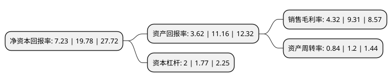

> 本页面由自动化程序生成于 2022年5月20日 01:21
> 内容可能存在错误，如有bug请提交issue至：https://github.com/Eroleice/doc-pi/issues
{.is-warning}

# 上市公司基本情况

## 基本资料

深圳欧陆通电子股份有限公司（以下简称“欧陆通”）成立于1996年05月29日，深圳市。于2020年08月24日在深交所创业板上市。

欧陆通注册资本10,166万元，主要从事开关电源产品的研发，生产与销售。公司主要产品包括电源适配器和服务器电源等，公司产品广泛应用于办公电子，机顶盒，网络通信，安防监控，音响，金融POS终端，数据中心等众多领域。以下是详细信息：

- 公司名称: 深圳欧陆通电子股份有限公司
- 股票代码: 300870.SZ
- 所在地: 广东 - 深圳市
- 成立日期: 1996年05月29日
- 注册资本: 10,166万元
- 法定代表人: 王合球
- 主营业务: 主要从事开关电源产品的研发，生产与销售公司主要产品包括电源适配器和服务器电源等，公司产品广泛应用于办公电子，机顶盒，网络通信，安防监控，音响，金融POS终端，数据中心等众多领域
- 公司官网: www.honor-cn.com
- 公司介绍: 公司是中国大陆南部最大开关电源适配器生产商之一。集开发、生产、销售于一体，集中生产开关电源,开关适配器、充电器、直流转换器、电子变压器、感应器和LED电源等电子消费产品。公司在开关电源领域深耕多年，为国家高新技术企业，并设有深圳市企业技术中心、博士后创新实践基地和广东省高能效智能电源及电源管理工程技术研究中心。公司以客户需求为导向，致力于为客户提供可靠、高效、智能的开关电源产品，并在研发创新、生产工艺等方面积累了丰富的核心技术，截至目前，公司拥有71项专利技术、30项软件著作权和多项专有技术。公司始终高度重视产品质量，已通过了ISO9001:2015质量管理体系证书及QC080000:2017有害物质过程管理体系、ANSI/ESD S20.20：2014静电防护体系认证，并依据体系实施了完善的质量控制。报告期内，公司产品通过中国CCC、新加坡PSB、韩国KC、泰国TISI、墨西哥NOM、南非NRCS、美国UL、美国FCC、欧盟GS、欧盟CE等多国和地区的产品安全及电磁兼容认证。

## 股东及高管情况

上市公司第一大股东为深圳市格诺利信息咨询有限公司，持股29,234,023股，占比28.76%，**疑似为**上市公司实际控制人。

截至2022年03月31日，上市公司的前十大股东中，共有3名自然人股东，5名机构股东，2个产品账户，其中5%以上大股东共有2名。上市公司前十大股东明细如下：

> 未能通过持股比例判定出上市公司实际控制人（持股30%以上）
> 可能存在通过间接持股、联合持股、协议控制等方式拥有实际控制权的主体，具体请参考上市公司定期公告！
{.is-warning}

> 截至2022年03月31日，上市公司前十大股东信息如下：

| 股东名称 | 持股数量（股） | 持股比例 |
| --- | --- | --- |
| 深圳市格诺利信息咨询有限公司 | 29,234,023 | 28.76% |
| 深圳市王越王投资合伙企业(有限合伙) | 29,234,023 | 28.76% |
| 深圳市通聚信息技术咨询合伙企业(有限合伙) | 3,635,231 | 3.58% |
| 中国工商银行股份有限公司-中欧价值智选回报混合型证券投资基金 | 3,613,925 | 3.55% |
| 西藏同创伟业创业投资有限公司 | 3,194,100 | 3.14% |
| 杨冀 | 2,007,196 | 1.97% |
| 华夏人寿保险股份有限公司-自有资金 | 1,875,355 | 1.84% |
| 房莉 | 1,771,048 | 1.74% |
| 平安银行股份有限公司-中欧新兴价值一年持有期混合型证券投资基金 | 900,801 | 0.89% |
| 王红法 | 787,400 | 0.77% |

## 利润表分析

上市公司2021年总收入为25.71亿元，净利润为1.11亿元，实现盈利。

## 杜邦分析

> 数据列示周期：2021年 | 2020年 | 2019年
{.is-info}

上市公司的净资产收益率在近一年有所下降，下降幅度为-63.45%，其变化情况分解如下：
- 上市公司的销售毛利率在近一年下降了-53.6%，可能是生产效率的下降、商品原材料价格上涨或商品价格的下跌所致。
- 上市公司的资产周转率在近一年下降了-30%，可能是源自于更慢的销售回款或库存管理效果下降。
- 上市公司的财务杠杆比率在近一年上升了12.99%，可能是增加负债扩大生产规模。

