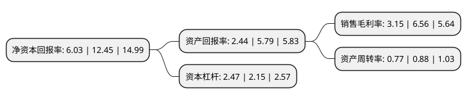

> 本页面由自动化程序生成于 2022年5月20日 01:21
> 内容可能存在错误，如有bug请提交issue至：https://github.com/Eroleice/doc-pi/issues
{.is-warning}

# 上市公司基本情况

## 基本资料

广东科翔电子科技股份有限公司（以下简称“科翔股份”）成立于2001年11月02日，惠州市。于2020年11月05日在深交所创业板上市。

科翔股份注册资本17,233.769万元，公司主要从事高密度印制电路板研发，生产和销售，主要产品包括双层板，多层板，高密度互连(HDI)板，厚铜板，高频/高速板，金属基板，IC载板等PCB产品。以下是详细信息：

- 公司名称: 广东科翔电子科技股份有限公司
- 股票代码: 300903.SZ
- 所在地: 广东 - 惠州市
- 成立日期: 2001年11月02日
- 注册资本: 17,233.769万元
- 法定代表人: 郑晓蓉
- 主营业务: 公司主要从事高密度印制电路板研发，生产和销售，主要产品包括双层板，多层板，高密度互连(HDI)板，厚铜板，高频/高速板，金属基板，IC载板等PCB产品
- 公司官网: www.gdkxpcb.com
- 公司介绍: 公司是一家从事高密度印制电路板研发、生产和销售的高新技术企业。公司目前拥有四个PCB生产基地，PCB年产能超过180万平方米，可以一站式提供双层板、多层板、高密度互连(HDI)板、厚铜板、高频/高速板、金属基板、IC载板等PCB产品，产品终端应用于消费电子、通讯设备、工业控制、汽车电子、计算机等领域。经过十八年发展，公司已成为国内产品品类最齐全、应用领域最广泛的PCB企业之一，位列中国电子电路行业协会2018年度内资PCB企业第21位、综合PCB企业第45位，N.T.Information2018年度全球百强PCB制造商第88位。

## 股东及高管情况

上市公司第一大股东为郑晓蓉，持股34,169,684股，占比15.25%，**疑似为**上市公司实际控制人。

截至2022年04月29日，上市公司的前十大股东中，共有6名自然人股东，4名机构股东，其中5%以上大股东共有5名。上市公司前十大股东明细如下：

> 未能通过持股比例判定出上市公司实际控制人（持股30%以上）
> 可能存在通过间接持股、联合持股、协议控制等方式拥有实际控制权的主体，具体请参考上市公司定期公告！
{.is-warning}

> 截至2022年04月29日，上市公司前十大股东信息如下：

| 股东名称 | 持股数量（股） | 持股比例 |
| --- | --- | --- |
| 郑晓蓉 | 34,169,684 | 15.25% |
| 郑晓蓉 | 34,169,684 | 19.83% |
| 郑晓蓉 | 34,169,684 | 19.83% |
| 谭东 | 26,460,600 | 11.81% |
| 谭东 | 26,460,600 | 15.35% |
| 珠海横琴科翔富发电子合伙企业(有限合伙) | 6,000,000 | 3.48% |
| 共青城银泰嘉杬投资管理合伙企业(有限合伙) | 5,515,000 | 3.2% |
| 珠海横琴科翔富昌电子合伙企业(有限合伙) | 5,000,000 | 2.9% |
| 珠海横琴科翔富昌电子合伙企业(有限合伙) | 5,000,000 | 2.9% |
| 陈焕先 | 3,910,566 | 2.27% |

## 利润表分析

上市公司2021年总收入为22.52亿元，净利润为0.7亿元，实现盈利。

## 杜邦分析

> 数据列示周期：2021年 | 2020年 | 2019年
{.is-info}

上市公司的净资产收益率在近一年有所下降，下降幅度为-51.57%，其变化情况分解如下：
- 上市公司的销售毛利率在近一年下降了-51.98%，可能是生产效率的下降、商品原材料价格上涨或商品价格的下跌所致。
- 上市公司的资产周转率在近一年下降了-12.5%，可能是源自于更慢的销售回款或库存管理效果下降。
- 上市公司的财务杠杆比率在近一年上升了14.88%，可能是增加负债扩大生产规模。

