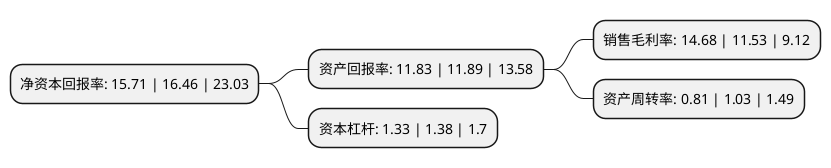

> 本页面由自动化程序生成于 2022年5月20日 01:21
> 内容可能存在错误，如有bug请提交issue至：https://github.com/Eroleice/doc-pi/issues
{.is-warning}

# 上市公司基本情况

## 基本资料

深圳朗特智能控制股份有限公司（以下简称“朗特智能”）成立于2003年08月29日，深圳市。于2020年12月02日在深交所创业板上市。

朗特智能注册资本6,387万元，公司从事智能控制器及智能产品的研发，设计，生产和销售，公司产品分为两大类:智能控制器和智能产品。以下是详细信息：

- 公司名称: 深圳朗特智能控制股份有限公司
- 股票代码: 300916.SZ
- 所在地: 广东 - 深圳市
- 成立日期: 2003年08月29日
- 注册资本: 6,387万元
- 法定代表人: 欧阳正良
- 主营业务: 公司从事智能控制器及智能产品的研发，设计，生产和销售，公司产品分为两大类:智能控制器和智能产品
- 公司官网: www.longtechcc.com
- 公司介绍: 公司从事智能控制器及智能产品的研发、设计、生产和销售，产品主要运用于智能家居及家电、离网照明、汽车电子和新型消费电子等行业。一方面，公司专注于为智能家居及家电、汽车电子等领域提供各类智能控制器产品及相应解决方案。另一方面，公司凭借在智能控制器相关领域积累的丰富行业经验与资源，与下游终端品牌商(指拥有自主品牌终端电子产品的企业)的合作不断深入，逐步参与其部分智能整机产品的开发过程，以满足客户一站式采购服务需求。目前，公司与下游客户合作设计、生产的智能产品涉足离网照明、汽车电子、新型消费电子等领域。公司成立发展至今建立了完善的品质质量体系，分别通过了ISO9001质量管理体系认证、ISO14001环境管理体系认证、IATF16949汽车行业质量管理体系认证、ISO13485医疗器械质量管理体系认证以及知识产权管理体系认证。

## 股东及高管情况

上市公司第一大股东为欧阳正良，持股27,739,710股，占比43.43%，为上市公司实际控制人。

截至2022年03月31日，上市公司的前十大股东中，共有7名自然人股东，3名机构股东，其中5%以上大股东共有4名。上市公司前十大股东明细如下：

> 截至2022年03月31日，上市公司前十大股东信息如下：

| 股东名称 | 持股数量（股） | 持股比例 |
| --- | --- | --- |
| 欧阳正良 | 27,739,710 | 43.43% |
| 深圳市鹏城高飞投资管理合伙企业(有限合伙) | 8,013,690 | 12.55% |
| 苟兴荣 | 4,938,640 | 7.73% |
| 深圳市良特投资管理有限公司 | 3,698,640 | 5.79% |
| 珠海鹏城展翅投资咨询合伙企业(有限合伙) | 2,895,000 | 4.53% |
| 唐拥武 | 936,703 | 1.47% |
| 徐新华 | 225,750 | 0.35% |
| 王艳秋 | 174,450 | 0.27% |
| 殷凤 | 85,500 | 0.13% |
| 肖继荣 | 82,100 | 0.13% |

## 利润表分析

上市公司2021年总收入为9.6亿元，净利润为1.4亿元，实现盈利。

## 杜邦分析

> 数据列示周期：2021年 | 2020年 | 2019年
{.is-info}

上市公司的净资产收益率在近一年有所下降，下降幅度为-4.56%，其变化情况分解如下：
- 上市公司的销售毛利率在近一年上升了27.32%，可能是生产效率的提升、商品原材料价格下跌或商品价格的上涨所致。
- 上市公司的资产周转率在近一年下降了-21.36%，可能是源自于更慢的销售回款或库存管理效果下降。
- 上市公司的财务杠杆比率在近一年下降了-3.62%，可能是减少负债降低财务费用。

