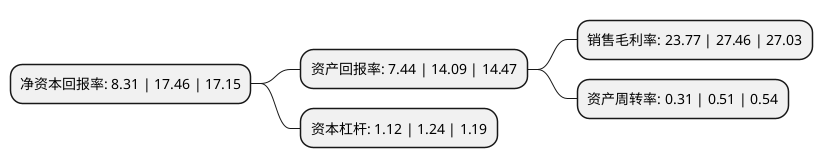

> 本页面由自动化程序生成于 2022年5月20日 01:21
> 内容可能存在错误，如有bug请提交issue至：https://github.com/Eroleice/doc-pi/issues
{.is-warning}

# 上市公司基本情况

## 基本资料

常州中英科技股份有限公司（以下简称“中英科技”）成立于2006年03月28日，常州市。于2021年01月26日在深交所创业板上市。

中英科技注册资本7,520万元，公司主营业务为高频通信材料及其制品的研发，生产和销售。公司主要产品包括D型和CA型两类高频覆铜板及高级聚合物基复合材料。以下是详细信息：

- 公司名称: 常州中英科技股份有限公司
- 股票代码: 300936.SZ
- 所在地: 江苏 - 常州市
- 成立日期: 2006年03月28日
- 注册资本: 7,520万元
- 法定代表人: 俞卫忠
- 主营业务: 公司主营业务为高频通信材料及其制品的研发，生产和销售公司主要产品包括D型和CA型两类高频覆铜板及高级聚合物基复合材料
- 公司官网: www.czzyst.cn
- 公司介绍: 公司是由中英有限于2016年10月25日依法整体变更设立的股份有限公司。公司主营业务为高频通信材料及其制品的研发、生产和销售。公司于2011年获常州市政府批准成立“企业技术中心”和“高频微波工程研究中心”，专门从事先进高频通信材料的生产设备和工艺研发。公司的高频微波基板已获得“国家化工行业生产力促进中心”认定的科技成果鉴定证书，并获得江苏省科学技术厅的“高新技术产品认定”称号。鉴于公司卓越的研发能力，公司于2012年分别获得“江苏省科技进步奖”和“中国石油和化学工业科技进步奖”。此外，公司多次获得“常州市民营科技企业”、“常州市科技进步奖”、“江苏省民营科技企业”、“江苏省明星企业”等各类奖项。

## 股东及高管情况

上市公司第一大股东为俞卫忠，持股17,727,600股，占比23.57%，**疑似为**上市公司实际控制人。

截至2022年03月31日，上市公司的前十大股东中，共有5名自然人股东，5名机构股东，其中5%以上大股东共有4名。上市公司前十大股东明细如下：

> 未能通过持股比例判定出上市公司实际控制人（持股30%以上）
> 可能存在通过间接持股、联合持股、协议控制等方式拥有实际控制权的主体，具体请参考上市公司定期公告！
{.is-warning}

> 截至2022年03月31日，上市公司前十大股东信息如下：

| 股东名称 | 持股数量（股） | 持股比例 |
| --- | --- | --- |
| 俞卫忠 | 17,727,600 | 23.57% |
| 俞丞 | 13,113,200 | 17.44% |
| 常州市中英管道有限公司 | 7,500,000 | 9.97% |
| 戴丽芳 | 5,909,200 | 7.86% |
| 常州中英汇才股权投资管理中心(有限合伙) | 3,045,000 | 4.05% |
| 朱新爱 | 1,575,000 | 2.09% |
| 滨州涌泉企业管理合伙企业(有限合伙) | 1,523,700 | 2.03% |
| 宁波梅山保税港区子今投资管理合伙企业(有限合伙)-宁波梅山保税港区曦华股权投资合伙企业(有限合伙) | 800,000 | 1.06% |
| 宁波梅山保税港区子今投资管理合伙企业(有限合伙)-宁波梅山保税港区宜安投资合伙企业(有限合伙) | 800,000 | 1.06% |
| 马龙秀 | 580,000 | 0.77% |

## 利润表分析

上市公司2021年总收入为2.17亿元，净利润为0.51亿元，实现盈利。

## 杜邦分析

> 数据列示周期：2021年 | 2020年 | 2019年
{.is-info}

上市公司的净资产收益率在近一年有所下降，下降幅度为-52.41%，其变化情况分解如下：
- 上市公司的销售毛利率在近一年下降了-13.44%，可能是生产效率的下降、商品原材料价格上涨或商品价格的下跌所致。
- 上市公司的资产周转率在近一年下降了-39.22%，可能是源自于更慢的销售回款或库存管理效果下降。
- 上市公司的财务杠杆比率在近一年下降了-9.68%，可能是减少负债降低财务费用。

