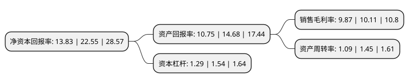

> 本页面由自动化程序生成于 2022年5月20日 01:21
> 内容可能存在错误，如有bug请提交issue至：https://github.com/Eroleice/doc-pi/issues
{.is-warning}

# 上市公司基本情况

## 基本资料

深圳秋田微电子股份有限公司（以下简称“秋田微”）成立于2004年11月05日，深圳市。于2021年01月28日在深交所创业板上市。

秋田微注册资本8,000万元，公司主要从事液晶显示及触控产品的研发，设计，生产和销售，主要产品包括单色液晶显示器，单色液晶显示模组，彩色液晶显示模组及电容式触摸屏等。以下是详细信息：

- 公司名称: 深圳秋田微电子股份有限公司
- 股票代码: 300939.SZ
- 所在地: 广东 - 深圳市
- 成立日期: 2004年11月05日
- 注册资本: 8,000万元
- 法定代表人: 黄志毅
- 主营业务: 公司主要从事液晶显示及触控产品的研发，设计，生产和销售，主要产品包括单色液晶显示器，单色液晶显示模组，彩色液晶显示模组及电容式触摸屏等
- 公司官网: www.av-display.com.cn
- 公司介绍: 公司于2004年成立，是一家专业从事液晶显示器件及其配套产品研发、设计、生产和销售的高新技术企业，致力于在全球范围内，为广大客户提供标准以及定制化的显示产品和显示技术解决方案，产品被广泛应用于工业控制、医疗、智能家居、电表、仪器仪表、人机界面、车载显示，以及其他信息终端领域。公司主要从事液晶显示及触控产品的研发、设计、生产和销售，主要产品包括单色液晶显示器、单色液晶显示模组、彩色液晶显示模组及电容式触摸屏等。公司产品应用于工业控制及自动化、物联网与智慧生活、医疗健康、汽车电子等众多领域。公司已与欧姆龙、惠普、西门子、GE、比亚迪、施耐德等众多海内外知名企业建立了长期稳定的合作关系。公司已取得国家高新技术企业、IATF16949:2016质量管理体系认证、ISO9001:2015质量管理体系认证、ISO14001:2015环境体系认证、ANSI/ESD S20.20-2014防静电体系认证、GB/T29490-2013知识产权管理体系认证等证书，且已经形成具有自主知识产权的核心技术及产品体系。

## 股东及高管情况

上市公司第一大股东为深圳市汉志投资有限公司，持股36,072,000股，占比45.09%，为上市公司实际控制人。

截至2022年04月28日，上市公司的前十大股东中，共有7名机构股东，1个产品账户，2个海外主体，其中5%以上大股东共有4名。上市公司前十大股东明细如下：

> 截至2022年04月28日，上市公司前十大股东信息如下：

| 股东名称 | 持股数量（股） | 持股比例 |
| --- | --- | --- |
| 深圳市汉志投资有限公司 | 36,072,000 | 45.09% |
| 深圳市汉志投资有限公司 | 36,072,000 | 45.09% |
| 北海诚誉投资有限公司 | 7,032,977 | 8.79% |
| 北海诚誉投资有限公司 | 6,708,077 | 8.3851% |
| ZHANGHUI | 2,694,000 | 3.37% |
| JLGrandPalaceTechnologyCo.,LLC | 2,460,000 | 3.08% |
| 深圳市兴业华成投资管理有限公司 | 1,944,000 | 2.43% |
| 赣州春华赋投资合伙企业(有限合伙) | 1,767,840 | 2.21% |
| 铸锋资产管理(北京)有限公司-铸锋纯钧11号私募证券投资基金 | 1,599,999 | 2% |
| 赣州谷雨赋投资合伙企业(有限合伙) | 1,265,880 | 1.58% |

## 利润表分析

上市公司2021年总收入为11.11亿元，净利润为1.09亿元，实现盈利。

## 杜邦分析

> 数据列示周期：2021年 | 2020年 | 2019年
{.is-info}

上市公司的净资产收益率在近一年有所下降，下降幅度为-38.67%，其变化情况分解如下：
- 上市公司的销售毛利率在近一年下降了-2.37%，可能是生产效率的下降、商品原材料价格上涨或商品价格的下跌所致。
- 上市公司的资产周转率在近一年下降了-24.83%，可能是源自于更慢的销售回款或库存管理效果下降。
- 上市公司的财务杠杆比率在近一年下降了-16.23%，可能是减少负债降低财务费用。

