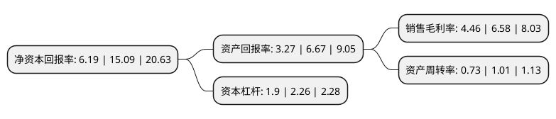

> 本页面由自动化程序生成于 2022年5月20日 01:21
> 内容可能存在错误，如有bug请提交issue至：https://github.com/Eroleice/doc-pi/issues
{.is-warning}

# 上市公司基本情况

## 基本资料

深圳市南极光电子科技股份有限公司（以下简称“南极光”）成立于2009年01月04日，深圳市。于2021年02月03日在深交所创业板上市。

南极光注册资本11,842.569万元，公司的主营业务是以背光显示模组为核心的手机零部件的研发，生产和销售。公司的主要产品是LED背光显示模组，该产品为液晶显示屏幕(LCD)显示器产品中的背面光源组件。以下是详细信息：

- 公司名称: 深圳市南极光电子科技股份有限公司
- 股票代码: 300940.SZ
- 所在地: 广东 - 深圳市
- 成立日期: 2009年01月04日
- 注册资本: 11,842.569万元
- 法定代表人: 姜发明
- 主营业务: 公司的主营业务是以背光显示模组为核心的手机零部件的研发，生产和销售公司的主要产品是LED背光显示模组，该产品为液晶显示屏幕(LCD)显示器产品中的背面光源组件
- 公司官网: www.cnnjg.com
- 公司介绍: 公司的主营业务是以背光显示模组为核心的手机零部件的研发、生产和销售。公司产品广泛应用于智能手机和车载显示器、医疗显示仪、工控设备显示器、家电显示器、其他消费电子显示器等各种专业显示领域。目前，公司的背光显示模组主要应用于智能手机领域。公司通过多年来在背光显示模组行业“精耕细作”，在产品研发、品质控制、供货能力等方面拥有较强的实力，并与多家知名企业建立了稳定的业务合作关系。在手机背光源领域，公司目前已进入京东方、合力泰、深超光电、华显光电、帝晶光电、信利光电、联创电子等领先的液晶显示模组企业的合格供应商体系，应用的手机终端品牌包括华为、OPPO、VIVO、小米、三星、LG、传音、摩托罗拉等；在专业显示领域，公司客户包括骏成电子、天山电子等，产品已经应用到海尔、美的、Honeywell等终端客户；目前，公司利用生产背光源的核心技术及设备研发成功5G手机后盖，并开始小批量生产。

## 股东及高管情况

上市公司第一大股东为潘连兴，持股31,331,000股，占比26.46%，**疑似为**上市公司实际控制人。

截至2022年03月31日，上市公司的前十大股东中，共有6名自然人股东，4名机构股东，其中5%以上大股东共有2名。上市公司前十大股东明细如下：

> 未能通过持股比例判定出上市公司实际控制人（持股30%以上）
> 可能存在通过间接持股、联合持股、协议控制等方式拥有实际控制权的主体，具体请参考上市公司定期公告！
{.is-warning}

> 截至2022年03月31日，上市公司前十大股东信息如下：

| 股东名称 | 持股数量（股） | 持股比例 |
| --- | --- | --- |
| 潘连兴 | 31,331,000 | 26.46% |
| 姜发明 | 31,331,000 | 26.46% |
| 深圳市奥斯曼咨询管理合伙企业(有限合伙) | 3,427,980 | 2.89% |
| 深圳市南极光管理咨询合伙企业(有限合伙) | 3,427,980 | 2.89% |
| 李少平 | 3,201,045 | 2.7% |
| 泉州瀚睿投资合伙企业(有限合伙) | 1,998,433 | 1.69% |
| 梁荣勋 | 1,730,420 | 1.46% |
| 王威 | 1,110,240 | 0.94% |
| 徐贤强 | 1,105,800 | 0.93% |
| 北京紫峰投资管理有限公司-湖州紫峰吉盛股权投资合伙企业(有限合伙) | 1,048,000 | 0.88% |

## 利润表分析

上市公司2021年总收入为9.42亿元，净利润为0.42亿元，实现盈利。

## 杜邦分析

> 数据列示周期：2021年 | 2020年 | 2019年
{.is-info}

上市公司的净资产收益率在近一年有所下降，下降幅度为-58.98%，其变化情况分解如下：
- 上市公司的销售毛利率在近一年下降了-32.22%，可能是生产效率的下降、商品原材料价格上涨或商品价格的下跌所致。
- 上市公司的资产周转率在近一年下降了-27.72%，可能是源自于更慢的销售回款或库存管理效果下降。
- 上市公司的财务杠杆比率在近一年下降了-15.93%，可能是减少负债降低财务费用。

