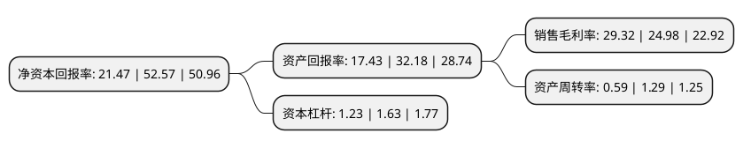

> 本页面由自动化程序生成于 2022年5月20日 01:21
> 内容可能存在错误，如有bug请提交issue至：https://github.com/Eroleice/doc-pi/issues
{.is-warning}

# 上市公司基本情况

## 基本资料

深圳市博硕科技股份有限公司（以下简称“博硕科技”）成立于2016年08月26日，深圳市。于2021年02月26日在深交所创业板上市。

博硕科技注册资本8,000万元，公司主要从事电子产品功能性器件的设计，研发，生产和销售，公司电子产品功能性器件业务聚焦于智能手机，智能穿戴设备等消费电子以及汽车电子两大应用领域;同时还为满足客户需求配套提供夹治具及自动化设备的设计，研发，生产及销售。以下是详细信息：

- 公司名称: 深圳市博硕科技股份有限公司
- 股票代码: 300951.SZ
- 所在地: 广东 - 深圳市
- 成立日期: 2016年08月26日
- 注册资本: 8,000万元
- 法定代表人: 徐思通
- 主营业务: 公司主要从事电子产品功能性器件的设计，研发，生产和销售，公司电子产品功能性器件业务聚焦于智能手机，智能穿戴设备等消费电子以及汽车电子两大应用领域;同时还为满足客户需求配套提供夹治具及自动化设备的设计，研发，生产及销售
- 公司官网: www.bsc-sz.com
- 公司介绍: 公司主要从事电子产品功能性器件的设计、研发、生产和销售。公司电子产品功能性器件业务聚焦于智能手机、智能穿戴设备等消费电子以及汽车电子两大应用领域。同时为满足客户需求，公司配套提供夹治具及自动化设备的设计、研发、生产及销售。公司为国家高新技术企业，已建立一支研发经验丰富、梯队结构合理的技术研发团队，能够快速响应客户的研发、设计需求，公司先后取得42项专利权及2项软件著作权；公司具备较强的供应链管理能力，通过“两化融合”实现了生产线信息化、数字化全面升级，不断提升整体生产管理效率；公司具备完善的质量管理体系，先后通过了ISO9001:2015质量管理体系认证、ISO14001:2015环境管理体系认证、IATF16949:2016汽车行业质量管理体系等国内外体系认证。

## 股东及高管情况

上市公司第一大股东为深圳市摩锐科技有限公司，持股30,600,000股，占比38.25%，为上市公司实际控制人。

截至2022年03月31日，上市公司的前十大股东中，共有6名自然人股东，3名机构股东，1个产品账户，其中5%以上大股东共有3名。上市公司前十大股东明细如下：

> 截至2022年03月31日，上市公司前十大股东信息如下：

| 股东名称 | 持股数量（股） | 持股比例 |
| --- | --- | --- |
| 深圳市摩锐科技有限公司 | 30,600,000 | 38.25% |
| 厦门市鸿德诚科技合伙企业(有限合伙) | 18,000,000 | 22.5% |
| 徐思通 | 11,400,000 | 14.25% |
| 吴磊 | 422,075 | 0.53% |
| 阮水龙 | 250,100 | 0.31% |
| 英大国际信托有限责任公司 | 249,950 | 0.31% |
| 王东民 | 130,356 | 0.16% |
| 黄昌儒 | 128,000 | 0.16% |
| 李忠霞 | 90,500 | 0.11% |
| 广发证券股份有限公司-博道成长智航股票型证券投资基金 | 77,000 | 0.1% |

## 利润表分析

上市公司2021年总收入为8.35亿元，净利润为2.45亿元，实现盈利。

## 杜邦分析

> 数据列示周期：2021年 | 2020年 | 2019年
{.is-info}

上市公司的净资产收益率在近一年有所下降，下降幅度为-59.16%，其变化情况分解如下：
- 上市公司的销售毛利率在近一年上升了17.37%，可能是生产效率的提升、商品原材料价格下跌或商品价格的上涨所致。
- 上市公司的资产周转率在近一年下降了-54.26%，可能是源自于更慢的销售回款或库存管理效果下降。
- 上市公司的财务杠杆比率在近一年下降了-24.54%，可能是减少负债降低财务费用。

