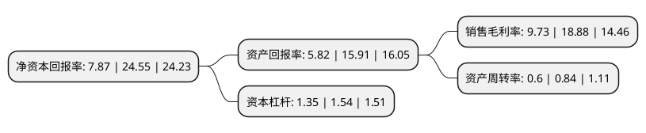

> 本页面由自动化程序生成于 2022年5月20日 01:21
> 内容可能存在错误，如有bug请提交issue至：https://github.com/Eroleice/doc-pi/issues
{.is-warning}

# 上市公司基本情况

## 基本资料

江苏本川智能电路科技股份有限公司（以下简称“本川智能”）成立于2006年08月23日，南京市。于2021年08月05日在深交所创业板上市。

本川智能注册资本7,729.828万元，专业从事印制电路板的研发，生产和销售。公司主要产品为多品种的印制电路板，公司产品按照层数可分为单/双面板和多层板。以下是详细信息：

- 公司名称: 江苏本川智能电路科技股份有限公司
- 股票代码: 300964.SZ
- 所在地: 江苏 - 南京市
- 成立日期: 2006年08月23日
- 注册资本: 7,729.828万元
- 法定代表人: 董晓俊
- 主营业务: 专业从事印制电路板的研发，生产和销售公司主要产品为多品种的印制电路板，公司产品按照层数可分为单/双面板和多层板
- 公司官网: www.allfavorpcb.com
- 公司介绍: 公司致力于为市场提供小批量印制电路板产品及解决方案，专业从事印制电路板的研发、生产和销售。印制电路板作为承载电子元器件并连接电路的桥梁，是几乎所有电子产品的基础组件，对电子产品的质量和性能起着关键性作用，被誉为“电子产品之母”。公司产品主要销往中国、美国、日本、欧洲、澳洲等地。公司在通信设备、工业控制、汽车电子等产品应用领域布局较深，与众多下游行业领先企业建立了长期稳定的合作关系。公司从3G时代开始就一直紧跟基站天线用PCB技术发展趋势，是业内最早攻克5G基站天线用中高频多层板生产技术的少数厂商之一。

## 股东及高管情况

上市公司第一大股东为董晓俊，持股18,802,000股，占比24.32%，**疑似为**上市公司实际控制人。

截至2022年03月31日，上市公司的前十大股东中，共有8名自然人股东，2名机构股东，其中5%以上大股东共有4名。上市公司前十大股东明细如下：

> 未能通过持股比例判定出上市公司实际控制人（持股30%以上）
> 可能存在通过间接持股、联合持股、协议控制等方式拥有实际控制权的主体，具体请参考上市公司定期公告！
{.is-warning}

> 截至2022年03月31日，上市公司前十大股东信息如下：

| 股东名称 | 持股数量（股） | 持股比例 |
| --- | --- | --- |
| 董晓俊 | 18,802,000 | 24.32% |
| 深圳瑞瀚股权投资企业(有限合伙) | 15,400,000 | 19.92% |
| 周国雄 | 6,360,000 | 8.23% |
| 江培来 | 5,250,000 | 6.79% |
| 黄庆娥 | 3,150,000 | 4.08% |
| 深圳市达晨财智创业投资管理有限公司-深圳市达晨创通股权投资企业(有限合伙) | 2,898,684 | 3.75% |
| 江东城 | 1,638,000 | 2.12% |
| 董春花 | 610,000 | 0.79% |
| 陈晓琴 | 410,000 | 0.53% |
| 雷立英 | 206,000 | 0.27% |

## 利润表分析

上市公司2021年总收入为5.54亿元，净利润为0.53亿元，实现盈利。

## 杜邦分析

> 数据列示周期：2021年 | 2020年 | 2019年
{.is-info}

上市公司的净资产收益率在近一年有所下降，下降幅度为-67.94%，其变化情况分解如下：
- 上市公司的销售毛利率在近一年下降了-48.46%，可能是生产效率的下降、商品原材料价格上涨或商品价格的下跌所致。
- 上市公司的资产周转率在近一年下降了-28.57%，可能是源自于更慢的销售回款或库存管理效果下降。
- 上市公司的财务杠杆比率在近一年下降了-12.34%，可能是减少负债降低财务费用。

