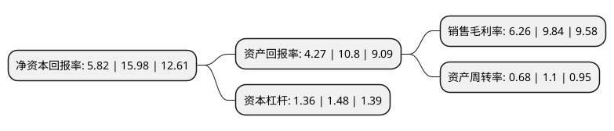

> 本页面由自动化程序生成于 2022年5月20日 01:21
> 内容可能存在错误，如有bug请提交issue至：https://github.com/Eroleice/doc-pi/issues
{.is-warning}

# 上市公司基本情况

## 基本资料

广东格林精密部件股份有限公司（以下简称“格林精密”）成立于2002年04月29日，惠州市。于2021年04月15日在深交所创业板上市。

格林精密注册资本41,338万元，主营业务为智能终端精密结构件，精密模具的研发，设计，生产和销售。主要产品为智能终端精密结构件，精密模具。以下是详细信息：

- 公司名称: 广东格林精密部件股份有限公司
- 股票代码: 300968.SZ
- 所在地: 广东 - 惠州市
- 成立日期: 2002年04月29日
- 注册资本: 41,338万元
- 法定代表人: 吴宝玉
- 主营业务: 主营业务为智能终端精密结构件，精密模具的研发，设计，生产和销售主要产品为智能终端精密结构件，精密模具
- 公司官网: www.green-cpc.com
- 公司介绍: 公司是国内领先的消费电子产品结构件的专业提供商，主要从事多功能精密结构件及精密模具的研发、设计、生产和销售业务。经过15年的不断发展，公司目前具有整合金属、塑胶等多种材料的综合设计与生产能力，能够将天线、电磁屏蔽、声腔、散热、防水防尘等功能集成到精密结构件产品上，实现精密结构件的功能化，从而为客户提供结构件功能化的一揽子技术解决方案和多功能精密结构件产品。凭借先进的技术和优质的产品，公司已与领先的国际国内知名品牌商及大型电子产品制造商建立了长期稳定的合作关系，成为了亚马逊、TCL、阿尔卡特、联想、摩托罗拉、努比亚等公司的主要合作伙伴。合作期间，公司曾经获得TCL授予的“最佳战略合作伙伴奖”、摩托罗拉授予的“最佳创新奖”等奖项。

## 股东及高管情况

上市公司第一大股东为惠州市惠丰宝股权投资合伙企业(有限合伙)，持股124,213,228股，占比30.05%，为上市公司实际控制人。

截至2022年03月31日，上市公司的前十大股东中，共有7名机构股东，1个产品账户，2个海外主体，其中5%以上大股东共有2名。上市公司前十大股东明细如下：

> 截至2022年03月31日，上市公司前十大股东信息如下：

| 股东名称 | 持股数量（股） | 持股比例 |
| --- | --- | --- |
| 惠州市惠丰宝股权投资合伙企业(有限合伙) | 124,213,228 | 30.05% |
| 丰骏投资有限公司 | 91,805,225 | 22.21% |
| 乐清市超然投资管理中心(有限合伙) | 17,512,887 | 4.24% |
| HQH VENTURES LIMITED | 15,026,005 | 3.63% |
| HQHVENTURESLIMITED | 15,026,005 | 3.63% |
| 西安亿仕登企业管理咨询有限合伙企业 | 12,329,701 | 2.98% |
| 招商证券资管-招商银行-招商资管格林精密员工参与创业板战略配售集合资产管理计划 | 10,338,000 | 2.5% |
| 乐清康尔乐股权投资合伙企业(有限合伙) | 10,036,842 | 2.43% |
| 东莞红土创业投资有限公司 | 8,842,105 | 2.14% |
| 惠州红土创业投资有限公司 | 6,947,369 | 1.68% |

## 利润表分析

上市公司2021年总收入为14.23亿元，净利润为0.89亿元，实现盈利。

## 杜邦分析

> 数据列示周期：2021年 | 2020年 | 2019年
{.is-info}

上市公司的净资产收益率在近一年有所下降，下降幅度为-63.58%，其变化情况分解如下：
- 上市公司的销售毛利率在近一年下降了-36.38%，可能是生产效率的下降、商品原材料价格上涨或商品价格的下跌所致。
- 上市公司的资产周转率在近一年下降了-38.18%，可能是源自于更慢的销售回款或库存管理效果下降。
- 上市公司的财务杠杆比率在近一年下降了-8.11%，可能是减少负债降低财务费用。

