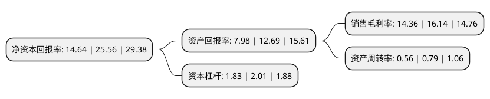

> 本页面由自动化程序生成于 2022年5月20日 01:22
> 内容可能存在错误，如有bug请提交issue至：https://github.com/Eroleice/doc-pi/issues
{.is-warning}

# 上市公司基本情况

## 基本资料

深圳市创益通技术股份有限公司（以下简称“创益通”）成立于2003年09月25日，深圳市。于2021年05月20日在深交所创业板上市。

创益通注册资本9,000万元，以研发设计和精密制造为核心，产品按照应用领域主要包括数据存储互连产品及组件，消费电子互连产品及组件，新能源精密结构件等。以下是详细信息：

- 公司名称: 深圳市创益通技术股份有限公司
- 股票代码: 300991.SZ
- 所在地: 广东 - 深圳市
- 成立日期: 2003年09月25日
- 注册资本: 9,000万元
- 法定代表人: 张建明
- 主营业务: 以研发设计和精密制造为核心，产品按照应用领域主要包括数据存储互连产品及组件，消费电子互连产品及组件，新能源精密结构件等
- 公司官网: www.chysz.cn
- 公司介绍: 公司是一家以研发设计和精密制造为核心，向客户提供精密连接器、连接线、精密结构件等互连产品的国家高新技术企业，产品按照应用领域主要包括数据存储互连产品及组件、消费电子互连产品及组件、新能源精密结构件等。自创立以来，公司一直奉行“创益社会，连通世界”的发展理念，坚持以客户为中心，以技术为驱动的发展策略，不断增强与电子行业知名公司的合作。公司一直高度专注于高速互连产品的创新发展，在数据存储领域达到国际一流厂商技术水平，并已向消费电子、5G通讯等领域发展。经过多年精密制造生产经验的积累，公司已掌握了连接器领域的核心技术。凭借高效的研发设计能力、先进的精密制造工艺水平、良好的产品品质管控水平，以及为客户精益求精的服务理念，公司在业内树立了专业、优质的企业形象。目前，公司与晟碟(西部数据)、莫仕、公牛集团、安克创新、星科金朋、伟创力、埃梯梯等国内外知名公司建立了长期稳定的合作关系。

## 股东及高管情况

上市公司第一大股东为张建明，持股32,940,000股，占比36.6%，为上市公司实际控制人。

截至2022年03月31日，上市公司的前十大股东中，共有6名自然人股东，4名机构股东，其中5%以上大股东共有2名。上市公司前十大股东明细如下：

> 截至2022年03月31日，上市公司前十大股东信息如下：

| 股东名称 | 持股数量（股） | 持股比例 |
| --- | --- | --- |
| 张建明 | 32,940,000 | 36.6% |
| 晏雨国 | 12,150,000 | 13.5% |
| 深圳彼得潘股权投资合伙企业(有限合伙) | 3,600,000 | 4% |
| 吴诚 | 3,150,000 | 3.5% |
| 深圳市互联通投资企业(有限合伙) | 2,700,000 | 3% |
| 上海景林景惠股权投资中心(有限合伙) | 1,800,000 | 2% |
| 张纪纯 | 1,440,000 | 1.6% |
| 晏美荣 | 1,350,000 | 1.5% |
| 深圳海晨投资合伙企业(有限合伙) | 1,188,000 | 1.32% |
| 宋浩兴 | 990,000 | 1.1% |

## 利润表分析

上市公司2021年总收入为4.99亿元，净利润为0.71亿元，实现盈利。

## 杜邦分析

> 数据列示周期：2021年 | 2020年 | 2019年
{.is-info}

上市公司的净资产收益率在近一年有所下降，下降幅度为-42.72%，其变化情况分解如下：
- 上市公司的销售毛利率在近一年下降了-11.03%，可能是生产效率的下降、商品原材料价格上涨或商品价格的下跌所致。
- 上市公司的资产周转率在近一年下降了-29.11%，可能是源自于更慢的销售回款或库存管理效果下降。
- 上市公司的财务杠杆比率在近一年下降了-8.96%，可能是减少负债降低财务费用。

