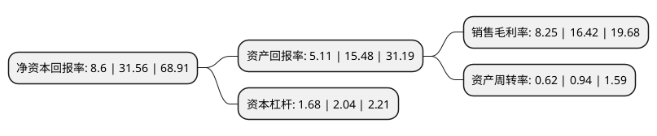

> 本页面由自动化程序生成于 2022年5月20日 01:22
> 内容可能存在错误，如有bug请提交issue至：https://github.com/Eroleice/doc-pi/issues
{.is-warning}

# 上市公司基本情况

## 基本资料

深圳市信濠光电科技股份有限公司（以下简称“信濠光电”）成立于2013年11月26日，深圳市。于2021年08月27日在深交所创业板上市。

信濠光电注册资本8,000万元，主要从事玻璃防护屏的研发，生产和销售，主要经营玻璃防护屏及相关触控显示产品，其中玻璃防护屏是公司的核心产品。以下是详细信息：

- 公司名称: 深圳市信濠光电科技股份有限公司
- 股票代码: 301051.SZ
- 所在地: 广东 - 深圳市
- 成立日期: 2013年11月26日
- 注册资本: 8,000万元
- 法定代表人: 姚浩
- 主营业务: 主要从事玻璃防护屏的研发，生产和销售，主要经营玻璃防护屏及相关触控显示产品，其中玻璃防护屏是公司的核心产品
- 公司官网: www.xinhaoph.com
- 公司介绍: 公司是一家主要从事玻璃防护屏的研发、生产和销售的高新技术企业，产品广泛应用于智能手机、平板电脑、智能手表等新一代信息终端。公司是目前国内规模较大的专业玻璃防护屏供应商之一，并已成为深天马、三星显示、华显光电、日本显示和信利光电等大型光电子器件制造商的玻璃防护屏配套供应商，产品最终应用于华为、vivo、三星等国内外知名品牌移动终端。

## 股东及高管情况

上市公司第一大股东为王雅媛，持股18,000,000股，占比22.5%，**疑似为**上市公司实际控制人。

截至2022年03月31日，上市公司的前十大股东中，共有8名自然人股东，2名机构股东，其中5%以上大股东共有2名。上市公司前十大股东明细如下：

> 未能通过持股比例判定出上市公司实际控制人（持股30%以上）
> 可能存在通过间接持股、联合持股、协议控制等方式拥有实际控制权的主体，具体请参考上市公司定期公告！
{.is-warning}

> 截至2022年03月31日，上市公司前十大股东信息如下：

| 股东名称 | 持股数量（股） | 持股比例 |
| --- | --- | --- |
| 王雅媛 | 18,000,000 | 22.5% |
| 梁国豪 | 12,164,000 | 15.21% |
| 姚浩 | 3,770,000 | 4.71% |
| 高瞻 | 3,770,000 | 4.71% |
| 宁波梅山保税港区君度德瑞股权投资管理中心(有限合伙) | 3,750,000 | 4.69% |
| 罗伟强 | 2,620,000 | 3.28% |
| 梁建 | 2,436,000 | 3.05% |
| 梁国强 | 1,800,000 | 2.25% |
| 深圳市富沃盈丰投资合伙企业(有限合伙) | 1,412,000 | 1.77% |
| 齐展 | 1,300,000 | 1.63% |

## 利润表分析

上市公司2021年总收入为18.76亿元，净利润为1.54亿元，实现盈利。

## 杜邦分析

> 数据列示周期：2021年 | 2020年 | 2019年
{.is-info}

上市公司的净资产收益率在近一年有所下降，下降幅度为-72.75%，其变化情况分解如下：
- 上市公司的销售毛利率在近一年下降了-49.76%，可能是生产效率的下降、商品原材料价格上涨或商品价格的下跌所致。
- 上市公司的资产周转率在近一年下降了-34.04%，可能是源自于更慢的销售回款或库存管理效果下降。
- 上市公司的财务杠杆比率在近一年下降了-17.65%，可能是减少负债降低财务费用。

