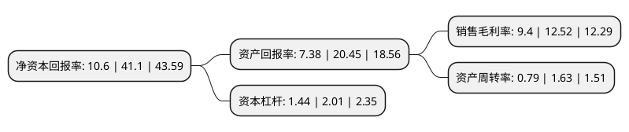

> 本页面由自动化程序生成于 2022年5月20日 01:22
> 内容可能存在错误，如有bug请提交issue至：https://github.com/Eroleice/doc-pi/issues
{.is-warning}

# 上市公司基本情况

## 基本资料

深圳市显盈科技股份有限公司（以下简称“显盈科技”）成立于2011年07月04日，深圳市。于2021年09月22日在深交所创业板上市。

显盈科技注册资本5,402万元，主要从事信号转换拓展产品的研发，生产和销售。公司产品分为:信号转换拓展产品和模具及精密结构件产品。以下是详细信息：

- 公司名称: 深圳市显盈科技股份有限公司
- 股票代码: 301067.SZ
- 所在地: 广东 - 深圳市
- 成立日期: 2011年07月04日
- 注册资本: 5,402万元
- 法定代表人: 林涓
- 主营业务: 主要从事信号转换拓展产品的研发，生产和销售公司产品分为:信号转换拓展产品和模具及精密结构件产品
- 公司官网: www.hkfullink.com
- 公司介绍: 公司是计算机、通信和消费电子(3C)周边产品及部件专业ODM供应商，主要从事信号转换拓展产品的研发、生产和销售。公司早在2015年即前瞻性地推出Type-C信号转换拓展产品，公司Type-C产品系列完整度、工艺成熟度、产品稳定性受到客户广泛认可，主要客户包括全球知名3C周边品牌商Belkin、StarTech.com、绿联科技、Cropmark等。为掌握核心生产环节、实现快速反应、提高产品工业设计水平并保护商业机密，2017年起，公司开始自行设计、生产模具及精密结构件，作为信号转换拓展产品的部件，同时逐步对外销售，用于大疆创新、罗马仕等少数对模具及精密结构件品质要求较高的品牌，公司业务开始向3C电子产品部件拓展。

## 股东及高管情况

上市公司第一大股东为林涓，持股17,395,000股，占比32.2%，为上市公司实际控制人。

截至2022年03月31日，上市公司的前十大股东中，共有9名自然人股东，1名机构股东，其中5%以上大股东共有3名。上市公司前十大股东明细如下：

> 截至2022年03月31日，上市公司前十大股东信息如下：

| 股东名称 | 持股数量（股） | 持股比例 |
| --- | --- | --- |
| 林涓 | 17,395,000 | 32.2% |
| 肖杰 | 7,351,000 | 13.61% |
| 珠海凯盈投资合伙企业(有限合伙) | 6,000,000 | 11.11% |
| 朱素婷 | 1,800,000 | 3.33% |
| 张国伟 | 1,700,000 | 3.15% |
| 姜国良 | 1,610,000 | 2.98% |
| 段圆圆 | 1,200,000 | 2.22% |
| 戴湘 | 1,000,000 | 1.85% |
| 李真 | 929,000 | 1.72% |
| 喻宇汉 | 800,000 | 1.48% |

## 利润表分析

上市公司2021年总收入为5.69亿元，净利润为0.53亿元，实现盈利。

## 杜邦分析

> 数据列示周期：2021年 | 2020年 | 2019年
{.is-info}

上市公司的净资产收益率在近一年有所下降，下降幅度为-74.21%，其变化情况分解如下：
- 上市公司的销售毛利率在近一年下降了-24.92%，可能是生产效率的下降、商品原材料价格上涨或商品价格的下跌所致。
- 上市公司的资产周转率在近一年下降了-51.53%，可能是源自于更慢的销售回款或库存管理效果下降。
- 上市公司的财务杠杆比率在近一年下降了-28.36%，可能是减少负债降低财务费用。

