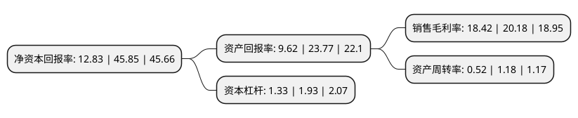

> 本页面由自动化程序生成于 2022年5月20日 01:22
> 内容可能存在错误，如有bug请提交issue至：https://github.com/Eroleice/doc-pi/issues
{.is-warning}

# 上市公司基本情况

## 基本资料

深圳市鸿富瀚科技股份有限公司（以下简称“鸿富瀚”）成立于2008年02月13日，深圳市。于2021年10月20日在深交所创业板上市。

鸿富瀚注册资本6,000万元，公司主要从事消费电子功能性器件和自动化设备的设计，研发，生产与销售，公司的主要产品为消费电子功能性器件及自动化设备。以下是详细信息：

- 公司名称: 深圳市鸿富瀚科技股份有限公司
- 股票代码: 301086.SZ
- 所在地: 广东 - 深圳市
- 成立日期: 2008年02月13日
- 注册资本: 6,000万元
- 法定代表人: 张定武
- 主营业务: 公司主要从事消费电子功能性器件和自动化设备的设计，研发，生产与销售，公司的主要产品为消费电子功能性器件及自动化设备
- 公司官网: www.hongfuhan.cn
- 公司介绍: 深圳市鸿富瀚科技有限公司成立于2008年，专业生产加工模切及五金产品，是富士康，比亚迪，光宝，业成等客户认证的精密模切加工供应商，拥有超过10个城市的远程快速交货能力，公司通过了ISO9001:2008质量和ISO14001:2004环境管理体系认证。公司致力发现每个员工的价值，充分给予员工发展平台，让员工和公司一同成长。

## 股东及高管情况

上市公司第一大股东为张定武，持股35,851,500股，占比59.75%，为上市公司实际控制人。

截至2022年03月31日，上市公司的前十大股东中，共有8名自然人股东，2名机构股东，其中5%以上大股东共有3名。上市公司前十大股东明细如下：

> 截至2022年03月31日，上市公司前十大股东信息如下：

| 股东名称 | 持股数量（股） | 持股比例 |
| --- | --- | --- |
| 张定武 | 35,851,500 | 59.75% |
| 恒美國際有限公司 | 3,600,000 | 6% |
| 深圳市瀚卓实业合伙企业(有限合伙) | 3,064,500 | 5.11% |
| 张定概 | 2,070,000 | 3.45% |
| 丘晓霞 | 414,000 | 0.69% |
| 尹良顺 | 90,000 | 0.15% |
| 李巍 | 64,700 | 0.11% |
| 郑淙效 | 61,000 | 0.1% |
| 袁佩良 | 51,000 | 0.09% |
| 黄金洲 | 45,000 | 0.08% |

## 利润表分析

上市公司2021年总收入为7.39亿元，净利润为1.36亿元，实现盈利。

## 杜邦分析

> 数据列示周期：2021年 | 2020年 | 2019年
{.is-info}

上市公司的净资产收益率在近一年有所下降，下降幅度为-72.02%，其变化情况分解如下：
- 上市公司的销售毛利率在近一年下降了-8.72%，可能是生产效率的下降、商品原材料价格上涨或商品价格的下跌所致。
- 上市公司的资产周转率在近一年下降了-55.93%，可能是源自于更慢的销售回款或库存管理效果下降。
- 上市公司的财务杠杆比率在近一年下降了-31.09%，可能是减少负债降低财务费用。

